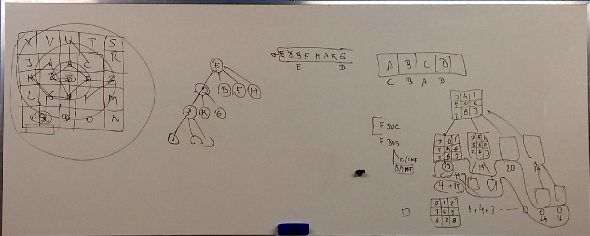
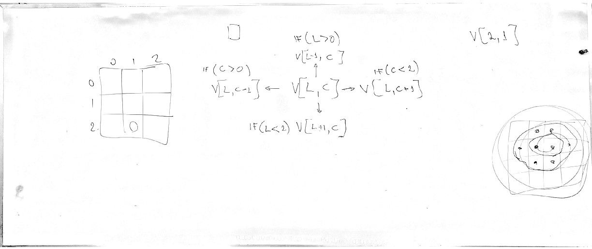

# Aula VI
## Quebra cabeças
Para verificar se um quebra cabeça não tem solução, deve-se ler todos os numeros 
da esquerda para direita e contando os numeros que não estão na ordem correta (menor < maior)

| 4 | 3 | 2 | 
| 5 | 8 | 6 | 
| 7 | 1 | - | 

4 -> 3 -> 2 -> 
5 -> 8 -> 6 -> 
7 -> 1 -> - 

### Quebra cabeça sem solução

| 1     | 2     | 3     | 4     | 
| 5     | 6     | 7     | 8     | 
| 9     | 10    | 11    | 12    | 
| 13    | 15    | 14    | -     | 

### Função sucessora
Responsavel por retornar os estados futuros

## Quadros
### Quadro I

### Quadro II
