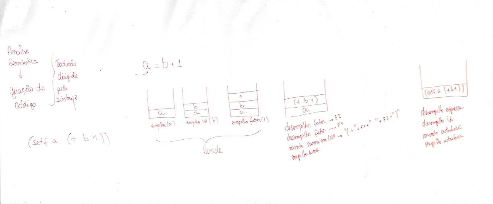
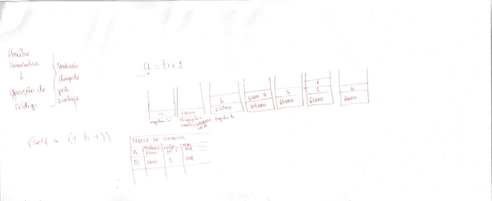

# Aula VII
## Analise semântica
```
Analise semântica   \
       :arrow_down:  >  Tradução dirigida pela sintaxe
Geração de código   /
```

### Analise do codigo :arrow_down:
$$
a = b + 1
$$

### Quadro I

### Quadro 2
