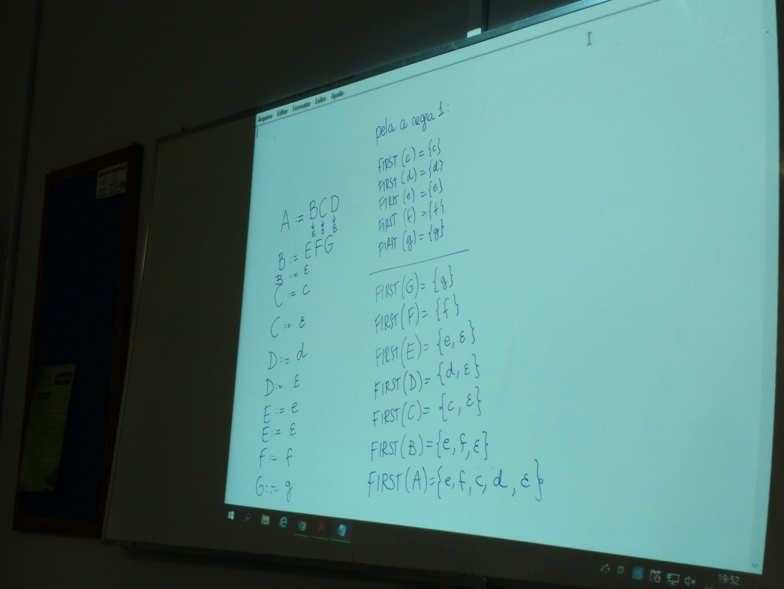
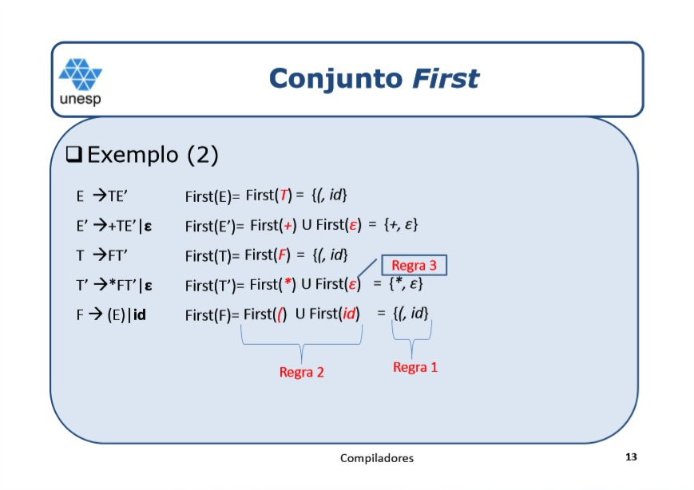
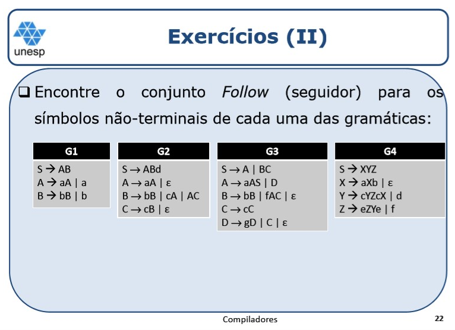
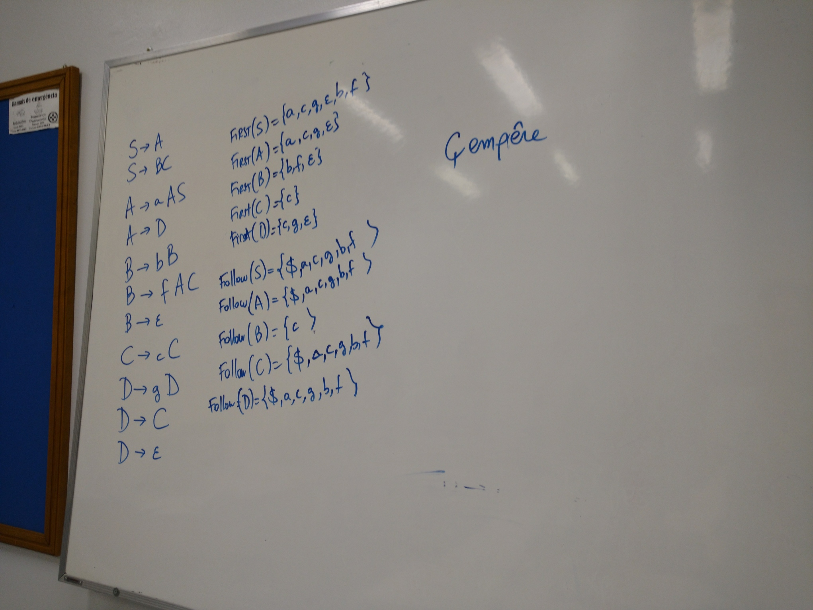

# Aula X

### Regras para o conjunto first

```
A ::= BCD
B ::= EFG
B ::= ε
C ::= c
C ::= ε
D ::= d
D ::= ε
E ::= e
E ::= ε
F ::= f
G ::= g
```

pela a regra 1:

``` 
first(c) = {c}
first(d) = {d}
first(e) = {e}
first(f) = {f}
first(g) = {g}
---------------
FIRST(G) = {g}
FIRST(F) = {f}
FIRST(E) = {e, ε}
FIRST(D) = {d, ε}
FIRST(C) = {c, ε}
FIRST(B) = {e, f, ε}
FIRST(A) = {e, f, c, d, ε}
```

## Terminais e não terminais

Se é minuscula é terminal

Se é maiúscula é não terminal

## Quadros



## Exercícios

### 1) Define o conjunto de símbolos que iniciam derivações a partir de uma sequência de símbolos e não terminais

> **Regra 1.** Se X é um simbolo terminal, então FIRST(X) ={X}

```- S -&gt; ABd
Gramática:
- S -> ABd
- A -> aA | ε
- B -> bB | cA | AC
- C -> cB | ε

first(A) = first(a) U first(ε)
              \/           \/
              {a}          {ε}
                    \/
              first(A) = {a, ε}
```

Resposta:

```
first(a) = {a}
first(b) = {b}
...
-----------------
FIRST(C) = {c, ε}
FIRST(B) = {b, c, a, ε}
FIRST(A) = {a, ε}
FIRST(S) = {a, b, c, d}
```

### 2) Exemplo 2



Resposta:

```
first E'- {+, ε}
first F {(, id}
first T' {*, ε}
first T {(, id}
first E {(, id}
```

### 3) Encontre o conjunto Follow (seguidor) para os símbolos não-terminais de cada uma das gramáticas



```
G3
first(a) = {a}
first(b) = {b}
...
-----------------
FIRST(C) = {c}
FIRST(D) = {g, c, ε}
FIRST(B) = {b, f, ε}
FIRST(A) = {a, c, g, ε}
FIRST(S) = {a, b, g, ε, b, f}
-----------------
FOLLOW(S) = {$, a, c, g, b, f}
FOLLOW(A) = {$, a, c, g, b, f}
FOLLOW(B) = {c}
FOLLOW(C) = {$, a, c, f, b, f}
FOLLOW(D) = {$, a, c, g, b, f}
```

