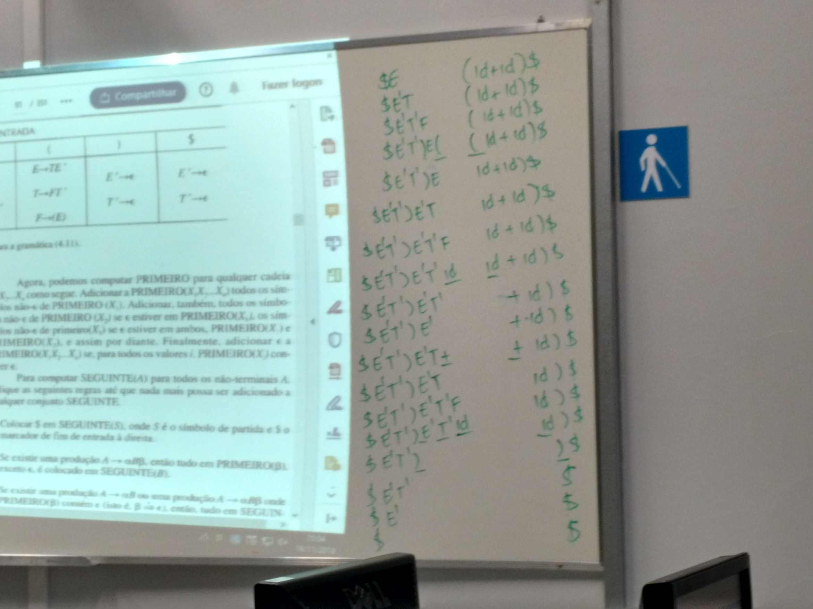
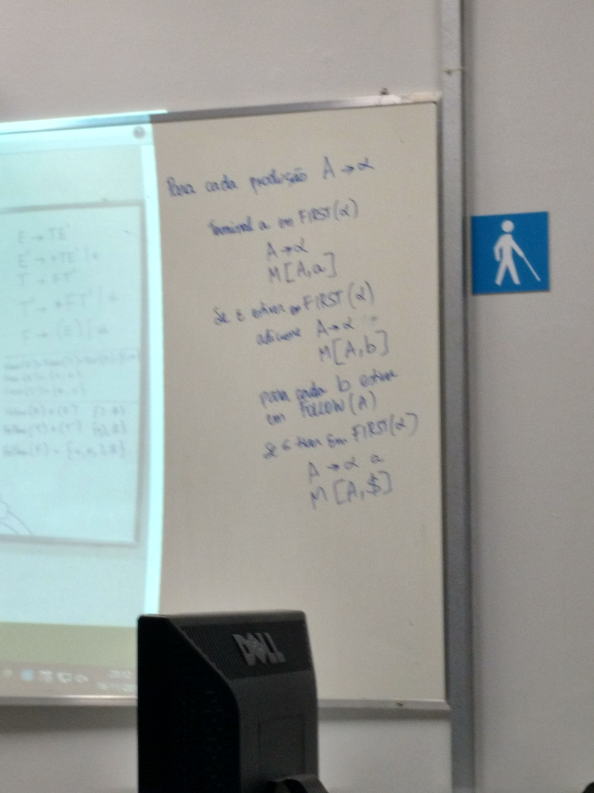

# Aula XI

## Construção da tabela preditiva

### Exercício

### Quadro II

Para cada produção A ➡ &alpha;

Terminal a em FIRST(&alpha;)

​		A ➡ &alpha;

​		M[A, a]

Se ε estiver em FIRST(&alpha;)

​	adicione A ➡ &alpha;

​	M[A, b]

Para cada b estiver em FOLLOW(A)

Se ε estiver em FIRST(&alpha;)

​	A ➡ &alpha; a

​	M[A, $]

### Exercicio

`(id + id)$`

## Observações da aula

O FIRST de um terminal é o próprio terminal