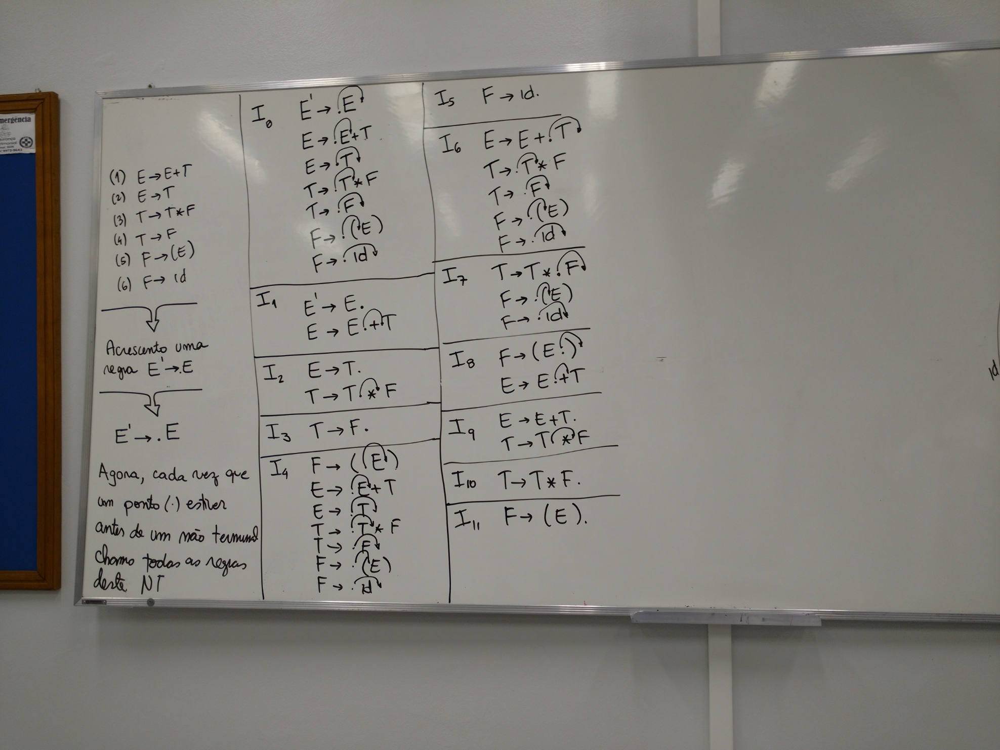
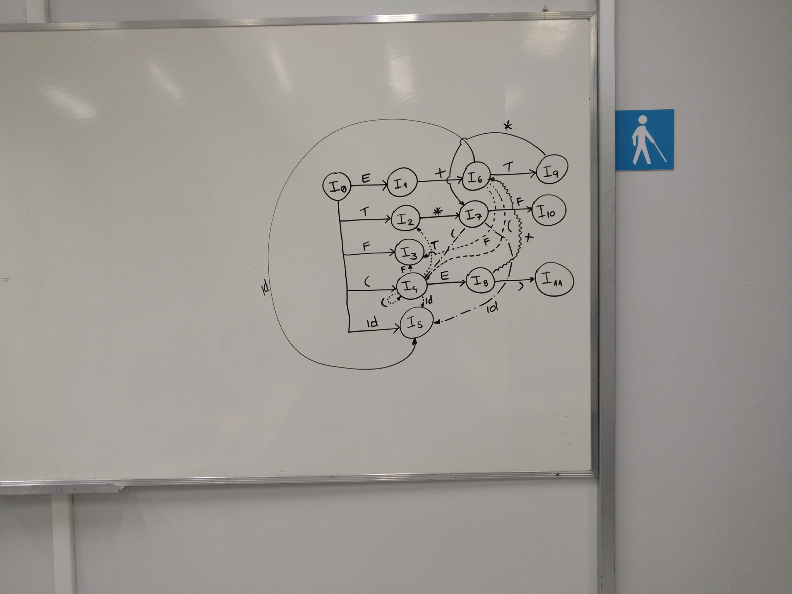

# Aula XI

## Explicação

1. E ➡ E + T
2. E ➡ T
3. T ➡ T * F
4. T ➡ F
5. F ➡ (E)
6. F ➡ id

​                        ⬇

Acrescentar uma regra `E' ➡ .E`

​                        ⬇

​                `E' ➡ .E`

Agora, cada vez que um ponto (.) estiver antes de um não terminal chama todas deste NT (não terminal)

```
I0	E' -> .E
	E  -> .E + T
	E  -> .T
	T  -> .T * F
	T  -> .F
	F  -> .(E)
	F  -> .id
-----------------------
I1  E' -> E.
	E  -> E. + T
-----------------------
I2  E' -> T.
	T  -> T. + F
-----------------------
I3  T  -> F.
-----------------------
I4  F  -> (.E)
	E  -> .E + T
	E  -> .T
	T  -> .T * F
	T  -> .F
	F  -> .(E)
	F  -> id
-----------------------
I5  F  -> id.
-----------------------
I6  E  -> E + .T
	T  -> .T * F
	T  -> .F
	F  -> .(E)
	F  -> id
-----------------------
I7  T  -> T * .F
	F  -> .(E)
	F  -> .id
-----------------------
I8  F  -> (E.)
	E  -> E. + T
-----------------------
I9  E  -> E + T.
	T  -> T. * F
-----------------------
I10 T  -> T * F.
```


## Quadros

### Quadro I



### Quadro II



## Exercícios

### Considere a Gramática G1 Abaixo:

G1 = {{S,X,Y}, {a,b,c,+}, S, P}

P:

S → Y + X 

S → X

X → Yc

X → a

Y → b

Y → &

#### Questão 1) Encontre o conjunto FIRST:

{a, b, &}

#### Questão 2 ) Encontre o conjunto FOLLOW:

{+, c, $}

#### Questão 3 ) Um analisador sintático Bottom-Up da família LR irá usar a estratégia de: 

letra **b**

(a)     Consumir e empilhar

**(b)    Empilhar e reduzir**

(c)     Deslocar e empilhar

(d)    Deslocar e reduzir

(e)     Herdar e sintetizar  

#### Questão 4 ) Quais dos analisadores sintáticos abaixo NÃO é Bottom-up: 

letra **e**

(a)     LR

(b)    SLR

(c)     LALR

(d)    Precedência de Operadores

**(e)     Preditivo**

#### Questão 5) Encontre os conjuntos (I0, I1, ...) para produzir a tabela SLR da gramática acima

 ```
I0--------------------
S' -> S
S  -> .Y + X
S  -> .X
X  -> .Yc
X  -> a
Y  -> b
Y  -> &
I1--------------------
S' -> S.
I2-----------------------
S  -> Y. + X
X  -> Y.c
I3-----------------------
S  -> X.
I4-----------------------
X  -> a.
I5-----------------------
X  -> b.
I6-----------------------
X  -> &.
I7-----------------------
S  -> Y +. X
X  -> .Yc
X  -> .a
Y  -> .b
Y  -> .&
I8-----------------------
X  -> Yc.
I9-----------------------
... (continua)
 ```

