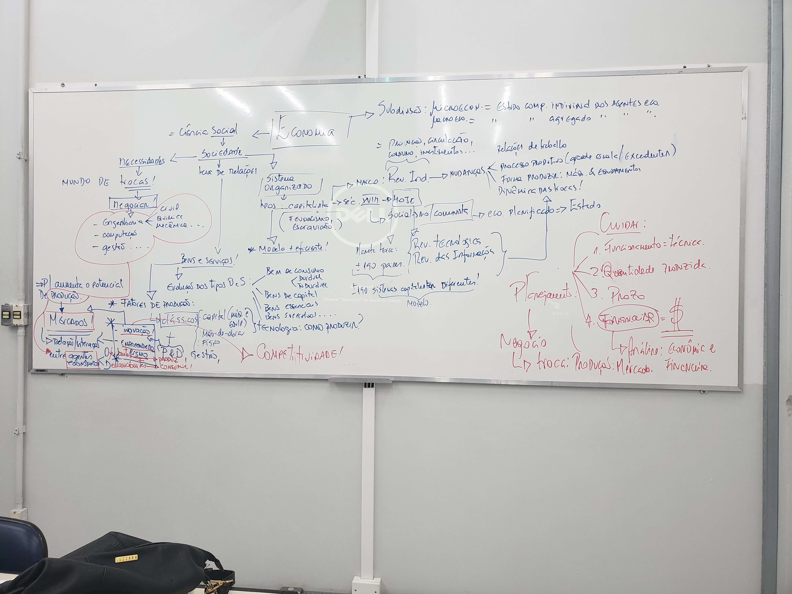
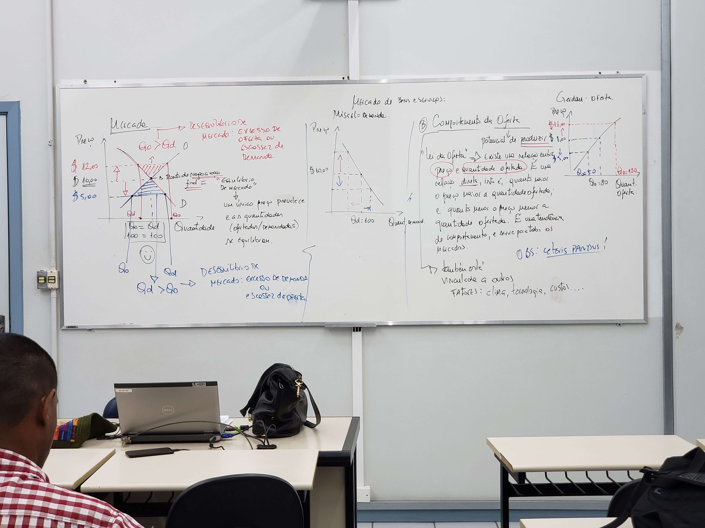

# Aula II

## Quadros

### I

### II

### III

### IV

## Anotações

- Capitalismo: modelo + eficiente
- Hoje estamos sendo comparados com a carga horaria do sec 18
- Inovação: algo que melhore sua eficiência 
- Empreendedorismo: potencia para atuar no processo de produção
- Mercado: relação/interação entre agentes econômicos (oferta/demanda)
  - Para entender o mercado, precisamos entender como funciona a oferta e a demanda

## Economia

Necessidades humanas ilimitadas em face aos recursos limitados.

Escassez de recursos.

- Microeconomia: estudo comportamento **individual** dos agentes econômicos
- Macroeconomia: estudo comportamento **agregado** dos agentes econômicos

### Macroeconomia

Depois: PIB, renda per capita, inflação, moeda, politicas

- 1929 - Quebra da bolsa de negócios (NY)
  - economista Keypes estudou muito o caso
  - 2008 aconteceu um caso bem parecido devido aos bancos

### Microeconomia

- Comportamento individual dos agentes
- Oferta
- Demanda
- Mercado
- Estruturas de mercados
- Equilíbrio / desequilíbrio

## Aspectos básicos sobre os mercados

Focar: Microeconomia

- Comportamento individual dos agentes econômicos
  - Oferta
  - Demanda

**OBS: "Ceteris paribus"** => Analise parcial, onde todos os demais fatores são mantidos constantes

**OBS: Bens normais**

### Comportamento da demanda (potencial de consumir)

> Oferta também esta vinculada a outros fatores: renda e preferencia além do preço.

#### "Lei da demanda""

> Tudo é regulado pelo preço

Existe uma relação entre preço (de um bem/serviço) e a quantidade demandada. é uma relação inversa, isto é, quanto **maior** for o preço, **menor** será a quantidade demanda; e quanto **menor** for o preço, **maior** será a quantidade demandada. é uma tendência de comportamento, e serve para todos os mercados.

### Comportamento da oferta (potencial de produzir)

> Oferta também esta vinculada a outros fatores: clima, tecnologia, custos...

#### "lei da oferta"

Existe uma relação entre preço e quantidade ofertada. É uma relação direta, isto é, quanto **maior** o preço **maior** a quantidade ofertada; e quanto **menor** o preço **menor** a quantidade ofertada. É uma tendência de comportamento, e serve para todos os mercados.

### Mercado

é o ponto de negociação final = "equilíbrio de mercado" - um único preço prevalece e as quantidades (ofertadas/demandadas) se equilibram.

#### Quantidade ofertada > Quantidade demandada

Desequilibro de mercado: excesso de oferta ou escassez de demanda

Consequência: estoque!

#### Quantidade demandada > Quantidade ofertada

Desequilíbrio de mercado: excesso de demanda ou escassez de oferta

Consequência: falta de mercadoria!