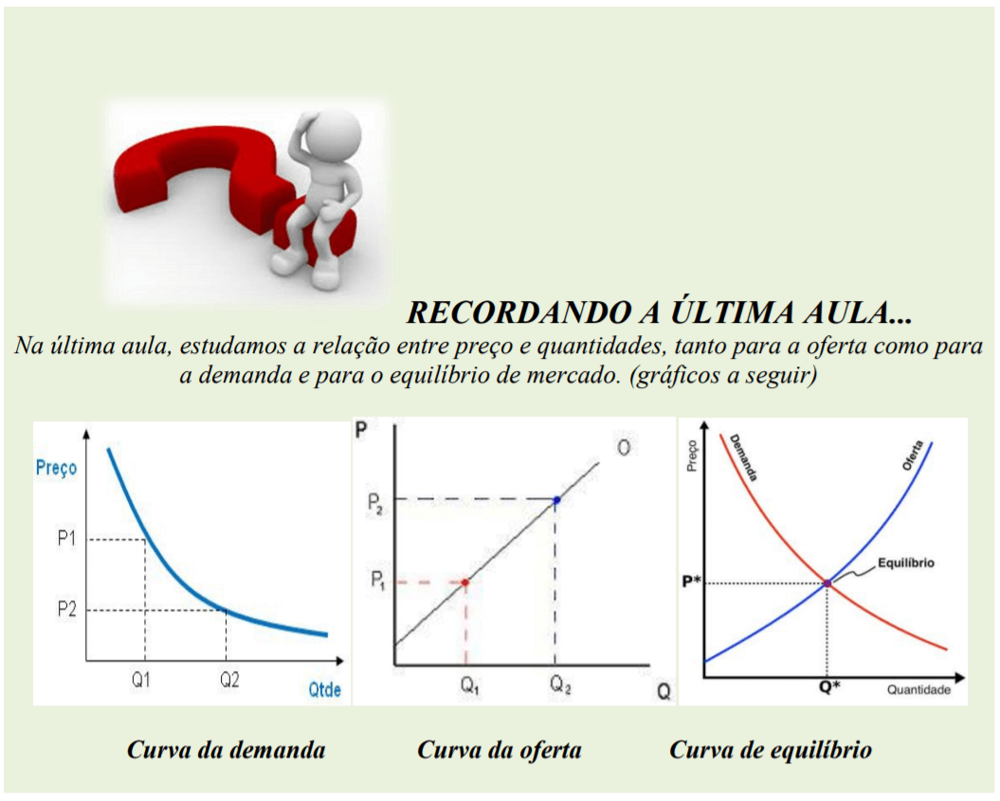
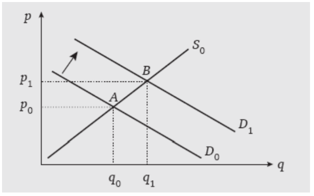
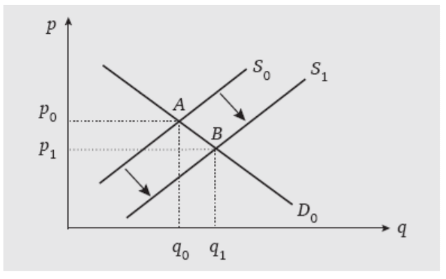
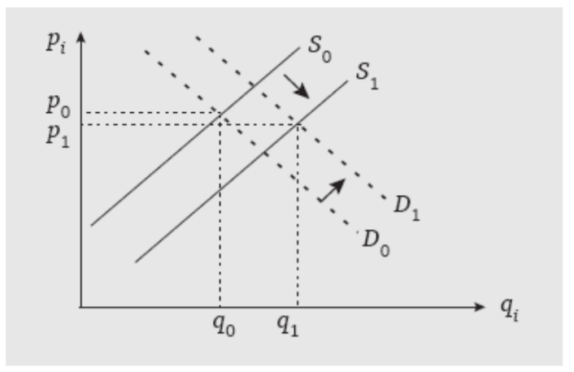

# Aula IV

## Teoria e Prática dos Mercados

### Atividades

#### Atividade I – Acesse a NOTÍCIA a seguir relacionada ao comportamento dos mercados. 

https://www.jornaldocomercio.com/_conteudo/economia/2020/03/729544-compras-nossupermercados-foram-20-acima-da-media-no-final-de-semana.html Agora, responda: 

1.  Qual o fator externo que fez mudar o comportamento dos mercados? 
2. Explique como o mercado de supermercados está se comportando com aumento de demanda. 
3. Explique como estão se comportando o mercado de álcool e máscaras, tanto pelo lado da oferta como para a demanda. 

#### Atividade II – Acesse a NOTÍCIA a seguir relacionada ao comportamento dos mercados.

https://www.jornaldocomercio.com/_conteudo/colunas/mercado_digital/2020/03/729663- impactado-pelo-covid-19-mercado-de-dispositivos-moveis-cai.html Agora, responda: 

1. Porque o mercado de dispositivos caiu? 
2. O que poderá acontecer com a oferta de dispositivos móveis no mercado? 
3. No pior dos cenários, de quanto será o percentual de queda no mercado de dispositivos móveis? 

#### Atividade III – Acesse o VÍDEO seguir relacionada ao comportamento da OFERTA. 

https://www.jornaldocomercio.com/_conteudo/galeria_de_videos/2020/02/726418-presidenteda-panvel-dimed-fala-do-impacto-do-digital-nas-lojas.html Agora, responda: 

1. Qual o fator que fez mudar o comportamento da Dimed no mercado? 
2. De que forma a tecnologia contribui para mudar o comportamento empresarial? Esse fator incentiva a ofertar mais ou menos bens? 
3. De que forma a demanda pode ser beneficiada com a tecnologia que a Dimed está incorporando no seu processo de produção?

### MUDANÇAS NO PONTO DE EQUILÍBRIO, EM VIRTUDE DE DESLOCAMENTOS DA OFERTA E DA DEMANDA

#### Explicações do livro "Economia Micro e Macro"

Como vimos, existem vários fatores que podem provocar deslocamento das curvas de oferta e demanda, que evidentemente provocarão mudanças do ponto de equilíbrio. Suponhamos, por exemplo, que o mercado do bem x esteja em equilíbrio, e o bem x seja um bem normal (não inferior). O preço de equilíbrio inicial é p0 e a quantidade, q0 (ponto A no próximo gráfico).

Suponhamos agora que os consumidores tenham um aumento de renda real (aumento do poder aquisitivo). Consequentemente, coeteris paribus, a demanda do bem x, a um mesmo preço, será maior. 

Isso significa um deslocamento da curva de demanda para a direita, para D1, como mostra a Figura 2.26. Assim, ao preço p0, teremos um excesso de demanda, que provocará gradativamente um aumento de preços. Com os preços aumentando, o excesso de demanda vai diminuindo, até acabar, no novo equilíbrio, ao preço p1, e à quantidade q1 (ponto B). 

> Figura 2.26 Mudança no ponto de equilíbrio devido a deslocamentos da demanda

Da mesma forma, um deslocamento da curva de oferta afeta a quantidade e os preços de equilíbrio. 

Suponhamos, para exemplificar, uma diminuição dos preços das matérias-primas usadas na produção do bem x. Consequentemente, a curva de oferta desse bem se desloca para a direita. Por um raciocínio análogo ao anterior, podemos perceber que o preço de equilíbrio se tornará menor, e a quantidade, maior. 

> Figura 2.27 Mudança no ponto de equilíbrio devido a deslocamentos da oferta

Também podemos combinar, num mesmo diagrama, os dois deslocamentos anteriores. Como pode ser visto na Figura 2.28, a quantidade de equilíbrio aumenta tanto pela variação 

Positiva da demanda quanto pela variação positiva da oferta. Com relação ao preço, porém o efeito final dependerá do deslocamento relativo das duas curvas. 

> Figura 2.28 Deslocamento conjunto da demanda e da oferta

> Fonte: Economia Micro e Macro – Autor: Marco Antônio Sandoval de Vasconcellos - Disponível na Biblioteca Virtual

#### Atividade IV 

1. Por quais OUTROS motivos, além do apontado no item 2.26 anterior, a DEMANDA se desloca? Dê um exemplo de deslocamento para a direita. Faça o gráfico. Dê um exemplo de deslocamento para a esquerda. Faça o gráfico. 
2. Por quais OUTROS motivos, além do apontado no item 2.27 anterior, a OFERTA se desloca? Dê um exemplo de deslocamento para a direita. Faça o gráfico. Dê um exemplo de deslocamento para a esquerda. Faça o gráfico. 
3. Dá para atribuir deslocamentos da oferta e demanda pelo vírus Covid-19? 
   1. { } sim 
   2. { } não 
4. O processo de produção da empresa na qual trabalha está sendo afetada de que forma por esse evento Covid-19? Diga se está tendo escassez de insumos ou alteração de preço ou alteração de quantidades ofertadas, ou seja, faça uma análise sobre o comportamento individual da sua empresa e tente projetar qual o comportamento que a empresa deverá ter. Caso não trabalhe pergunte para algum colega.