# Aula V

## Situação economica do pais

Desde semana passada estamos vivendo uma reviravolta em nossas vidas. Eventos que alteraram nossas rotinas profissionais e familiares. Fomos pegos de surpresa e agora tentamos reorganizar no dia-a-dia com a esperança de que esse ciclo não dure por muito tempo. Nunca vivenciamos algo tão restritivo, tão assustador e que terão consequências futuras em nossa economia e escolhas, individuais e coletivas.

Semana passada, peço desculpas a todos vocês pela forma como foi conduzida as atividades. Devo confessar que precisava de um tempo para raciocinar e planejar de que forma as aulas a distância se dariam, tendo em vista que todos nós, professores e alunos, planejamos realizar o semestre com aulas presenciais.  

Nesse momento, temos que verificar os instrumentos que temos que é o ensino a distância e conduzir da melhor forma possível para que todos nós possamos continuar interagindo. Sei também das dificuldades técnicas que alguns alunos têm com relação a acesso rápido e ininterrupto de internet e de aparelhos (computadores, notebooks, celulares e tablets, entre outros). Eu mesma estou com dificuldades técnicas com minha câmera e áudio para que possa usar a ferramenta Collaborate do Blackboard. Espero que essa semana consiga solucionar a questão para usar também esse instrumento entre nós. 

### Roteiro

Nesse sentido, hoje vamos dar seguimento as nossas aulas à distancia através de um roteiro que fiz (abaixo). Até o presente momento, vimos:

1. base introdutória sobre o *funcionamento dos mercados* onde ressaltamos seu comportamento relativo a lei da demanda, oferta e equilíbrio, e
2.  *deslocamentos da curva de demanda e de oferta*, que também tem aderência com o funcionamento dos mercados
3. E ainda hoje, introduzirei a questão da *elasticidade*, que se relaciona com essa parte inicial de funcionamento dos mercados.

 

## Roteiro Da Aula De Hoje:

### FÓRUM DE DISCUSSÃO

1º. Abri um ***FÓRUM DE DISCUSSÃO\*** para elucidar as dúvidas de vocês. A participação de todos é fundamental para que possamos avançar nos conteúdos, principalmente porque recebi e-mails de colegas de vocês solicitando explicações. Ou seja, ***A PARTICIPAÇÃO NO FÓRUM DEVE SER FEITA POR TODOS!\*** O FORUM possui temáticas:

- relativa ao item “a” para explicar as dúvidas de vocês e dar esclarecimentos adicionais.
- relativa ao item “b” para explicar as dúvidas de vocês e dar esclarecimentos adicionais.
- relativa a elasticidade (ou sensibilidade), item “c”, em que vou esclarecer os principais aspectos dessa questão. Na condução de minha explicação de hoje, repassarei os conceitos principais, exemplos e outros materiais afim de interagirmos durante o decorrer da aula.

> OU seja, na medida que formos conduzindo nosso processo, será disponibilizado outros vídeos e notícias para esclarecer melhor os tópicos.

### TESTE

2º. Disponibilizei um (01) ***TESTE\*** na temática D, onde vocês terão a oportunidade de responderem questões objetivas relativas a conceitos da base introdutória (item “a” acima com o nome de Oferta/Demanda/Mercados). ***ESSE TESTE DEVERÁ SER REALIZADOS POR TODOS!\*** Caso haja algum problema com o teste, por favor me comuniquem.

 

3º. Disponibilizei mais dois (02) ***TESTES\*** na temática D, onde vocês terão a oportunidade de responderem questões dissertativas relativas ao item “b” e “c” anterior. ***ESSES TESTES DEVERÃO SER REALIZADOS POR TODOS!\*** Caso haja algum problema com os testes, por favor me comuniquem.

 

**Não estarei colocando PRAZOS PARA A EXECUÇÃO FINAL DESSAS ATIVIDADES**, tendo em vista, como já mencionei antes, de que possam ter algumas dificuldades técnicas com internet e computador, mas reforço a importância de não deixarem acumularem as entregas. Ou seja, todas essas atividades são importantes para compor os 30% da nota da 1º. Avaliação (Práticas + testes + participação no fórum entre outras que serão desenvolvidas). Esse final de semana mesmo saiu uma notícia de que as empresas estariam tendo dificuldades em oferecer o serviço de internet em algumas localidades pelo aumento muito alto na demanda, ou seja, não tiveram tempo de realizarem investimentos.

## Tematica D

> **Para se organizarem e conduzirem os estudos, TODOS OS INSTRUMENTOS que utilizarmos são importantes!**

**I) Abri uma “temática D – vídeos de apoio – conteúdos econômicos”** onde já disponibilizei uns vídeos e disponibilizarei mais, testes e outros arquivos que julgar importante.

**II) Os conteúdos do livro de Economia: micro e macro**, até o presente momento e incluindo a elasticidade, **estão disponíveis no arquivo da temática D, onde separei os itens de cada capítulo que realmente são necessários****:**

1. introdução a economia (contextualização) – Cap. 1 (veja os itens dos capítulos no arquivo)
2. demanda, oferta e equilíbrio de mercado – Cap. 2 (veja os itens dos capítulos no arquivo) 
3. Hoje, ainda, elasticidade – Cap. 3 (veja os itens dos capítulos no arquivo)  

**III)Vocês podem usar** o caderno teórico e de aplicações disponível na temática A e complementar os estudos com os capítulos do livro, além do desenvolvimento das atividades, vídeos, testes, práticas, leituras entre outros instrumentos de ensino.

---------------------------------

Com essa caminhada, conseguiremos dar sequência em nossos estudos.

Fico a disposição sempre que precisarem não apenas para elucidar as dúvidas, mas também para receber de vocês também ideias de como nossas aulas podem acontecer (e também sobre outros assuntos interdisciplinares). 

Passarei esse aviso também via Mensagem de Curso. Estarei on-line no nosso turno normal de aula. Espero vocês!

-------------------

### Oferta/Demanda/Mercados

#### Economia descomplicada

<iframe width="560" height="315" src="https://www.youtube.com/embed/2FdEBPCxmvM" frameborder="0" allow="accelerometer; autoplay; encrypted-media; gyroscope; picture-in-picture" allowfullscreen></iframe>

##### Lemas fundamentais da economia

- o que produzir
- quando produzir
- como produzir

##### Micro economia:

- Como os **preços** podem armonizar a **oferta** e a **demanda** gerando **equilibrio**

##### Demanda

###### Quantidade demandada vs preço

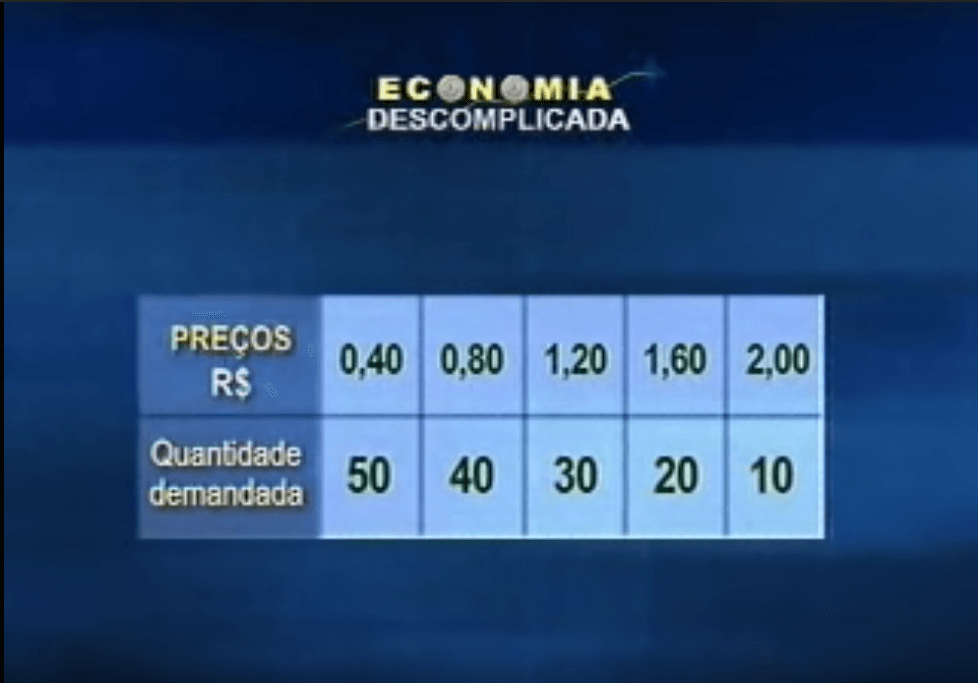

###### Curva da demanda

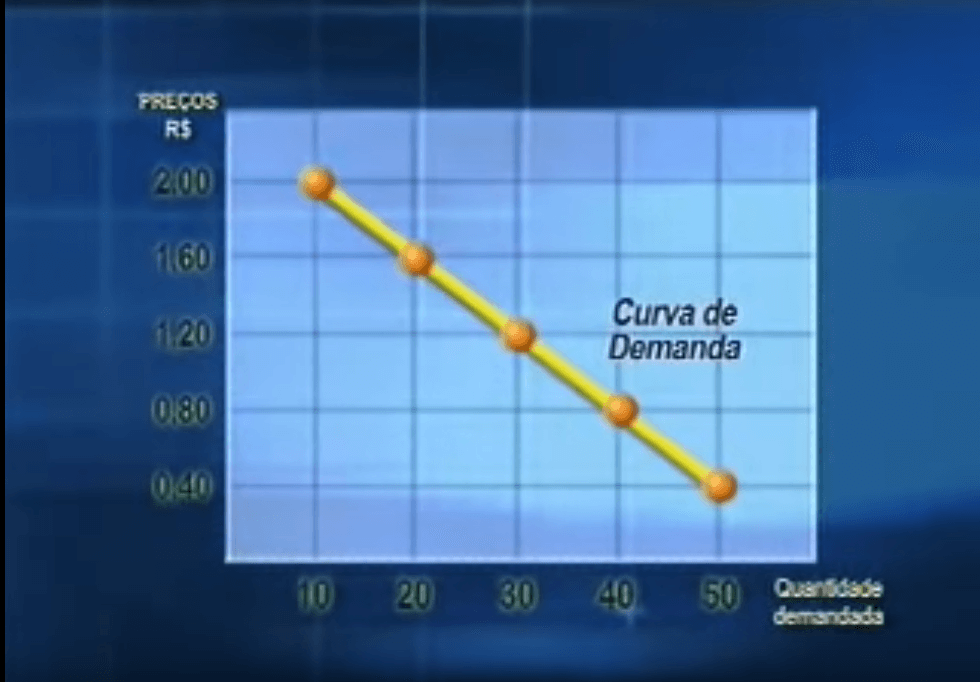

###### Demais fatores importantes para demanda

- o preço dos bens substitutos (manteiga x margarina)
- o preço dos bens complementares (pao x manteiga)
- a renda dos consumidores (consumidor compra mais de tudo)
  - no aumento de renda os bens inferiores (carne de segunda) diminuem
- o gosto dos consumidores

##### Oferta

###### Quantidade ofertada vs Preços

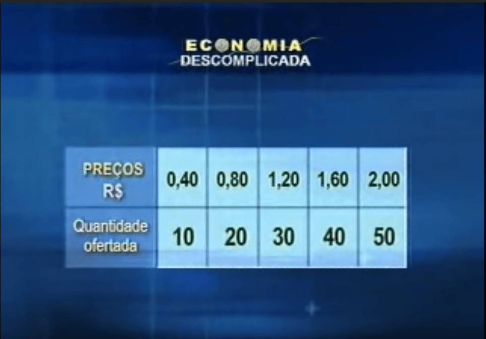

###### Curva da oferta

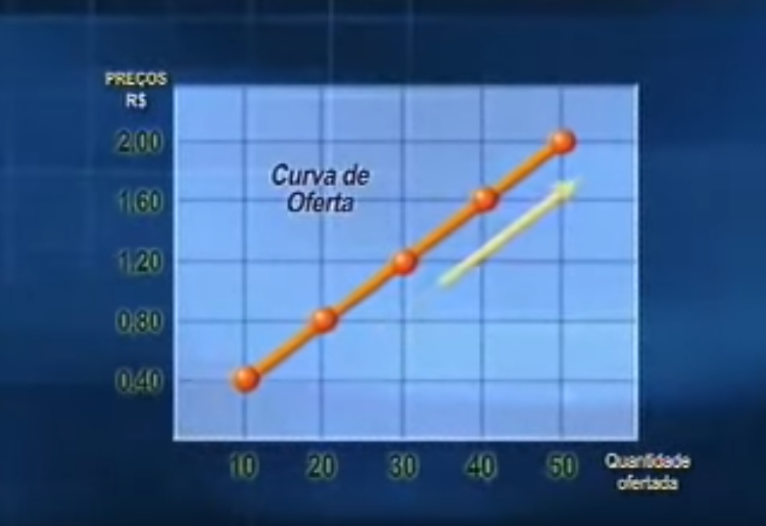

###### Outros fatores que geram alterações na oferta

- tecnologia
  - reduzir o custo da empresa
  - incrementar a produção
- preços dos insumos
  - para um chocolate, se o preço do cacau abaixar, logo o chocolate ira ficar mais barato.

#### Economia descomplicada 3

<iframe width="560" height="315" src="https://www.youtube.com/embed/-20_Wo8ky50" frameborder="0" allow="accelerometer; autoplay; encrypted-media; gyroscope; picture-in-picture" allowfullscreen></iframe>

##### Forças de mercado (Equilibrio de mercado)

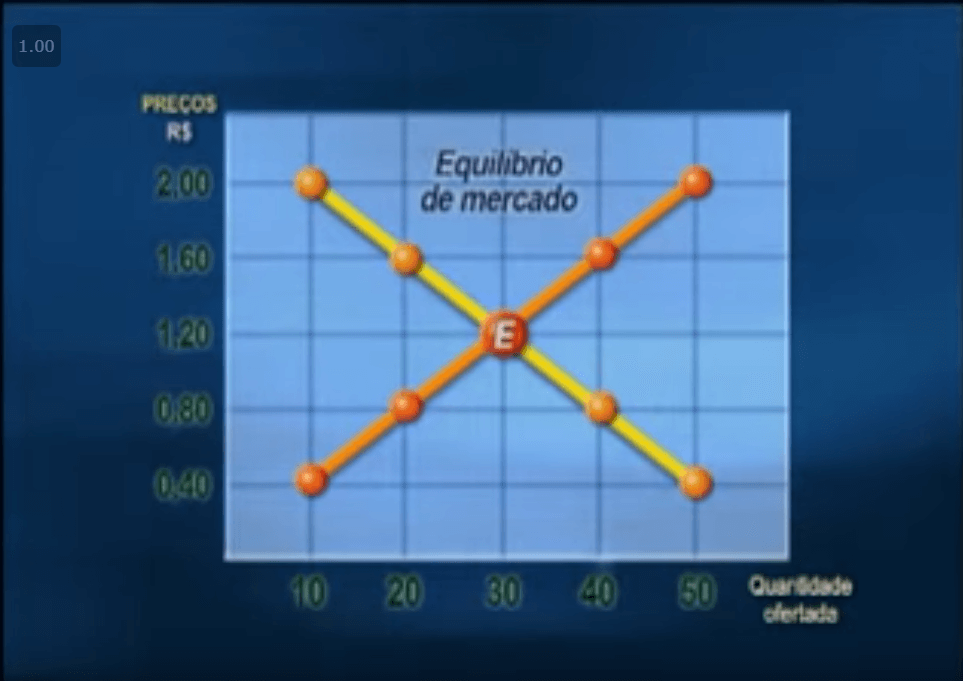

###### Tendencia do mercado

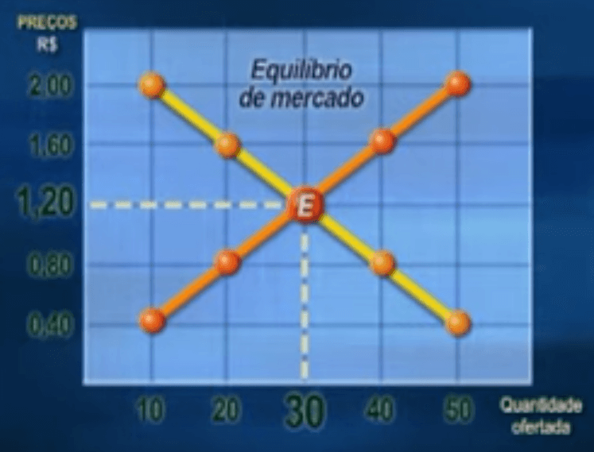

###### Excesso de oferta

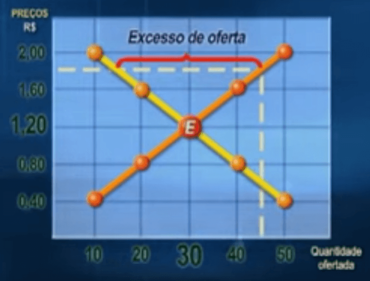

###### Excesso de demanda

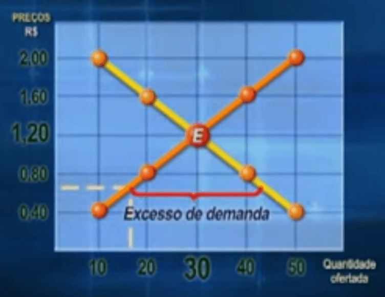

##### Concorrencia perfeita

modelo hipotetico

- muitos compradores e vendedores no mercado
- diversos vendedores com bens homogeneos
- livre entrada de firmas e compradores no mercado

##### Monopolio

empresa=monolio, se

- unica vendedora do seu produto
- produto nao tem substitutos proximos
- barreiras a entrada de outras empresas

#### [Testes sobre Oferta/Demanda/Mercados](https://feevale.blackboard.com/webapps/blackboard/content/launchAssessment.jsp?course_id=_88092_1&content_id=_1331632_1&mode=view)

Esse teste se relaciona com o comportamento dos mercados.

##### QUESTION 1

Ocorre um equilíbrio no mercado quando não há tendência para uma variação de preço.Isso acontece ao preço em que a quantidade demandada é___________ a  quantidade ofertada

- maior

- menor

- **igual** :heavy_check_mark:

- indefinida

##### QUESTION 2

A lei da demanda é válida para todo o mercado de remédios.

- True

- **False** :heavy_check_mark:

##### QUESTION 3

O preço de equilíbrio é, efetivamente, o único preço que harmoniza os interesses conflitantes dos produtores e dos consumidores.

- **True**​ :heavy_check_mark:

- False

##### QUESTION 4

Excesso de demanda se caracteriza como:

- quantidade demandada igual a ofertada

- quantidade demandada menor que a ofertada

- **quantidade ofertada menor que a demandada :heavy_check_mark:**

- quantidade ofertada maior que a demandada

##### QUESTION 5

Compõe o sistema de mercado: unidades familiares que são consumidores de bens e serviços; firmas (ou empresas) que são unidades que produzem bens e serviços; e. ainda, o governo cuja intervenção possibilita minimizar falhas de mercado e reduzir instabilidade por meio da gestão da política econômica.

- True :heavy_check_mark:

- **False** 

##### QUESTION 6

Qual o papel dos preços numa economia de mercado (capitalista)? 

- **o sistema de preços permite a coordenação das principais decisões, já que não há possibilidade de atender plenamente as infinitas necessidades humanas. As escolhas dos consumidores são delimitadas pela renda individual e pela disposição de pagar pelos bens e serviços, enquanto as firmas se pautam pela busca de maiores lucros.** :heavy_check_mark:

- o sistema de preços carece da coordenação das principais decisões, já que há possibilidade de atender plenamente as infinitas necessidades humanas. As escolhas dos consumidores são delimitadas somente pela renda individual, enquanto as firmas se pautam pela busca de maiores lucros.

- o sistema de preços permite a coordenação das principais decisões, já que não há possibilidade de atender plenamente as infinitas necessidades humanas. As escolhas dos consumidores são delimitadas pela renda individual e pela disposição de pagar pelos bens e serviços, enquanto as firmas não possuem interesse em considerar a produção e os custos para decidir seu processo.

- nenhuma das respostas

### Deslocamentos da curva da oferta

Esse video mostra como funciona o mecanismo de deslocamento da curva da oferta. Está em ingles, mas tem tradução para o português. O video apresenta conceitos que nao vamos trabalhar como o excedente do ofertante, portanto não se fixem nisso.

> OBS: Video sobre deslocamento da demanda não foi encontrado algum que pudesse auxiliar na condução do nosso aprendizado

#### A curvada oferta se desloca

<iframe width="560" height="315" src="https://www.youtube.com/embed/1RFDGo4YwxM" frameborder="0" allow="accelerometer; autoplay; encrypted-media; gyroscope; picture-in-picture" allowfullscreen></iframe>

##### Fatores importantes

- mudanças nos custos
  - Como inovações tecnologicas afetam os custos?
  - ----------Preço dos insumos ----------------------------
  - Impostos e taxas
  - expectativas
  - entrada e saida de produtores
  - Oportunidades

##### Aumento na oferta

Se uma tecnlogia diminuir o preço de produção, a oferta pelo produto ira aumentar

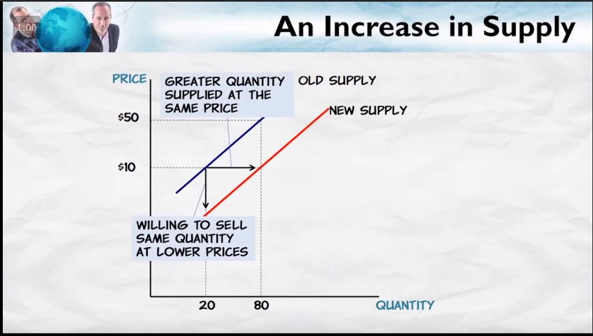

##### Aumento no preço dos insumos diminui a oferta

> custos altos = redução na oferta

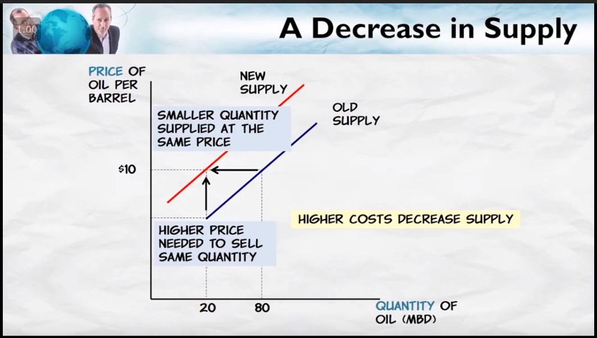

##### Imposto sobre produto

> Imposto sobre produto=aumento nos custos

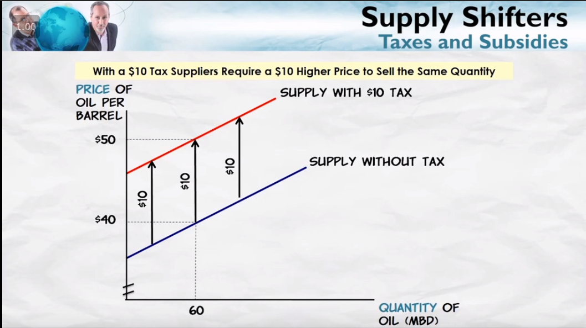

##### Subsidio

> Imposto sobre produto=redução nos custos

##### Expectativa

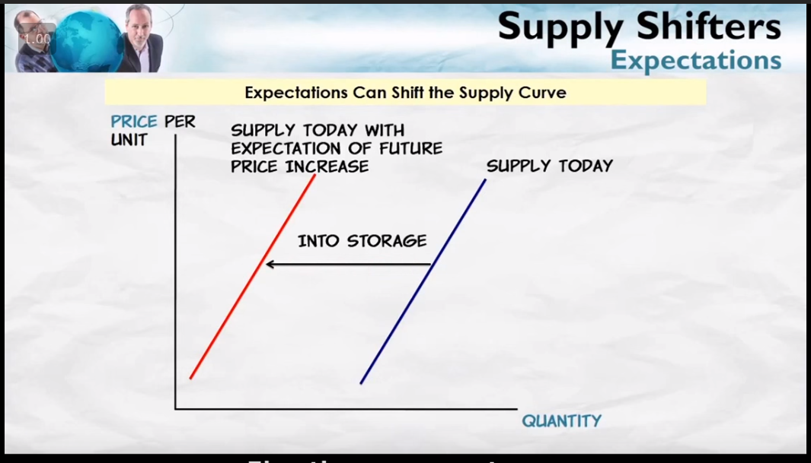

##### Entrada e saida de produtores

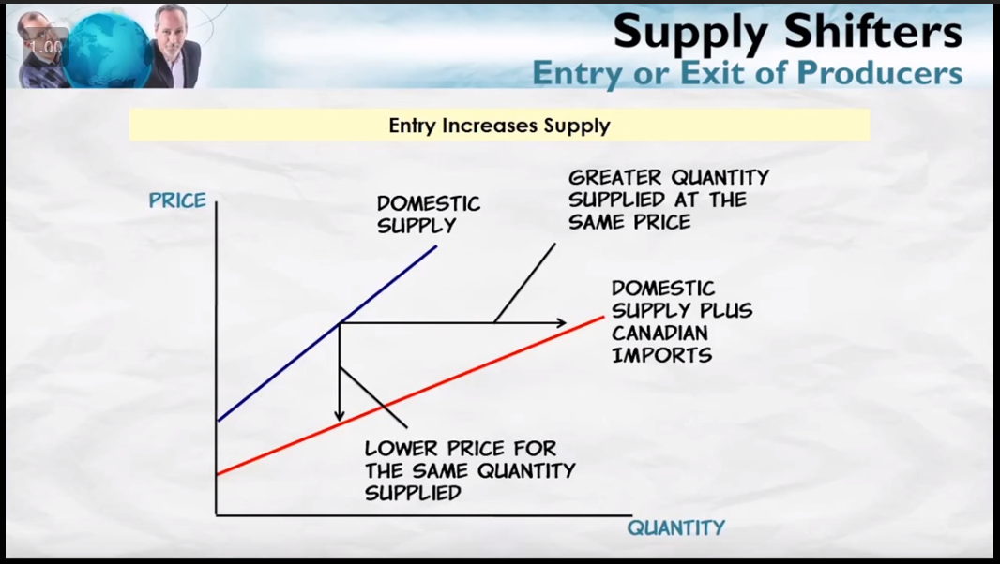

##### Oportunidades

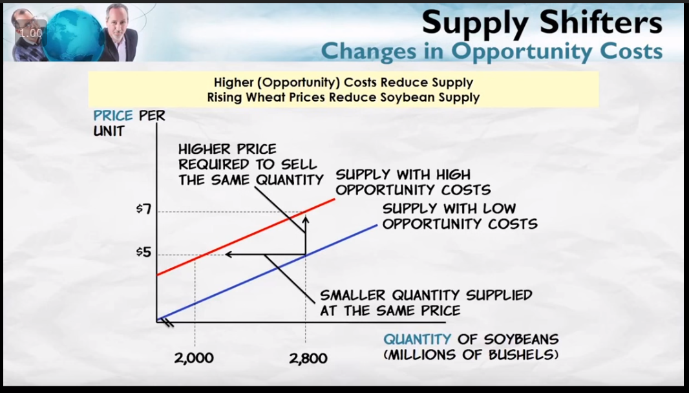


#### [Teste sobre Deslocamentos Oferta e Demanda](https://feevale.blackboard.com/webapps/blackboard/content/launchAssessment.jsp?course_id=_88092_1&content_id=_1331659_1&mode=view)

Esse teste tem relação ao conteúdo de deslocamento da curva da oferta e demanda.

##### QUESTION 1

O que acontece com o **mercado da industria farmacêutica** se a apropriação de **inovação tecnológica** for incorporada ao seu processo de **produção**?  Analise a resposta considerando o **deslocamento da curva da oferta**.


1. A curva da oferta tenderá para a **esquerda ou para a direita**?

A curva da oferta ira tendera a se deslocar para direita e para baixo, pois como seus custos abaixaram, a empresa tendem a vender a um preço mais baixo do que antes. aumentando a oferta do produto.

2. Diga qual a **tendência** do novo **ponto de equilíbrio**. O preço de equilíbrio irá aumentar ou diminuir?  As quantidades de equilíbrio serão maiores ou menores?

A tendencia no inicio é diminuir o preço do produto, mas com o custo de produção menor, as empresas tendem a produzir mais o produto, para vender mais no preço anterior, chegando a um novo ponto de equilibrio.

###### Resposta professora

Se há inovação tecnológica a curva da oferta se deslocará para a direita. 

O novo ponto de equilíbrio será: 

1. Preço menor.

2. Quantidades de equilíbrio maiores. 

### Elasticidade da demanda

Esse video está referenciado no "Forum - funcionamento dos mercados" na "temática - elasticidades".

Está em ingles, mas tem tradução para o português. A parte matemática não deve ser estudada, apenas os conceitos e relações.

<iframe width="560" height="315" src="https://www.youtube.com/embed/H63ZPPBLk54" frameborder="0" allow="accelerometer; autoplay; encrypted-media; gyroscope; picture-in-picture" allowfullscreen></iframe>

#### Anotações do video

##### A curva da demanda é elastica quando:

> Quando a quantidade esta mudando muito em resposta do preço

Quando um aumento no preço reduz bastante a quantidade demandada.

E, de maneira similar,  quando uma queda no preço aumenta bastante a quantidade demandada.

##### Demanda não elastica

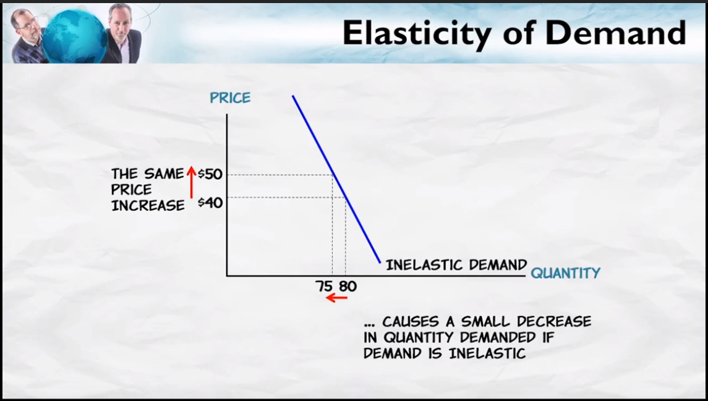

##### Demanda elastica

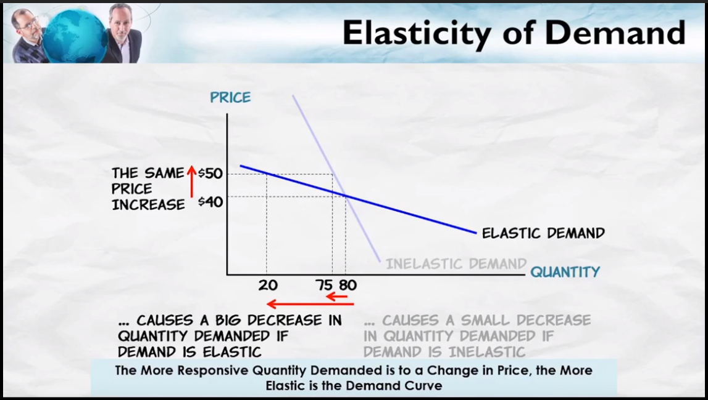

##### No caso de duas curvas

A curva mais horizontal sera a curva elastica.

##### Fatores determinates elasticidade da demanda

- **Disponibilidade de substitutos**

  > Quanto mais substitutos mais elastica a curva

- Horizonte temporal

- Categoria do produto

- Necessidade vs. luxo

  > Artigos de luxo são mais elasticos

- Tamanho da compra

  > Compra de tamanho maiores serão mais elasticas

| Menos elasticas            | Mais elasticas            |
| -------------------------- | ------------------------- |
| Poucos substitutos         | Muitos substitutos        |
| Curto prazo (Menor tempo)  | Longo prazo (Maior tempo) |
| Necessidades               | Luxo                      |
| Pequena parte do orçamento | Grande parte do orçamente |

#### [Teste sobre elasticidade](https://feevale.blackboard.com/webapps/blackboard/content/launchAssessment.jsp?course_id=_88092_1&content_id=_1331670_1&mode=view)

Esse teste se refere a sensibilidade ou elasticidades de comportamento da demanda face aos bens adquiridos no mercado. As explicações sobre o conteúdo está disponível no FORUM - funcionamento dos mercados/ TEMÁTICA - elasticidades. 

##### Question 1

A seguinte afirmação coloca que: 

```
“O petróleo, por ser a matéria prima básica da matriz energética mundial, é considerado um bem essencial. Sendo um bem essencial possuem pequena elasticidade-preço da demanda, isto é, são inelásticos em relação ao preço.”
```

Você concorda com tal afirmação? Justifique.

###### Resposta

Acredito que a frase correta seria "Sendo um bem essencial deixa de ter uma demanda elastica, isto é, são inelásticos em relação a quantidade demandada."

Mas parcialmetne sim, pois o pretroleo é um bem essencial e que possuem poucos substitutos, por isso sua demanda não é elastica.

###### Resposta professora

No curto prazo, o petróleo é um bem essencial para a demanda, portanto se o preço aumentar muito sua quantidade demandada cairá pouco,ou seja será inelastica ou insensível. Não há substitutos próximos que possam mudar rapidamente o comportamento da demanda. Já no longo prazo pode haver bens que possam substituir o petróleo e, portanto, as escolhas da demanda serão mais elásticas ou mais sensíveis.

### [Capítulos do Livro - cap. 1, cap 2, cap. 3](https://drive.google.com/open?id=1vVIQY64xMRX7HuXgQ5K003gUPvMerKtY)

## Temática - elasticidades ou sensibilidades dos mercados

Esse tópico nos conduzirá a entender que o comportamento da demanda muda dependendo da essencialidade do bem.

Nesse temática introduzirei o conceito e relações sobre as sensibilidades que os agentes tem conforme o tipo de bens que transacionam, mais especificamente, sob olhar da demanda.

Já observsarão que alcool gel se tornou um bem necessário hoje em dia? Pergunto a vocês: consideravam esse bem como algo que tivesse importância em nossas vidas enquanto consumidores? Eu mudei meu comportamento frente a esse bem... 

Ou seja, o tempo e a necessidade dos bens são fatores que interferem em nossas escolhas. Portanto, as quantidades consumidas por nós demandantes muda por esses fatores e a parte da economia que foca isso é o entendimentos sobre as sensibilidades ou elasticidades dos bens que são produzidos na economia.

Até esta altura, sabemos apenas que, quando aumenta o preço de um bem, a quantidade demandada deve cair, *coeteris paribus*. Ou seja, conhecemos apenas a direção, o sentido, mas não a magnitude numérica: isto é, se o preço aumenta em 10%, quanto cairá a quantidade demandada? O conceito de elasticidade fornece essa resposta numérica.

Elasticidade, em sentido genérico, é a alteração percentual em uma variável, dada uma variação percentual em outra, *coeteris paribus*. Assim, elasticidade é sinônimo de sensibilidade, resposta, reação de uma variável, em face de mudanças em outras variáveis.

------------------------------------

Trata-se de um conceito de ampla aplicação em Economia. Vejamos alguns exemplos:

### Exemplos da Microeconomia:

- elasticidade-preço da demanda: é a variação percentual na quantidade demandada, dada a variação percentual no preço do bem, *coeteris paribus*;

- elasticidade-renda da demanda: é a variação percentual na quantidade demandada, dada uma variação percentual na renda, *coeteris paribus*;

- elasticidade-preço cruzada da demanda: é a variação percentual na quantidade demandada, dada a variação percentual no preço de outro bem, *coeteris paribus*;

- elasticidade-preço da oferta: é a variação percentual na quantidade ofertada, dada a variação percentual no preço do bem, *coeteris paribus.*

### Exemplos da Macroeconomia:

- elasticidade das exportações em relação à taxa de câmbio: é a variação percentual nas exportações, dada a variação percentual da taxa de câmbio, *coeteris paribus*;

- elasticidade da demanda de moeda em relação à taxa de juros: é a variação percentual da procura de moeda, dada a variação percentual da taxa de juros, *coeteris paribus*.

Enfim, sempre quando tivermos uma relação entre variáveis em economia, podemos calcular a elasticidade.

 

### Temos dois tipos de entendimentos quanto as Elasticidades que são:

- a Elasticidade da Demanda e
- a Elasticidade da Oferta. 


*Vamos focar nosso estudo na Elasticidade da Demanda com as explicações a seguir nesse fórum**.* Entendendo a Elasticidade da Demanda o mesmo é válido para a Elasticidade da oferta. (Não consegui video para a Elasticidade da Demanda, apenas para a Elasticidade da Oferta que está disponível na temática D.)

### SOBRE A ELASTICIDADE DA DEMANDA, temos 3 tipos:

1. Elasticidade preço da demanda
2. Elasticidade preço cruzada da demanda (que diz respeito a demanda de bens que são substitutos ou complementares) e
3. Elasticidade renda da demanda. 

Veja que, as elasticidades da demanda são afetadas por essas três variáveis: preço, preço cruzada e renda


### ELASTICIDADE-PREÇO DA DEMANDA 

#### CLASSIFICAÇÃO DA DEMANDA, DE ACORDO COM A ELASTICIDADE-PREÇO

De acordo com a **ELASTICIDADE-PREÇO**, a demanda pode ser classificada como elástica, inelástica ou de elasticidade-preço unitária.

**a) Demanda elástica:** Significa que, dada uma variação percentual, por exemplo, de 10% no preço, a quantidade demandada varia, em sentido contrário, em 15%, *coeteris paribus*. Isso revela que a quantidade é bastante sensível à variação de seu preço.

**b) Demanda inelástica:** Nesse caso, os consumidores são pouco sensíveis a variações de preço: uma variação de, por exemplo, 10% no preço leva a uma variação na demanda desse bem de apenas 4% (em sentido contrário).

**c) Demanda de elasticidade unitária:** Se o preço aumenta em 10%, a quantidade cai também em 10%, *coeteris paribus.*

#### FATORES QUE AFETAM A ELASTICIDADE-PREÇO DA DEMANDA

São quatro os fatores que explicam o valor numérico da elasticidade-preço da demanda, a saber: disponibilidade de bens substitutos, essencialidade do bem, importância relativa do bem no orçamento e o horizonte de tempo.

*Disponibilidade de bens substitutos* Quanto mais substitutos, mais elástica a demanda, pois, dado um aumento de preços, o consumidor tem mais opções para “fugir” do consumo desse produto. Ou seja, trata-se de um produto cujos consumidores são bastante sensíveis à variação de preços.

*Essencialidade do bem* Quanto mais essencial o bem, mais inelástica sua procura. Esse tipo de bem não traz muitas opções para o consumidor “fugir” do aumento de preços. Exemplos clássicos: sal e açúcar.

*Importância relativa do bem no orçamento do consumidor* A importância relativa, ou peso do bem no orçamento, é dada pela proporção de quanto o consumidor gasta no bem, em relação a sua despesa total. Quanto maior o peso no orçamento, maior a elasticidade-preço da procura. O consumidor é muito afetado, por alterações nos preços, quanto mais gasta com o produto, dentro de sua cesta de consumo. Por exemplo: •carne: *elasticidade* alta; •fósforo: *elasticidade* baixa.

*Horizonte de tempo* Dependendo do horizonte de tempo de análise, um intervalo de tempo maior permite que os consumidores de determinada mercadoria descubram mais formas de substituí-la, quando seu preço aumenta. Ou seja, a elasticidade-preço da procura tende a aumentar no tempo.

#### RELAÇÃO ENTRE RECEITA TOTAL DO VENDEDOR (OU DISPÊNDIO TOTAL DO CONSUMIDOR) E ELASTICIDADE-PREÇO DA DEMANDA

A receita total do vendedor (*RT*), que corresponde ao próprio dispêndio ou gasto total dos consumidores, é dada por:

```
RT = preço unitário × quantidade comprada do bem
RT = p.q
```

Seria possível conhecermos, *a priori*, o que deve acontecer com a receita total *RT*, quando varia o preço de um bem? A *RT* aumenta, diminui ou permanece constante?

A resposta vai depender da elasticidade-preço da demanda.

a) se for *elástica* ⇒ ou seja, a variação percentual da quantidade demandada é maior  que a variação percentual do preço, a *RT* segue o sentido da quantidade, isto é, prepondera a variação da quantidade sobre a variação do preço;

– se *p* aumentar, *a quantidade* cairá, então a *RT* diminuirá.

 E O INVERSO É VERDADEIRO

NESSE CASO, OS BENS SÃO SENSÍVEIS. NORMALMENTE SÃO BENS SUPERFLUOS.

 

b) se for *inelástica* ⇒ ou seja, |variação percentual *é menor que a* variação percentual, prepondera o sinal do preço:

– se *p* aumentar, *a quantidade* cairá, e a *RT* aumentará;

E O INVERSO É VERDADEIRO

NESSE CASO, OS BENS SÃO INSENSÍVEIS. NORMALMENTE SÃO BENS ESSENCIAIS.


Um exemplo desse fato encontra-se na maior parte dos produtos agrícolas, principalmente alimentos, bem como o barril de petróleo, que apresentam demanda normalmente inelástica, por serem em sua maioria produtos essenciais.

Contudo, há um limite para o aumento do preço, pois, se esse aumento for muito elevado, pode acabar caindo no ramo elástico da demanda, e o consumidor tenta substituir o produto, ou reduz seu consumo, o que redundaria em queda da Receita Total dos produtores.

### ELASTICIDADE-PREÇO CRUZADA DA DEMANDA

É a variação percentual da quantidade demandada do bem *x*, dada uma variação percentual no preço do bem *y*, coeteris paribus. Nessa sensibilidade os bens podem ser substitutos ou concorrentes.

**Bens substitutos ou concorrentes**: o consumo de um bem substitui o consumo do outro. O aumento do preço de um bem *y* aumenta o consumo de bem *x*, *coeteris paribus*. Ex: açúcar e adoçante artificial

**Bens complementares**: são bens consumidos em conjunto. O aumento do preço de um bem *y* diminui a demanda de *x*, *coeteris paribus*. Ex: carro e combustível

### ELASTICIDADE-RENDA DA DEMANDA

É a variação percentual da quantidade demandada, dada uma variação percentual da renda do consumidor, coeteris paribus. Nesse caso devemos saber os conceitos do que sejam um bem superior, normal, inferior e de consumo saciado.

**bem superior (ou bem de luxo)**: dada uma variação da renda, o consumo varia mais que proporcionalmente; 
**bem normal**: o consumo aumenta quando a renda aumenta;    
**bem inferior**: a demanda cai quando a renda aumenta; carne de segunda, roupas rústicas etc.; 
**bem de consumo saciado**: variações na renda não alteram o consumo do bem. Ou seja, a variável renda não é importante para explicar o comportamento da demanda desse bem. Basicamente, são os casos da demanda de alimentos básicos, como açúcar, sal, arroz, que tendem a ter uma participação cada vez menor no orçamento do consumidor, à medida que sua renda aumenta. Isso também ocorre em qualquer outro tipo de bem ou serviço no qual o consumo não é afetado (é neutro) quando a renda do consumidor se altera. Ou seja, a variável renda não é significante para explicar o comportamento da demanda nesse mercado. 

-----------------------------------------------------------

### Conclusões e anotações

PORTANTO, ao lado da elasticidade-preço da demanda, a elasticidade-renda é o conceito de elasticidade mais difundido. Normalmente, a elasticidade-renda da demanda de produtos manufaturados é superior à elasticidade-renda de produtos básicos, como alimentos. Isso porque, quanto mais elevada a renda, a tendência é aumentar mais o consumo de produtos, como, por exemplo, eletrônicos, automóveis, relativamente aos alimentos (cujo consumo tem um limite fisiológico). A elasticidade-renda é muito importante para o planejamento empresarial, pois é um importante parâmetro para projetar suas vendas, de acordo com o crescimento da renda do país.

 

**Assintam o vídeo sobre Elasticidade da demanda.** *Nosso estudo irá focar nas relações sobre elasticidades. Portanto as fórmulas que aparecem no vídeo desconsiderem!*

Deixei o vídeo na temática D também.

<iframe width="560" height="315" src="https://www.youtube.com/embed/H63ZPPBLk54" frameborder="0" allow="accelerometer; autoplay; encrypted-media; gyroscope; picture-in-picture" allowfullscreen></iframe>

**Leiam a notícia sobre bens substitutos**

https://exame.abril.com.br/negocios/com-escassez-de-alcool-gel-venda-de-lenco-antisseptico-da-freeco-dispara/

**Leiam a notícia sobre essencialidade**

http://patrocinados.estadao.com.br/abihpec/2017/05/26/como-o-alcool-gel-se-tornou-essencial-na-nossa-vida/

**As informações referentes a essa temática foram subtraídas do Cap. 3 do Vasconcellos (Economia Micro e Macro)**