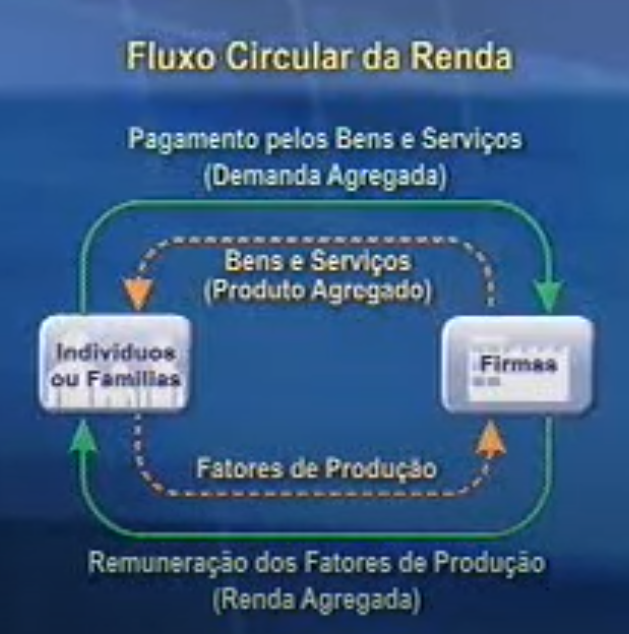
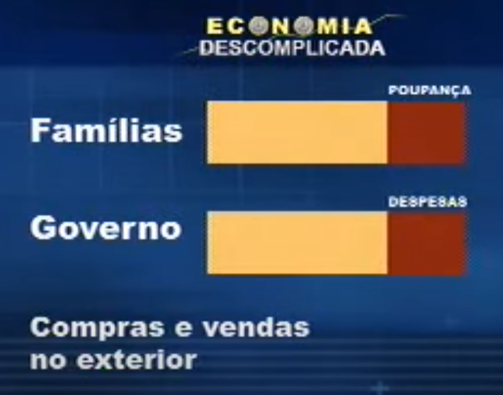
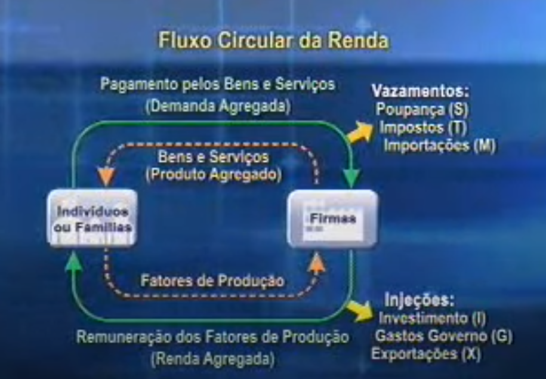

# Aula VIII

## Resumo

Seque o roteiro da aula de hoje, dia 22 de abril. Todos os arquivos estão na “temática D”:

1. Deixei os **CAPÍTULOS DO LIVRO DO VASCONCELLOS** que tratam de macroeconomia e medidas da atividade econômica e um arquivo de notícia sobre o Brasil. Esses materiais vão ser utilizados para a aula de hoje para explicar o conteúdo.
2. Deixei 4 **VÍDEOS** sobre macroeconomia para todos assistirem. Os vídeos são bem didáticos o que facilitará o entendimento de vocês.
3. Deixei um **TESTE** sobre macroeconomia inicial para todos fazerem!
4. Deixei um **TRABALHO DE PESQUISA** para todos fazerem e apresentarem na próxima aula. *Cada aluno fará uma intervenção no Collaborate, ou por escrito no Chat ou oral pelo microfone!*
5. Abri um **“FÓRUM DE DISCUSSÃO PARA DÚVIDAS”** quanto a essa parte inicial da macroeconomia e crescimento caso tenham dúvidas ao longo do período de estudo.

Estaremos **hoje no Collaborate as 19:30**, certo? Aguardo todos vocês lá!

**Amo** 😊 quando vocês se posicionam sobre algum fato real ou teórico! Essas intervenções são importantes para a construção do saber de vocês! Saber desenvolvido com argumentos acadêmicos (científicos) somados as vivências pessoais e profissionais!

## Materiais

### Videos
#### Esse video se refere a introdução a macroeconomia. 

Ver até 9min04seg.

<iframe width="560" height="315" src="https://www.youtube.com/embed/ePRTZ4QRWdo" frameborder="0" allow="accelerometer; autoplay; encrypted-media; gyroscope; picture-in-picture" allowfullscreen></iframe>

##### Objetivo da macroeconomia

- renda nacional
- nivel de emprego
- nivel dos preços
- consumo
- poupança
- exportações
- investimento totais

##### PIB (produto agregado)

somatorio de todos os bens produzidos pela economia

##### Preço produto agregado (nivel geral dos preços)

media de todos os preços produzidos

##### Metas que a politica macroeconomica precisa visar

- alto nivel de emprego
  - com a quantidade de desemprego menor, melhor o pib
- estabilidade de preços
  - inflação gera distorções em todo sistema economico
- distribuição de renda socialmente justa
- crescimento economico

##### Como atingir essas metas?

O governo deve atuar sobre:

- capacidade produtiva
- despesa da sociedade

##### Instrumentos de politica utilizados para isso

- politica fiscal
  - decisões dos governos sobre gastos x tributos
  - os efeitos podem ser sentidos:
    - variação dos gastos publicos em consumo e investimento
    - redução de impostos
    - 
- politica monetaria
  - decisções do governo sobre a quantidade de:
    - moeda
    - credito
    - juros
  - principal instrumento
    - taxa de juros
    - inflação baixa
- politica cambial e comercial
  - incentivo as exportações
  - desestimulos as importações

##### Como funciona os modelos macroeconomicos

- 2 agentes

  - Familia (todos individuos da sociedade)
    - possuem os fatores de produção:
      - Terra
      - Trabalho
      - Capital
  - Firmas (produzem bens e serviços)
    - utilizam os fatores de produção

- Para que as firmas utilizem os fatores de produção elas precisam pagar por eles

- Remunerações pagas pela utilização dos fatores de produção

  - Salarios (w)

    > remuneração do fator trabalho

  - Juros (j)

    > remuneração do capital monetario

  - Lucros (l)

    > remuneração do risco empresario

  - Alugueis (a)

    > remuneração do capital fisico

- Essas remunerações (w,j,l,a) constituem a renda das familias (y)

##### Produto agregado

soma de bens e serviços produzidos na economia em determinado periodo de tempo

##### Demanda agregada

despesa da familia com bens e serviços produzidos pelas firmas

##### Fluxo circular da renda

##### empresas investem em bens de capital

##### familias podem não gastar todos seus bens

isso é, podem poupar uma parte

##### Fluxo circular da renda com vazamentos e injeções

##### Investimento

Gastos que visam a aumentar a capacidade produtiva da economia

##### Poupança

Parcela da renda que não foi gasta com consumo

##### Identidade macroeconomica basica

produto agregado (Y) = demanda agregada (DA) = renda agregada (Y)

> faz com que o fluxo circular da renda esteja sempre equilibrado

##### Demanda global agregada

Consumo agregado (C) + Investimento agregado (I) + Gastos governamentais (G) + Exportações (X)

##### Oferta agregada global

Produto agregado interno (Y) + importações (M)

##### Demanda agregada interna ou produto agregado interno

Y = C + I + G + X - M

#### Esse video é do IBGE referente a crescimento.

<iframe width="560" height="315" src="https://www.youtube.com/embed/lVjPv33T0hk" frameborder="0" allow="accelerometer; autoplay; encrypted-media; gyroscope; picture-in-picture" allowfullscreen></iframe>

#### Esse video é do IBGE sobre desenvolvimento sustentável.

<iframe width="560" height="315" src="https://www.youtube.com/embed/9v5aSqJ_bf8" frameborder="0" allow="accelerometer; autoplay; encrypted-media; gyroscope; picture-in-picture" allowfullscreen></iframe>

#### Esse video é do IBGE sobre redução das desigualdades.

<iframe width="560" height="315" src="https://www.youtube.com/embed/DGLMC3Mcygc" frameborder="0" allow="accelerometer; autoplay; encrypted-media; gyroscope; picture-in-picture" allowfullscreen></iframe>

### Test
Teste - introdução a macro e medidas da economia
Esse teste contem 5 questões de multipla escolha. 

#### QUESTION 1

O PIB não deve ser confundido com o bem estar nacional, embora estejam fortemente relacionados. Qual das seguintes alternativas abaixo estão corretas:

I-   O PIB ignora muitas transações feitas fora do mercado formal de trabalho

II-  O PIB ignora os ativos segunda mão

III- O PIB ignora os ativos financeiros , como ações e títulos

IV- O PIB incorpora os artigos não vendidos, mas produzidos durante um determinado período

V- O PIB incorpora os custos ecológicos

- a) II, III e IV

- b) II, III, IV e V

- c) I, II, III e IV

- d) I, II, III, IV e V

#### QUESTION 2

Marque com C (correta  ) ou com I (incorreta) as seguintes questões , e logo após marque a alternativa certa.

I) (   ) O PNB é o valor total de renda recebida pelos residentes domésticos num determinado período de tempo. Sempre que os fatores domésticos de produção receberem mais do que os fatores estrangeiros de produção que trabalham na economia interna, o PIB será maior que o PNB.

II) (   ) Para realizar comparações significativas no cálculo do produto é fundamental saber se as alterações das variáveis macroeconômicas refletem alterações nos preços dos bens ou alterações no volume físico dos mesmos.

III) (   ) A macroeconomia é o ramo da economia que estuda o comportamento agregado dos agentes econômicos, e sua base se encontra fundamentada na microeconomia.

- a) alternativas I, II e III corretas

- b) alternativas I, II e III incorretas

- c) alternativa I correta, II correta, e III incorreta

- d) alternativa I incorreta, II correta e III correta

#### QUESTION 3

A expressão economia informal é usualmente empregada para indicar a parcela das atividades não contabilizadas no PIB. Além dessa economia subterrânea não fazer parte do PIB também podemos excluir de seus cálculos:

- I) os custos ecológicos provocados na natureza pelas fábricas.

- II) a fabricação de veículos pela empresa FIAT no ano corrente.

- III) os insumos intermediários.

a) I e II corretas

b) I e III corretas

c) II e III corretas

d) Todas as alternativas corretas

e) Todas as alternativas incorretas

#### QUESTION 4

Relacione a 1. coluna com a 2ª.coluna:

a. bens finais
b. bens de capital
c. investimento agregado
d. despesa nacional
e. depreciação

(     ) os que são vendidos para consumo ou utilização final.

(     ) gasto com os agentes econômicos com o produto nacional.

(     ) utilizados na fabricação de outros bens , mas que não se desgastam totalmente no processo produtivo.

(     ) aumento da capacidade produtiva da economia , num dado período.

(     ) consumo do estoque de capital físico em determinado período.

- a) e, b, a, d, c

- b) c, d, e, b, a

- c) d, b, c, e, a

- d) b, c, e, a, d

- e) a, d, b, c, e

### Pesquisa - crises macroeconômicas
Fazer um comparativo da Grande Depressão de 1929, Crise de 2008 e Crise atual pontuando o entendimento de como aconteceu cada crise e quais as consequências econômicas mundiais, conforme modelo a seguir.

1.       Grande depressão de 1929: Qual a causa e quais foram as consequências econômicas mundiais.

Colocar as referências bibliográficas da onde tirou as informações. Colocar fontes confiáveis capazes de serem colocadas em um trabalho científico.

2.       Crise de 2008: Qual a causa e quais foram as consequências econômicas mundiais.

Colocar as referências bibliográficas da onde tirou as informações. Colocar fontes confiáveis capazes de serem colocadas em um trabalho científico.

3. Crise de 2020: Qual a causa e quais as tendências dos efeitos para as economias mundiais.

 Colocar as referências bibliográficas da onde tirou as informações. Colocar fontes confiáveis capazes de serem colocadas em um trabalho científico.

## Aula => Macroeconomia

Vamos aprender sobre:

- Renda
- Investimento
- Politica

### FUNDAMENTOS DE TEORIA E POLÍTICA ECONÔMICA

#### Estabilidade de preços

- equilibrio nos preços
- planejamento
- controlar inflação
- "a inflação é o imposto sobre o pobre"

#### Distribuição equitativa de renda

#### Equilibrio externo

#### Inter relações e conflitos de objetivos

> dilemas de politica economica

--------------------------------

### Contabilidade Social

**O que torna um pais rico?**

É a capacidade produtiva dele

**O que é riqueza?**

Na questão da economia, riqueza esta associada a produção de um pais

**Tres oticas de mensuração:** produto, despesa e renda

Conceito de poupança

Observações sobre investimentos

**Formula final da despesa nacional**: 

### Anotações

- fins da macroeconomia
  - estudar o emprego, produção, preços, setor externo
- politica = meios da macroeconomia
  - forma que os gestores usam os canais para que consigam atingir as suas metas
- emprego e produção tem uma via de mão dupla
- Produto nacional != Produto interno
- produto nacional = renda nacional = despesa nacional
- setor publico tambem faz parte do PIB

tipos politicas:

- fiscal
- monetaria
- cambial
- rendas