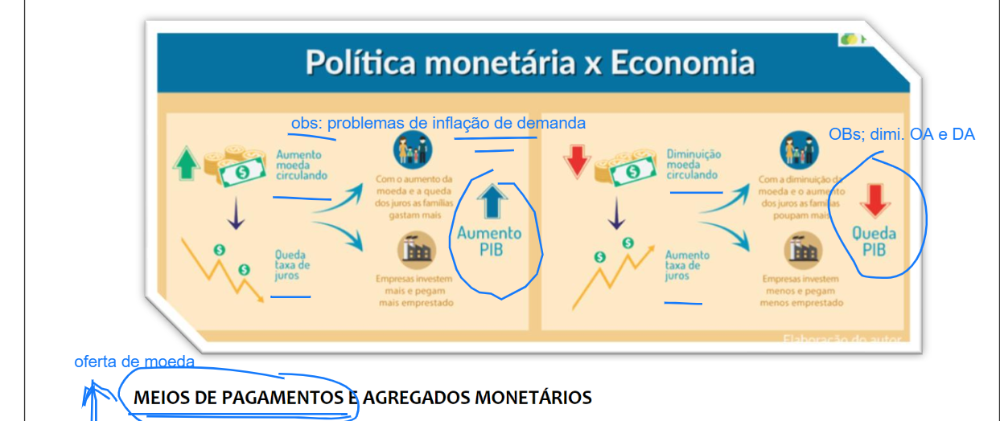
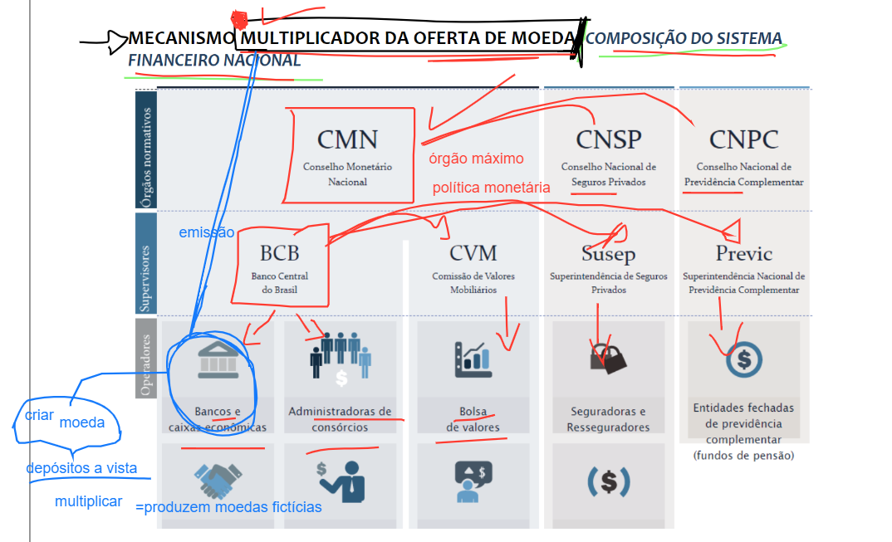
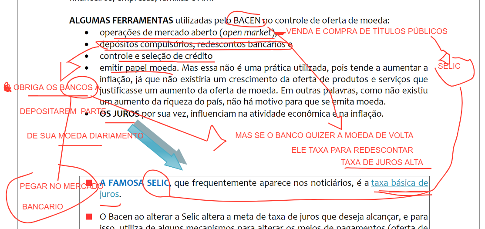

# Aula XIII

## Dividas do pais

http://www.tesouro.fazenda.gov.br/apresentacao-para-investidores

## Politicas monetarias

- aumento moeda circulando 
  - queda taxa de juros
  - aumento no pib
- diminuição da moeda circulando 
  - aumento taxa de juros
  - queda no pib

### mecanismo multiplicador da oferta da moeda 

### selic = taxa basica de juros

### Resumo aula

- **Vídeos bem didáticos sobre política monetária, instrumentos e instituições!**

vídeo - O que é moeda?

https://www.youtube.com/watch?v=9xaKZf-X4II

Vídeo - O que é banco central?

https://www.youtube.com/watch?v=Ziuo4WnD2m4

Vídeo – O que é CMN?

https://www.youtube.com/watch?v=9B8RdQtkGP8

Vídeo – O que é CVM?

https://www.youtube.com/watch?v=P_OvBc8RXMg

Vídeo - O que são Juros?

https://www.youtube.com/watch?v=P-sWy6rdgAE

Vídeo – O que são juros negativos?

https://www.youtube.com/watch?v=DzqQEBpHdeA

Video – O que é o Copom?

https://www.youtube.com/watch?v=89zQrmJO3YM

Vídeo - O que é taxa Selic?

https://www.youtube.com/watch?v=DGmnbgZF2Qo

Vídeo - O que é política monetária?

https://www.youtube.com/watch?v=Q5se92y1eds

- **Navegue na pagina do Banco Central!**

https://www.bcb.gov.br/

- **Ata da última reunião do Copom**

https://www.bcb.gov.br/content/copom/atascopom/Copom230-not20200506230.pdf

- **Notícia**

https://agenciabrasil.ebc.com.br/economia/noticia/2020-05/copom-reduz-selic-para-325-ao-ano-para-conter-impacto-de-pandemia

- **Composição do Sistema Financeiro Nacional**

https://www.bcb.gov.br/pre/composicao/composicao.asp?frame=1

- **implementação da PM para combater a inflação/ slides de 2006**

https://www.bcb.gov.br/pec/appron/Apres/20060221PR-Regime%20de%20metas%20para%20a%20infla%E7%E3o.pdf

## Anotações

- moeda server para especular