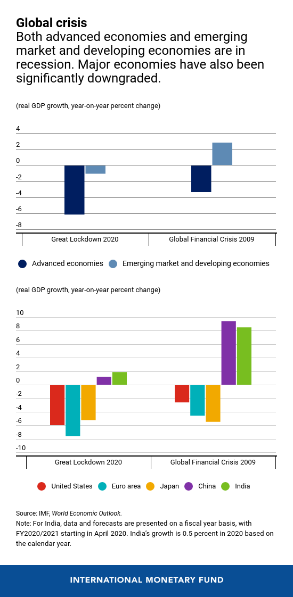
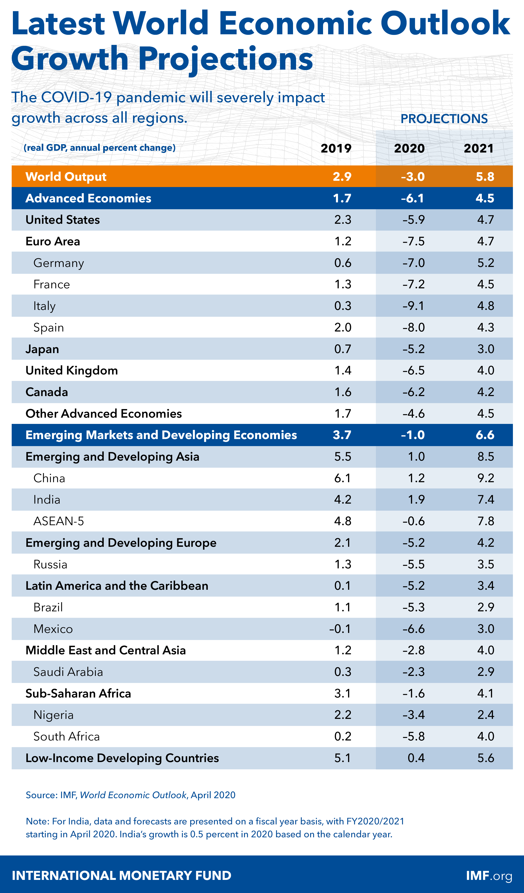

# Crises macroeconômicas

**Fazer um comparativo da Grande Depressão de 1929, Crise de 2008 e Crise atual** pontuando o entendimento de como aconteceu cada crise e quais as consequências econômicas mundiais, conforme modelo a seguir.

Qual a causa e quais foram as consequências econômicas mundiais.

> Colocar as referências bibliográficas da onde tirou as informações. Colocar fontes confiáveis capazes de serem colocadas em um trabalho científico.

## Grande depressão de 1929

### Causa

**Quebra da bolsa de Nova Iorque**

Houve um aumento na produção, porem não houve aumento salariais, assim o mercado não teve como absolver a quantidade de mercadorias que eram produzidas. Houve um aumento nos investimento na bolsa de valores devido ao boom econômico e a alta especulação monetária.

Essa propriedade não estava em bases solidas. A demanda da massa não podia acompanhar a produtividade em rápido crescimento do sistema industrial resultando na superprodução e especulação. Que, no fim, provocou o colapso

### Consequências econômicas mundiais

#### Alto índice de desemprego

- EUA: 27%
- Grã-Bretanha: 23%
- Bélgica: 23%
- Suécia: 24%
- Áustria: 29%
- Noruega: 31%
- Dinamarca: 32%
- Alemanha: 44%

#### Falência de várias empresas

Tanto do setor industrial quanto do setor agrícola

#### Pobreza

A Grande Depressão causou pobreza geral nos Estados Unidos e em diversos países do mundo.

#### Brasil

Em 1929, o país exportava praticamente apenas um produto, o café, e as boas colheitas já tinham feito que o preço do produto tivesse uma queda.  Como não era um produto de primeira necessidade, vários importadores diminuíram as compras significativamente.  Em janeiro de 1929 a saca de café era cotada a 200 mil réis. Um ano depois, seu preço era 21 mil réis. Chegou a ocorrer a destruição de 78,2 milhões de sacas de café.

### Solução

As soluções para a crise foram aplicadas, principalmente, por F. Delano Roosevelt e sua política do New Deal (Novo Acordo), que procurou replanejar a economia americana.

1. Promoveu obras publicas

2. Promoveu benefícios sociais

   - Salario mínimo

   - Seguro desemprego

3. Interveio na economia para:

   - Evitar queda nos preços
   - Controlar a produção

FONTE: https://brasilescola.uol.com.br/historiag/crise29.htm

## Crise de 2008

> Fez o governo dos EUA repensar sobre o livre mercado

### Causa

**Bolha imobiliária nos Estados Unidos**

A crise de 2008 ocorreu devido a uma bolha imobiliária nos EUA, causada pelo aumento nos valores imobiliários. Os bancos ofereciam créditos sem uma analise se quem estava pegando o empréstimo poderia pagar. E com o tempo as pessoas que haviam pego o empréstimo, não conseguiam mais pagar a divida e acabavam vendendo o imóvel. Porem, nesse momento as taxas de juros haviam aumentado e as pessoas não queriam mais comprar imóveis pelo preço original e ai os vendedores para não ficar com a divida, tiveram que baixar o preço dos imóveis. Mas nesse momento os vendedores tinham menos dinheiro para pagar as parcelas e os bancos acabaram sem dinheiro para realizar suas operações.

### Consequências econômicas mundiais

- quebra do tradicional banco americano Lehman Brothers e a recusa do governo norte-americano de salvá-lo
- bolsas ao redor do mundo entraram em colapso
- governo americano teve que salvar a seguradora AIG
- Citigroup, Northern Rock, Swiss Re, UBS e Société Générale declararam enormes prejuízos nos balanços
- renda coletiva das famílias norte-americanas teve uma queda de mais de 25% entre 2007 e 2008
- S&P 500 caiu cerca de 45%
- O desemprego subiu para 10,1%

#### Europa

- Grécia teve de contratar empréstimos do Fundo Monetário Internacional e implementar cortes de gastos, reduzindo direitos trabalhistas, folha salarial dos servidores públicos e realizando privatizações
- Na Grécia: aumento do nível de desemprego, diminuição da renda, diminuição dos direitos dos trabalhadores

#### Brasil

- forte queda no índice BOVESPA
- aumento no preço do dólar
- redução nas previsões para o PIB do país
- prejuízo milionário na Sadia

### Solução

*“Eu acredito muito na livre iniciativa, por isso o meu instinto natural é se opor a intervenção do governo. Eu acredito que as empresas que tomam más decisões devem sair do mercado. Em circunstâncias normais, eu teria seguido esse curso. Mas estas não são circunstâncias normais. O mercado não está funcionando corretamente. Houve uma perda generalizada de confiança, e grandes setores do sistema financeiro da América estão em risco”. (George W. Bush, 2008)*

- Programa de Alívio de Ativo Problemático
- intervenção do governo dos EUA

FONTE: https://www.politize.com.br/crise-financeira-de-2008/

## Crise de 2020

### Causa

**Provocada pela pandemia do novo coronavírus COVID-19**

Causada devido as medidas de isolamento social para conter a doença. Com o isolamento as pessoas pararam de consumir parando o mercado e trazendo diversos impactos econômicos.

### Consequências econômicas mundiais

- Mercado de ações americano despencou 20%
- A taxa de desemprego pode disparar para acima de 20%

- Projeções da economia

FONTE: https://blogs.imf.org/2020/04/14/the-great-lockdown-worst-economic-downturn-since-the-great-depression/

#### Brasil

- Taxa de desemprego pode chegar a 15%
- Selic em 3%
- Mercado de trabalho no Brasil, despencou de 82,6 em março, para 39,7 pontos, em abril
- PIB de 2020 pela SPE é de -4,7%

FONTE: https://oglobo.globo.com/economia/mais-da-metade-dos-paises-do-mundo-deve-terminar-2020-com-desemprego-maior-do-que-na-crise-de-2008-24422358

### Solução

- https://www.gov.br/economia/pt-br/centrais-de-conteudo/publicacoes/notas-informativas/2020/nota-uma-ana-lise-da-crise-gerada-pela-covid19.pdf
- https://g1.globo.com/economia/noticia/2020/05/10/crise-e-coronavirus-v-u-ou-w-os-3-cenarios-possiveis-para-a-recuperacao-economica-apos-a-pandemia-de-covid-19.ghtml