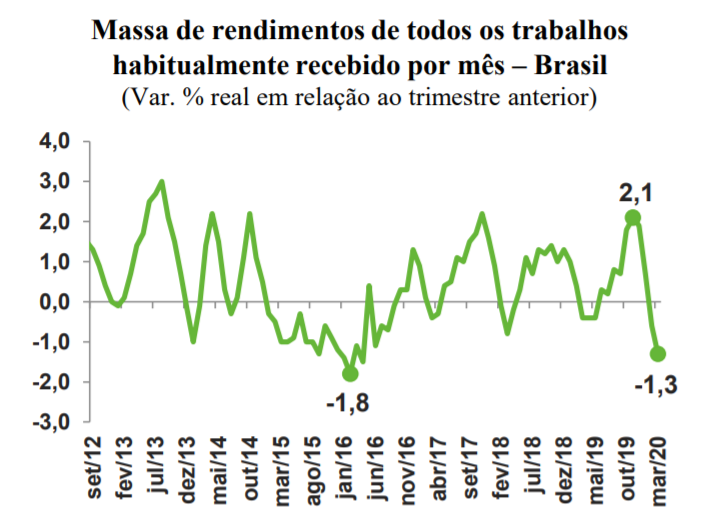

# ATIVIDADE SOBRE PRODUTO E RENDA NACIONAL

## Atividade I

Acessar a notícia seguinte, a nível internacional: 

https://g1.globo.com/economia/noticia/2020/05/06/zona-do-euro-tera-recessao-recorde-e-inflacao-vai-desaparecer-diz-preve-comissao-europeia.ghtml

Após, faça uma **análise** incluindo **de que forma** essa projeção **irá afetar** os componentes da **oferta e demanda agregada**. 

Lembre que: 

```
OA = DA 
PIB = C + I + G + X - M 
```

### Analise

É apresentado na noticia que devido ao COVID-19, a zona do euro ira contrair a uma taxa recorde de 7,7%, isso acontece devido as paralizações que aconteceram ou que estão acontecendo na indústria e no comercio, que visam diminuir o contato das pessoas, evitando a disseminação do vírus.

**inflação** irá quase desaparecer, enquanto a dívida pública e o déficit orçamentário vão disparar

**queda dois décimos** maior do que a projetada pelo Fundo Monetário Internacional (FMI)


depois de **crescer 1,2%** em 2019, o **PIB** das 19 economias da zona do euro em seu conjunto devem ter uma **contração de 7,7%** este ano

**crescimento** do **PIB em 2021, a 6,3%**


**taxa de inflação** irá desacelerar a **0,2% em 2020**

**acelerando a 1,1%** no próximo ano


O **investimento irá despencar 13,3%** este ano


Os esforços para sustentar as economias vão ampliar os déficits orçamentários na zona do euro para 

8,5% do PIB este ano

de 0,6% no ano passado, 

indo a 3,5% em 2021.


dívida publica da zona do euro saltará a 102,7% do PIB este ano 

de 86% no ano passado, 

recuando a apenas 98,8% em 2021.


O PIB da Grécia deve sofrer a maior contração, de 9,7%, 

com a Itália recuando 9,5% 

e a Espanha, 9,4%.

O PIB da Alemanha, a maior economia da Euro zona, cairá 6,5% em 2020, segundo a projeção.


Atividade empresarial quase paralisa em abril

O PMI Composto final do IHS Markit para a zona do euro despencou a 13,6 em abril 

de 29,7 em março, a leitura mais fraca desde que a pesquisa começou em 1998.


O PMI do setor de serviços recuou a 12,0 em abril 

de 26,4 em março, 

ligeiramente acima da preliminar de 11,7.

## Atividade II

Acessar a notícia seguinte, a nível nacional, o “INFORME ECONÔMICO No. 17/2020” feito pela FIERGS (Federação das Indústrias do Estado do Rio Grande do Sul) através do link: 

https://www.fiergs.org.br/numeros-da-industria/informe-economico 

Ler apenas os seguintes itens do INFORME:

- Impactos da pandemia na indústria gaúcha 
- Impossibilidade de procurar emprego segurou a taxa de desemprego 
- Primeiras consequências na renda já começaram a aparecer 

**Após, faça uma análise** pontuando os componentes da demanda e oferta agregada que esse informe ressalta. 

Lembre que: 

```
OA = DA 
PIB = C + I + G + X - M 
```

### Analise Impactos da pandemia na indústria gaúcha

e a crise desencadeada pelo novo coronavírus **afeta 97,6% das indústrias gaúchas**

quase todas de forma negativa (dois terços de modo intenso)


A **demanda** recuou em 80,0% das empresas (em 43,6% intensamente)

, gerando **queda do faturamento** em sete de cada dez e **cancelamentos de pedidos/encomendas** em 56,6% delas


Outro impacto importante da pandemia, que atingiu 55,4% das empresas, foi a inadimplência de clientes.


Oito em cada dez enfrentam **dificuldades na aquisição de insumos e matérias-primas**, 

assim como na **logística de transporte**, tanto de produtos quanto de matérias-primas


seis de cada dez indústrias reportam **dificuldades financeiras para realizar pagamentos** rotineiros, 

como tributos, fornecedores, salários, energia elétrica e aluguel


42,3% das empresas cortaram a produção (14,3% por tempo indeterminado). 

em 41,6% delas, a pandemia também foi responsável pela redução da produção, 

em 22,0% de modo intenso


a crise causada pela pandemia obrigou praticamente todas (99,4%) a tomar medidas 

para se ajustar à contração da produção e conter a disseminação da doença


afastamento de empregados de grupo de risco (66,1% das empresas)

realização de campanhas de informação e de prevenção/medidas extras de higiene (64,9%)

e a adoção de trabalho domiciliar (60,7%)


afastamento de empregados com sintomas (52,4% das empresas)

concessão de férias para parte dos empregados (47,0%)

e o uso do banco de horas (46,4%)

19,6% das **empresas já dispensaram/demitiram empregados**

### Analise Impossibilidade de procurar emprego segurou a taxa de desemprego 

**A taxa de desemprego**, anunciada pelo IBGE com a PNAD Contínua, foi de 12,2% no primeiro trimestre deste ano, 

**uma alta** de 1,2 ponto percentual (p.p.) na comparação com o último trimestre de 2019


O **número de desempregados subiu** para 12,9 milhões, uma alta de 10,5%


as elevações na passagem do quarto para o primeiro trimestre ficaram abaixo da média observada nos últimos anos (2017-2019), 

onde a alta foi de 1,4 p.p. na **taxa de desemprego** e de 12,1% na **população desocupada**


a **queda** em relação ao mesmo trimestre do ano anterior, que foi de 0,8 p.p. nos trimestres encerrados em janeiro e fevereiro, 

foi de apenas 0,5 p.p. no trimestre encerrado em março. 

(acho que se refere a população desocupada)


**a diminuição** de 2,5% na **população ocupada** na passagem do 4ºT/19 

para o 1ºT/20 foi a maior já registrada nesse tipo de comparação


grupo de pessoas que não estão ocupadas e nem procurando emprego também apresentou a maior taxa da história (+2,8%)  na passagem trimestral

fazendo esse contingente atingir 67,3 milhões de pessoas, maior patamar já registrado.


parcela da população fora da força de trabalho que desistiu de procurar emprego ficou estável

### Analise Primeiras consequências na renda já começaram a aparecer 

pessoas ocupadas, considerando todos os trabalhos e o habitual recebido por mês, apresentou crescimento nulo em termos nominais na passagem do 4ºT/19 para o 1ºT/20, o pior desempenho já observado na série histórica iniciada em 2012

juntamente com o verificado no 1ºT/18


Ao considerar a inflação, a queda foi de 1,3%,

a quarta pior retração em termos reais,

ficando atrás apenas de trimestres situados entre o final de 2015 e início de 2016

no auge da mais recente recessão quando a inflação atingiu 2 dígitos.




## Atividade III 

Assistir a entrevista da Economista Mônica de Boulle *(vídeo disponível na temática E).* 

**Após faça uma análise** pontuando quais as ações e projeções necessárias que as economias mundiais devem fazer para contornar e diminuir os impactos da crise atual, conforme a visão da economista. Tente identificar quais os componentes da oferta e demanda agregada que devem ser priorizados.


- a economia vai voltar intermitentemente
- pois o virus vai e volta
- os 600 reais pode ser uma medida permanente durante uns 2 anos


- a monica fala de planos futuros enquanto os ministros do pais ainda querem seguir com a agenda de dezembro
- 