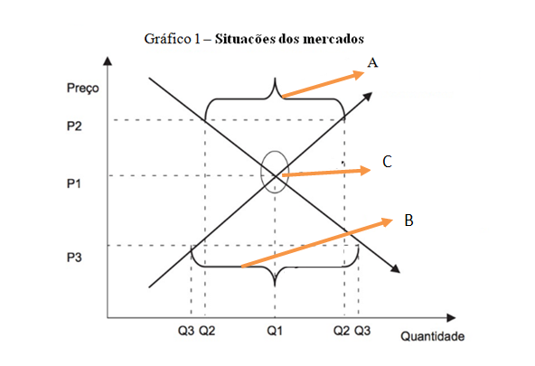

# Revisão Prova I

## Estudo

conceito de economia, questão da escassez e problemas fundamentais, tipos de sistemas econômicos (funcionamento dos mercados), agentes econômicos, divisão da economia, exemplos e aplicações práticas.

## Mercados

fundamentos da microeconomia, demanda, oferta, fatores, tipos de curvas, bens, equilíbrio, desequilíbrios, deslocamentos de curva, exemplos e aplicações práticas.

## Elasticidade

conceito elasticidade, elasticidade preço da demanda, elasticidade cruzada da demanda, elasticidade renda da demanda, tipo de bens para cada elasticidade, exemplos e aplicações práticas.

## Estruturas de mercado

concorrência perfeita e imperfeita, concorrência perfeita, oligopólio, monopólio, concorrência monopolística, cartel, CADE, exemplos e aplicações práticas.

## Teoria da firma

objetivo da firma, Produção,eficácia técnica e eficácia econômica,função de produção, produto total, produto médio, produto marginal, lei dos rendimentos decrescentes, isoquanta, economias de escala; Custos, isocusto, custo contábil x custo de oportunidade, custo total, custo médio, custo marginal, caminhos de expansão, exemplos e aplicações práticas.

## Questões

### Questão 1 – Conforme as questões a seguir, identifique a alternativa correta:

I) A Economia atual é uma ciência que analisa de que forma as pessoas e as empresas, individual ou coletivamente, organizam a produção de bens e serviços para a satisfação das necessidades humanas, considerando escassos os recursos disponíveis para a produção desses bens ou serviços. Em outras palavras, a **Economia estuda como as pessoas tomam decisões sobre compra, venda, investimento, poupança, consumo, trabalho etc.**, e como interagem umas com as outras com o objetivo de satisfazer suas necessidades econômicas. :x:

II) A **Macroeconomia** é o campo da Ciência Econômica que aborda os aspectos específicos das relações econômicas, ou como os **agentes econômicos** influenciam essas relações. Enfoca as relações de mercado, estabelecidas pela oferta e demanda de bens e o equilíbrio e o grau de variação de ambos (elasticidade), a forma pela qual as empresas se organizam no mercado, entre outros pontos. Assim, a Macroeconomia aborda os agentes econômicos e suas inter-relações e influências no estabelecimento das relações econômicas.  :x:

III) A **Microeconomia**, por outro lado, aborda os aspectos econômicos de **forma ampla**, e também as consequências gerais do relacionamento entre os agentes econômicos. Enfoca a produção total de uma economia como um todo (riqueza nacional), as consequências das variações dos preços dessa economia (inflação ou deflação, distribuição de renda etc.), o papel do Estado na economia (políticas monetária e fiscal), entre outros pontos. :x:

IV) Para a produção dos bens e serviços, a sociedade utiliza os fatores produtivos disponíveis, que serão transformados pelas unidades produtivas (empresas ou pessoas). Esses fatores produtivos (inputs) são todos os bens (tangíveis ou intangíveis) utilizados, mediante a combinação de diferentes tecnologias, na produção de outros bens que serão colocados no mercado (outputs). Ao serem combinados entre si por meio da tecnologia dotada pela unidade produtiva, esses fatores produtivos resultarão em bens e serviços finais que serão adquiridos pelas pessoas para a satisfação de suas necessidades.

V) Define-se como sistema econômico a **forma de organização** das relações de produção e consumo de **bens e serviços** pelos agentes da sociedade (instituições, empresas, pessoas, governo e outros) para a satisfação de suas necessidades.

- a) VERDADEIRAS: I, II, III – FALSAS: IV, V

- **b) VERDADEIRAS: IV, V – FALSAS: I, II,III**

- c) VERDADEIRAS: I, IV, V – FALSAS: II, III

- d) VERDADEIRAS: II, III, IV – FALSAS: I, V

- e) VERDADEIRAS: III, V – FALSAS: I, II, IV

### Questão 2 – Relacione a primeira coluna com a segunda:

| Alternativa                                                  | Opções                                                       |
| ------------------------------------------------------------ | ------------------------------------------------------------ |
| (A) economia de mercado (B) economia centralmente planificada | (  A  ) esse sistema é baseado principalmente na livre iniciativa e na acumulação de capital. (  B  ) o governo central é responsável pelo planejamento e a execução das principais atividades econômicas. (  B  ) a autoridade central procura equalizar a disponibilidade de recursos com a produção de bens e serviços desejáveis ou necessários pela maioria da população. (  A  ) livre interação entre os indivíduos que desejam consumir e os que desejam produzir bens e serviços.   (  A  ) pode haver aumento da produtividade, pois a concorrência força produtores a produzirem com custos cada vez menores, o que resulta na maximização da utilização dos fatores produtivos, com a produção de quantidades crescentes a custos reduzidos; (  B  ) inexistência de livre iniciativa, devido à pouca liberdade da alocação dos fatores produtivos, o que impede as pessoas de trabalharem nas funções que desejam e de produzirem individualmente bens e serviços que desejarem comercializar. (  A  ) pode acontecer falhas no mercado, pois o surgimento de grandes corporações, resultado da concorrência, pode resultar na concentração de mercado de alguns setores e, por consequência, em desvantagens para os consumidores. (  B  ) há estabilidade econômica, uma vez que a economia está livre de flutuações decorrentes do mercado, pois o governo central tende a coordenar a produção visando evitar escassez de produtos ou desemprego dos fatores produtivos, principalmente mão de obra. |

 #### A ordem correta das questões é

- a) B, B, B, A, A, A, A, B

- b) A, A, B, A, A, B, A, A

- c) A, A, A, B, A, B, A, A

- **d) A, B, B, A, A, B, A, B**

- e) B, B, B, A, A, B, B, B

### Questão 3 – Conforme o gráfico a seguir:

 

(A) o ponto A se refere a uma situação de equilíbrio de mercado. :x:

(B) o ponto B se refere a uma situação de desequilíbrio de mercado denominada de escassez de oferta ou excesso de demanda. :heavy_check_mark:

(C) o ponto C se refere a uma situação de desequilíbrio de mercado denominada de escassez de demanda ou excesso de oferta. :x:

(D) caso o preço esteja abaixo do preço de mercado (P3), a demanda será maior que a oferta e a mercadoria se tornará mais escassa. :heavy_check_mark:

(E) se o preço estiver acima do preço de equilíbrio (P2), haverá excesso de mercadorias (oferta maior que demanda) e as empresas não terão incentivos para produzir aquela quantidade. :heavy_check_mark:

(F) o equilíbrio de mercado ocorre quando as quantidades ofertada (Qs) e demandada (Qd) são iguais, ou quando preço e quantidade são comuns a ambas. Esse equilíbrio ocorre no ponto C do gráfico. :heavy_check_mark:

#### Qual das afirmações são verdadeiras?

- a) VERDADEIRAS: A, B, C – FALSAS: D, E, F

- **b) VERDADEIRAS: B, D, E, F – FALSAS: A, C**

- c) VERDADEIRAS: C, D, E, F – FALSAS: A, B

- d) VERDADEIRAS: A, B, D – FALSAS: C, E, F

- e) VERDADEIRAS: E, F – FALSAS: A, B, C, D

### Questão 4 – Sobre a elasticidade é falso afirmar que:

a)  A **elasticidade da demanda** **mede** a intensidade da **variação da demanda** em bem ou serviço em relação aos fatores determinantes, no caso dos diferentes produtos. Isso porque produtos diferentes reagem de forma diferente às variações dos fatores determinantes (preço do próprio produto, renda e preço dos bens relacionados), e essa diferença **é determinada pelo grau de elasticidade do produto**. :x:

b) A elasticidade-preço da demanda (Epd) é influenciada diretamente pela essencialidade do produto **(relação entre necessidade e supérfluo)**: isso significa que o grau de elasticidade de um produto possui uma relação inversa ao grau de necessidade desse produto. Um produto cuja necessidade é alta (as pessoas precisam desse produto no dia a dia e, portanto, já adquirem o necessário) terá um grau de elasticidade baixo, pois uma alteração no preço provocará uma baixa alteração na demanda, uma vez que as pessoas já estão adquirindo o necessário. :question:

c) A existência de substitutos próximos, também é outro fator que influencia na elasticidade-preço da demanda (Epd) isso significa que o grau de variação da elasticidade de um produto terá uma relação direta com a possibilidade ou não da substituição do produto por outro com a mesma função, no caso de uma variação do preço do primeiro. Isso porque, no caso da existência de bens substitutos, as pessoas tendem a migrar para este se houver aumento do preço do produto principal, o que tende a provocar uma grande redução na demanda do mesmo, e o contrário também pode acontecer.

d) Além do preço do próprio produto, outro fator que provoca alterações na demanda é a renda. O cálculo da elasticidade-renda da demanda (Erd) tem por objetivo analisar a influência da variação do preço de um produto em relação aos outros produtos a ele relacionados.

e) Quando a variação percentual da quantidade demandada é maior que a variação percentual do preço do produto isso significa que a elasticidade-preço da demanda (Epd) é elástica, ou seja, nessa categoria os produtos são considerados bens supérfluos podendo servir de exemplo serviços de entretenimento como cinemas.

### Questão 5 –  Os principais conceitos utilizados na Teoria da Produção são destacados a seguir:

| Opções                                                       | Alternativas                                                 |
| ------------------------------------------------------------ | ------------------------------------------------------------ |
| I) _______________é uma unidade técnica que produz bens e/ou serviços de forma racional, procurando maximizar seus resultados relativos à produção e ao lucro. Esse conceito abrange um empreendimento de modo geral, que inclui as atividades industriais e agrícolas, profissionais, técnicas e de serviços.   II) ________________são bens ou serviços utilizados pela firma para a realização da produção. São divididos em dois fatores principais: capital e trabalho. O fator capital (K) são os elementos que contribuem indiretamente para a realização da produção (máquinas, equipamentos, prédios, entre outros) ou que serão transformados em produtos finais (matérias- -primas e insumos de produção). O trabalho (L) corresponde à capacidade humana atuando no processo produtivo (atividade física e intelectual) e que resultará em produtos.   III) _________________ ocorrem quando a variação na quantidade do produto total é mais que proporcional à variação utilizada dos fatores de produção.   IV) ________________é a relação que mostra qual a quantidade máxima obtida do produto a partir da quantidade utilizada dos fatores de produção (K;L). Indica o máximo de produto que se pode obter com a combinação dos fatores produtivos, uma vez escolhido determinado processo de produção mais conveniente. | Fatores de produção  Rendimentos crescentes de escala  Função de produção  Empresa ou firma |

#### Portanto, a ordem correta das lacunas é:

- a) I) fatores de produção – II) empresas ou firmas – III) função de produção – IV) rendimentos crescentes de escala

- b) I) fatores de produção – II) rendimentos crescentes de escala – III) função de produção – IV) empresas ou firmas

- c) I) função de produção – II) fatores de produção – III) rendimentos crescentes de escala – IV) empresas ou firmas

- d) I) empresas ou firmas – II) fatores de produção – III) função de produção – IV) rendimentos crescentes de escala

- e) I) empresas ou firmas – II) fatores de produção – III) rendimentos crescentes de escala – IV) função de produção

### Questão 6 – Sobre o comportamento dos custos na Teoria da Firma é FALSO afirmar que:

a) Da mesma forma que na teoria da produção, os custos são analisados em dois momentos: no curto e no longo prazo. No curto prazo, os custos totais de uma empresa são compostos pelo custo fixo, que representa um custo de produção que não varia em função da quantidade produzida, e pelo custo variável, que apresenta uma variação em função da quantidade produzida.

b) Custo total é o custo de se produzir uma unidade extra do produto, ou seja, referem-se às variações de custo, quando se altera a produção. Enquanto que Custo marginal é a soma do custo fixo e custo variável.

c) Os custos de produção se referem ao total de recursos financeiros despendidos para a realização do processo produtivo de um bem ou serviço, ou, de outra forma, o valor total pago pela utilização dos fatores produtivos utilizados no processo de produção de um produto.

d) Custos contábeis representam os custos mensuráveis, como água, luz, salários etc., e os custos econômicos, representam os custos não mensuráveis, também chamados de custo de oportunidade, pois representam um custo resultante da postergação de um ganho atual para a obtenção de um ganho futuro.

e) O caminho de expansão relaciona aumentos de orçamento ou custo total com aumentos de produção total, representando assim pontos possíveis de equilíbrio da firma, quando a produção se expande.

### Questão 7 – A notícia abaixo evidencia um case sobre o que acontece nos mercados:

------------------

Cadê arquiva denúncias contra a XP Investimentos

ATO DE CONCENTRAÇÃO

Tribunal entendeu que eventuais condutas da empresa não caracterizaram descumprimento do acordo firmado com a autarquia

(por Assessoria de Comunicação Social Publicado: 18/03/2020)

 O Conselho Administrativo de Defesa Econômica (Cade) decidiu, na sessão de julgamento desta quarta-feira (18/03), pelo arquivamento de denúncias (entre elas a realizada pelo banco BTG Pactual) de supostas práticas anticompetitivas por parte da XP Investimentos.

As denúncias foram analisadas no âmbito do acompanhamento do Acordo em Controle de Concentrações (ACC) firmado entre a XP e o Cade. O acordo foi celebrado em 2018 como condição para a aprovação do ato de concentração pelo qual o Itaú adquiriu participação da XP.

Não foram verificadas, no âmbito da análise, que eventuais condutas cometidas pela XP relatadas nas denúncias tenham caracterizado qualquer forma de exigência de exclusividade ou ocorrência de fechamento de mercado que possa apontar algum problema concorrencial ou uma ofensa ao acordo.

Desse modo, o Tribunal da autarquia decidiu arquivar as denúncias. O monitoramento do ACC firmado com a XP, porém, continuará sendo realizado pelo Cade até a conclusão do acordo, que deve acontecer em 2023.

-----------------------------

Ou seja, a partir desse case percebe-se que as práticas dos mercados podem, algumas vezes, convergir ou diferir dos modelos teóricos estudados. Esses modelos enfocam características como o tamanho das empresas, a transparência do mercado em que atuam, os objetivos dos agentes entre outros. Duas estruturas básicas servem de referência: a concorrência perfeita e a concorrência imperfeita. Cada uma delas possui características distintas que são importantes para compreender a tomada de negociações entre ofertantes e demandantes.  A partir desse fato e de posse dos conhecimentos teóricos estudados na disciplina, identifique se os tipos de estruturas de mercado abaixo correspondem com suas características conceituais.

I) A estrutura de mercado denominada concorrência perfeita é uma situação ideal de mercado, em que a concorrência entre os agentes (produtores e compradores) leva ao equilíbrio do mercado (ponto de equilíbrio). Isso porque uma de suas características é a existência de um grande número de produtores e compradores, e o poder de cada agente nesse mercado, de forma individual, é inexistente.

II) A concorrência monopolística corresponde a uma situação de mercado que possui um grande número de produtores e compradores que vendem bens substitutos entre si (concorrência perfeita). Porém, dentre os inúmeros produtores, um deles se destaca por alguma característica do bem produzido (marca, qualidade, aspectos etc.), o que o torna diferente dos demais produtores, sendo esse produtor o único fornecedor daquele bem ou serviço diferenciado (monopólio). Um exemplo é o caso de uma franquia de fast food que produz um lanche específico, que só poderá ser adquirido na rede franquiada.

III) O oligopólio é uma estrutura de mercado constituída por um pequeno grupo de empresas que detém o controle da oferta de determinado produto, num mercado com um grande número de consumidores. A característica fundamental é a existência de interdependência entre as empresas. Dada a importância de cada empresa no setor, as decisões de uma quanto a preços, qualidade, propaganda etc. afetam o comportamento das demais.

IV) No monopólio uma única empresa atua no mercado além de não haver substitutos próximos e de haver barreiras a entrada. Como exemplo desse tipo de mercado tem-se a exploração de petróleo no Brasil, que é exercido por uma única empresa, com um grande número de consumidores. Além disso, esse tipo de estrutura pode oportunizar a formação de cartel que corresponde a uma associação de empresas do mesmo ramo produtivo visando dominar o mercado e controlar a concorrência.

#### Quais afirmativas estão corretas?

- a) II, III e IV corretas

- b) II e III corretas
- c) I, II e III corretas
- d) apenas a IV correta
- e) todas corretas