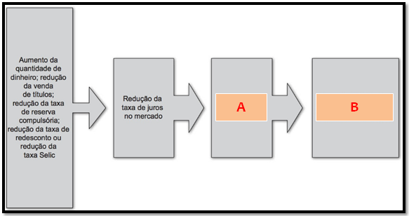

# Prova II

## Mapa mental de estudo

## Questões

### Questão  1 \*(1 ponto\*) – Qual das questões abaixo estão \*corretas\*?

A **-** Um dos principais aspectos abordados pela Macroeconomia em relação ao ambiente econômico é como os países ou regiões medem a geração global da riqueza, ou seja, como eles fazem para medir a produção e o consumo de bens e serviços do total de pessoas e empresas. Para que o governo possa contabilizar os diferentes produtos de um país, cidade ou região, essa contabilização é feita em termos monetários, ou seja, considera-se o preço do produto. Isso porque todos os bens e serviços produzidos serão vendidos no mercado, e, portanto, todos pos- suem um preço em moeda nacional.

B - Apesar de algumas limitações, a medida do PIB é um indicador útil tanto para comparações internacionais como para medir o crescimento do país ao longo dos anos, captando razoavelmente o grau de desenvolvimento social e econômico. Entretanto, é sempre oportuno considerar também outros indicadores para que se tenha uma avaliação mais completa da real condição socioeconômica de um pais. O indicador mais utilizado para avaliar o bem-estar do ponto de vista social é o Índice de Desenvolvimento Humano (IDH), divulgado periodicamente pelas Nações Unidas calculado a partir de uma média aritmética de indicadores sociais (taxa de alfabetização, nível de escolaridade e expectativa de vida) e econômicos (renda real *per capita*).

C - Outro fato importante a ser considerado na mensuração da riqueza de um país corresponde à forma de contagem dos bens produzidos. Para evitar a ocorrência da dupla contagem da produção (somar a produção de pneus, depois a produção de motores, de lataria, de autopeças, e por fim somar tudo novamente com a contabilização do automóvel), utiliza-se a contabilização pelo Valor Adicionado Bruto, isto é, pelo valor que foi acrescido ao valor dos bens intermediários em cada etapa produtiva.

D - Para medir o PIB de um país utilizam-se três formas consecutivas, chamadas de óticas de mensuração do PIB: a *ótica da oferta* (ou da produção), que corresponde ao cálculo da riqueza de um país a partir de todos os bens e serviços produzidos por ele no período; a *ótica da renda*, que corresponde à somatória de toda a renda auferida pelos agentes econômicos de um país (pessoas e empresas); e a *ótica da demanda*, que representa a forma pela qual essa renda é consumida por esses agentes. Assim, o somatória de toda a produção social, que corresponde à oferta total de bens e serviços, deverá ser igual ao consumo (ou demanda agregada) dessa produção. Portanto, há igualdade entre: Produção (oferta) = Renda = Consumo (demanda).

- a) apenas A e B corretas
- b) apenas B e C corretas
- c) apenas C e D corretas
- **d) todas corretas** :heavy_check_mark:
- e) todas estão incorretas

### Questão 2 (1 ponto) - Qual é o reflexo do alto nível de desemprego atual provocado pelo COVID-19 sobre a atividade econômica brasileira?

1. aumento na arrecadação dos impostos
2. aumento da demanda agregada
3. aumento nos investimentos das empresas
4. diminuição no consumo das famílias
5. aumento nos gastos do governo

Quais afirmativas estão, portanto, incorretas?

- a) I, II e IV
- b) II, III e V
- **c) I, II e III** :heavy_check_mark:
- d) III e IV
- e) IV e V

### Questão 3 (1 ponto) -  O processo inflacionário, quando resulta em altas variações do nível de preços por um longo período (hiperinflação) ou por variações contínuas (aceleração inflacionária), provoca desequilíbrios na estrutura econômica de uma sociedade. Qual dessas alternativas está correta com esses desequilíbrios?

I) Distribuição sobre a renda, pois os agentes que se beneficiam da remune- ração do capital (aluguéis, juros e lucros) conseguem, em uma situação de inflação alta, corrigir de forma mais rápida sua renda (aumento do valor do aluguel, busca por investi- mentos com maior retorno etc.), enquanto os agentes que obtêm sua renda por meio do trabalho (salários) têm maior dificuldade para realizar tal correção. Com isso, a remune- ração do capital passa a ter uma participação cada vez maior, em relação ao trabalho, no total de rendimentos sociais.

II) Dificuldades para estimar o retorno dos investimentos (expectativas), pois os investidores e empresários, em uma situação de alta inflacionária, passam a ter dúvidas em relação às ações do governo para conter a inflação e às consequências dessas ações para o mercado financeiro e a produção.

III) Desequilíbrios na balança comercial, pois em uma situação de alta inflacionária os preços internos dos bens e serviços tornam-se mais altos que os praticados em outros países com inflação baixa. Com isso os produtos internos tornam-se menos competitivos em relação aos externos, o que reduz as exportações (pois os compradores internacionais deixarão de comprar os produtos do país com alta inflação) e aumenta as importações (pois os consumi- dores internos passarão a preferir os produtos importados, mais baratos), o que resulta, por fim, num déficit na balança comercial (importações maiores que exportações).

- a) todas incorretas
- **b) todas corretas** :heavy_check_mark:
- c) apenas a III correta
- d) apenas a II correta
- e) apenas a I correta

### Questão 4 (1 ponto) – As políticas fiscal, monetária e cambial representam meios alternativos diferentes para as mesmas finalidades, que é intervir na estabilidade do país. Nesse sentido, a política econômica deve ser executada mediante uma combinação adequada de diversos instrumentos fiscais, monetários e cambiais. Nesse sentido, relacione os instrumentos que satisfaça cada política, conforme o quadro a seguir:

a. Política fiscal

b. Política monetária

c. Política cambial

---------------

1.(    ) balança de pagamentos

2.(    ) depósito compulsório

3.(    ) impostos, taxas e contribuições

4.(    ) operações de open market

5.(    ) gastos públicos

6.(    ) regime de bandas cambiais

7.(    ) reservas internacionais

8.(    ) balança de capitais

9.(    ) financiamento e empréstimos

10.(    ) importações e exportações

- a) a, b, c, c, c, a, b, c, b, a
- b) b, a, c, c, b, a, a, c, b, c
- c) a, c, b, b, a, c, a, b, a, a
- **d) c, b, a, b, a, c, c, c, b, c **:heavy_check_mark:
- e) c, b, a, a, b, a, a, c, a, b

### Questão 5 (1 ponto) - A política fiscal é um conjunto de medidas que o governo federal utiliza para controlar suas receitas e despesas, visando produzir efeitos desejáveis e evitar efeitos indesejáveis sobre a atividade econômica e para a execução dessas medidas, o setor público realiza periodicamente o planejamento da origem e a aplicação dos recursos financeiros necessários. Esse planejamento está contido no orçamento público e é composto pelas receitas, despesas e saldo fiscal. Portanto, o saldo fiscal é a relação entre as receitas e despesas públicas, ou seja, é o saldo entre o que foi arrecadado menos o que foi gasto. Assim:

Quando esse saldo for positivo (despesa menor que receita pública), é denominado superávit nas contas públicas.

Quando esse saldo for negativo (despesa maior que receita), é denominado déficit nas contas públicas.

Quando esse saldo for nulo (despesa iguala receita), é denominado equilíbrio fiscal.

 Nesse sentido, pergunta-se: Caso o saldo fiscal do governo apresente déficit nas contas públicas, de que forma o governo pode financiá-lo?

- a) o governo pode financiar vendendo títulos do governo através do Banco Central, emitindo moeda e promovendo uma política fiscal restritiva, com aumento dos gastos
- b) o governo pode financiar vendendo ações na Bolsa de Valores, emitindo moeda e promovendo uma política fiscal restritiva, com diminuição dos gastos
- c) o governo pode financiar comprando ações na Bolsa de Valores, emitindo moeda e promovendo uma política fiscal expansiva, com aumento dos gastos
- **d) o governo pode financiar vendendo títulos do governo através do Banco Central, emitindo moeda e promovendo uma política fiscal restritiva, com diminuição dos gastos** :heavy_check_mark:
- e) o governo pode financiar exclusivamente emitindo moeda e promovendo uma política fiscal expansiva, com aumento dos gastos

### Questão 6 (1 ponto) - A figura seguinte se refere a política monetária expansionista. Complete qual o efeito dela sobre a economia:

- a) A representa diminuição da Demanda Agregada e B representa diminuição da produção e emprego com tendência a aumento de inflação.
- b) A representa aumento da Demanda Agregada e B representa aumento da produção, mas diminuição do emprego com tendência a deflação.
- c) A representa diminuição da Demanda Agregada e B representa aumento da produção e emprego com tendência a deflação.
- d) A representa aumento da Demanda Agregada e B representa diminuição da produção e emprego com tendência a aumento de inflação.
- **e) A representa aumento da Demanda Agregada e B representa aumento da produção e emprego com tendência a aumento de inflação. **:heavy_check_mark:

### Questão 7 (1 PONTO) – A taxa de câmbio e o balanço de pagamentos representam os principais elementos de atuação comercial do país com outros países. A taxa de câmbio corresponde ao valor da moeda estrangeira dentro do país, e serve como parâmetro de comparação de preços nacionais com os preços internacionais dos mesmos produtos. O valor dessa taxa de câmbio provoca influência direta no balanço de pagamentos, que é o registro de todas as movimentações comerciais do país com outros países, principalmente no saldo da balança comercial, que é o resultado das movimentações comerciais de mercadorias do país com o resto do mundo. Nesse sentido, relacione as palavras-chaves com as lacunas.

Serviços e rendas

Conta Capital e Financeira

Transações unilaterais

Balança comercial

-----------------------

________________ são registradas as entradas e saídas de investimento direto (em planas produtivas) e de investimento em carteiras (ações e títulos do governo).
_____________ é todo o envio ou recebimento de um país, de bens e recursos financeiros ao resto do mundo e que não envolvem obrigações em contrapartida, como, por exemplo, transferências de heranças, doações em bens ou dinheiro, pagamentos de pensões a cidadãos nacionais residentes no exterior, ajudas humanitárias, remessas de migrantes no exterior etc.
_____________ são registradas todas as compras (importações) e vendas (exportações) de bens tangíveis, como, por exemplo, soja, açúcar, carros, computadores, aviões etc.
_____________é o registro da compra (importação) e venda (exportação) de bens intangíveis, como, por exemplo, transportes, viagens internacionais, seguros, royalties e licenças, serviços profissionais e técnicos, aluguel de equipamentos, lucros e dividendos de investimentos, juros de empréstimos etc.

- **a) A) Conta Capital e Financeira; B) Transações Unilaterais; C) Balança Comercial; D) Serviços e Rendas **:heavy_check_mark:
- b) A) Balança Comercial; B) Transações Unilaterais; C) Conta Capital e Financeira; D) Serviços e Rendas
- c) A) Serviços e Rendas; B) Transações Unilaterais; C) Balança Comercial; D) Conta Capital e Financeira
- d) A) Transações Unilaterais; B) Serviços e Rendas; C) Balança Comercial; D) Conta Capital e Financeira
- e) A) Conta Capital e Financeira; B) Balança Comercial; C) Transações Unilaterais; D) Serviços e Rendas