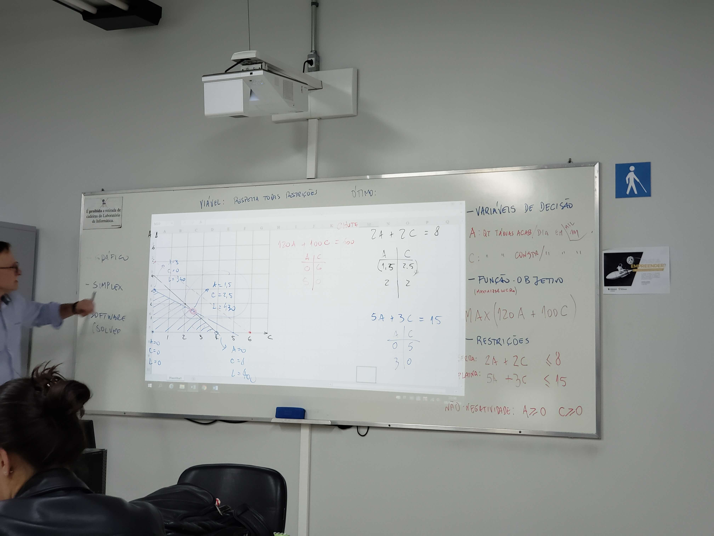

# Aula II

### O que é um modelo?

Somos treinados para gerar modelos mentalmente

---------------------------------

3 elementos básicos da formulação

- Variáveis de decisão
  - B: Botas
  - S: sandalias
  - T: tenis
- Função objetivo
  - B: 3000
  - S: 2000
  - T: 0
  - MAX(B10 S6 T8)
- Restrições
  - B >= 1000
  - Viável: respeita todas as restrições
  - Ótimo: 

Exemplo: 

**1)** Madeireira...

- Variáveis de decisão
  - A: (Quantidade de tabuas de acabamento / dia) em mil metros
  - C: (Quantidade de tabuas de construção / dia) em mil metros

- Função objetivo
  - **(maximizar lucro)**
  - MAX(120A + 100C)
- Restrições
  - SERRA: 2A + 2C <= 8
  - PLAINA: 5A + 3C <= 15
  - Não negatividade: A >= 0  C >= 0

Métodos

- gráfico
- simplex
- software (solver do excel)

## Livros

Rápido e Devagar: Duas Formas de Pensar

Livro por Daniel Kahneman

