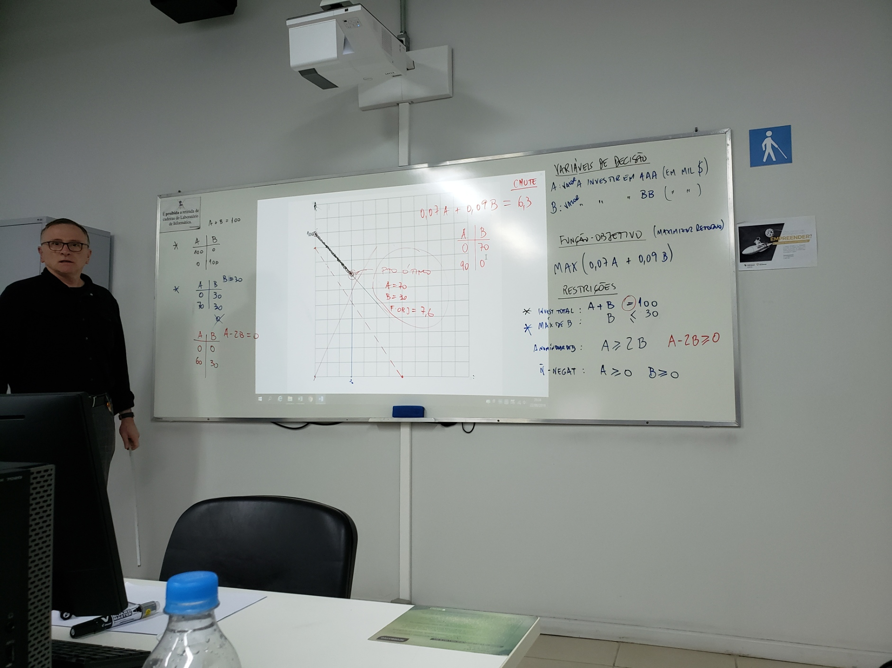

# Aula IV

## Anotações

Professor PIER

## Exercicios

### 5 – Problema Financeiro

Suponha que o consultor financeiro de uma universidade deva investir *exatamente* $100.000 em 2 tipos de papéis: fundo AAA, que paga um dividendo de 7% e ações BB, que pagam um dividendo de 9%. Foi estabelecido que não mais do que $30.000 podem ser investidos em ações BB, ao passo que o total investido no fundo AAA deve ser pelo menos o dobro do que o investido em ações BB. Quanto deve ser investido em cada tipo de papel para maximizar o retorno para a universidade?

#### Variáveis de decisão

- A: Valor a investir em AAA (Em mil $)

- B: Valor a investir em BB (Em mil $)

#### Função objetivo

MAX(0,07A + 0,09B)

#### Restrições

maximo de B: B <= 30

A  no minimo dobro de B: A >= 2B

Investimento total: A + B = 100

Não negativo: A >= 0, B >= 0

Quadro I:

### **6 -**  Um jovem estava saindo com duas namoradas: 

Maria e Luísa. Sabe, por experiência, que:

(a) Maria, elegante, gosta de freqüentar lugares sofisticados, mais caros, de modo que uma saída de três horas custará 80 reais;

 (b) Luísa, mais simples, prefere um divertimento mais popular, de modo que, uma

saída de três horas custará 55 reais;

(c) seu orçamento permite dispor de 330 reais mensais para diversão;

(d) seus afazeres escolares lhe dão liberdade de, no máximo, 18 horas e 40.000 calorias de sua energia para atividades sociais;

(e) cada saída com Maria consome 5.000 calorias, mas com Luísa, mais alegre e extrovertida, gasta o dobro;

(f) ele gosta das duas com a mesma intensidade.

Como deve planejar sua vida social para obter o número máximo de saídas? Formule o problema.

#### Variaveis de decisão

- M: Numero de saídas de 3h com **Maria** por Mês

- L: Numero de saídas de 3h com **Luísa** por Mês

#### Função objetivo

MAX(M + L)

#### Restrições

TEMPO: 3M + 3L <= 18

DINHEIRO: 80M + 55L <= 330

ENERGIA: 5kM + 10kL <= 40k

Não negativo: M >= 0, L >= 0

## Exercicio aula

### 7 - Um intermediário de ferro velho

Um intermediário de ferro velho recebeu um pedido de um freguês para que entregue um **mínimo de duas toneladas de metal**. O freguês exige, no entanto, que pelo menos **uma tonelada** do total entregue seja **Cobre**. O freguês recusar-se-á a aceitar a entrega caso o total contenha mais de **175 kg de resíduos**. O intermediário pode comprar ferro velho de dois fornecedores, em quantidades ilimitadas, com os seguintes percentuais de cobre e resíduos: 

|              | **FORNECEDOR 01** | **FORNECEDOR 02** |
| ------------ | ----------------- | ----------------- |
| COBRE        | 25%               | 75%               |
| RESÍDUOS     | 5%                | 10%               |
| **CUSTO/Kg** | **R$ 1,00**       | **R$ 4,00**       |

Determinar as quantidades ótimas a comprar de cada fornecedor a fim de satisfazer o pedido. O objetivo é minimizar o custo. 

#### Variáveis de decisão

- F1: Quantidade de kg compradas pelo fornecedor 1

- F2: Quantidade de kg compradas pelo fornecedor 2

#### Função objetivo

MIN(0,30F1 + 0,85F2)

#### Restrições

Residuos: 0,05F1 <= 175, 0,1F2 <= 175

Cobre: 0,25F1 >= 1000, 0,75F2 >= 1000

Pedido minimo: F1 + F2 >= 2000

Não negativo: F1 >= 0, F2 >= 0