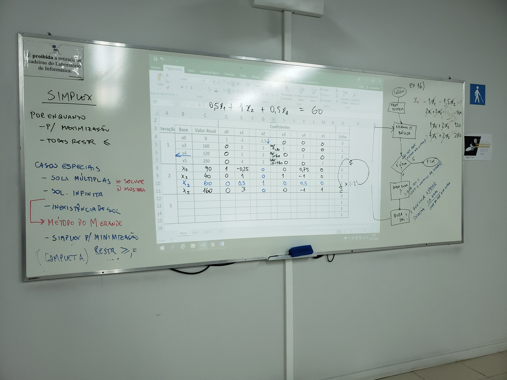
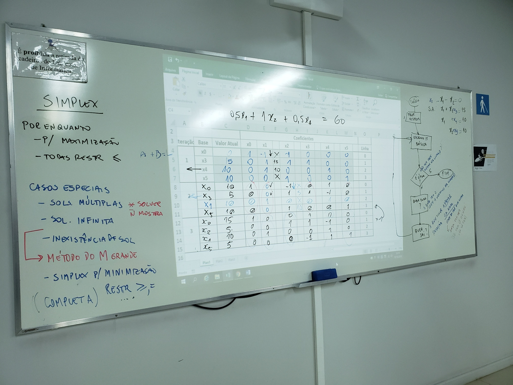

# Aula IX

## Simplex

Por enquanto

- P/ maximização
- Todas restrições `<=`

### Casos especiais

- Soluções múltiplas *** solver não mostra**
- Solução infinita
- Inexistência de solução
  - Método do M grande
- Simplex por minimização

### Exercícios

16)

MAX (1x_1 + 1,5x_2)

Suj. A 2x_1 + 2x_2 <= 160

​           1x_1 + 2x_2 <= 120

​           4x_1 + 2x_2 <= 280

​           x_1, x_2 >= 0

--------------------------------------

Adicionar x_0 e x_n para cada resto das restrições
$$
x_0 = 1x_1 + 1,5x_2 \\

2x_1 + 2x_2 + 1x_3 = 160 \\

1x_1 + 2x_2 + 1x_4 = 120 \\

4x_1 + 2x_2 + 1x_5 = 280 \\
$$

--------------------------------------------

Igualar função objetivo a 0
$$
x_0 - 1x_1 - 1,5x_2 = 0 \\

2x_1 + 2x_2 + 1x_3 = 160 \\

1x_1 + 2x_2 + 1x_4 = 120 \\

4x_1 + 2x_2 + 1x_5 = 280 \\
$$
Fluxo algoritmo

```flow
in=>start: Início
ps=>operation: Preparar sistema
eb=>operation: Escrevo Iteração Básica
eo=>condition: Não tem coeficiente negativo na linha 0? (É ótima?)
qe=>operation: Quem entra? (A que tem o coeficiente + negativo)
qs=>operation: Quem sai? (A que tiver a menor relação (valor atual/Coeficiente da variavel que entra))
fi=>end: Fim

in->ps->eb->eo
eo(no)->qe->qs->eb
eo(yes)->fi
```

Quadro I



II

