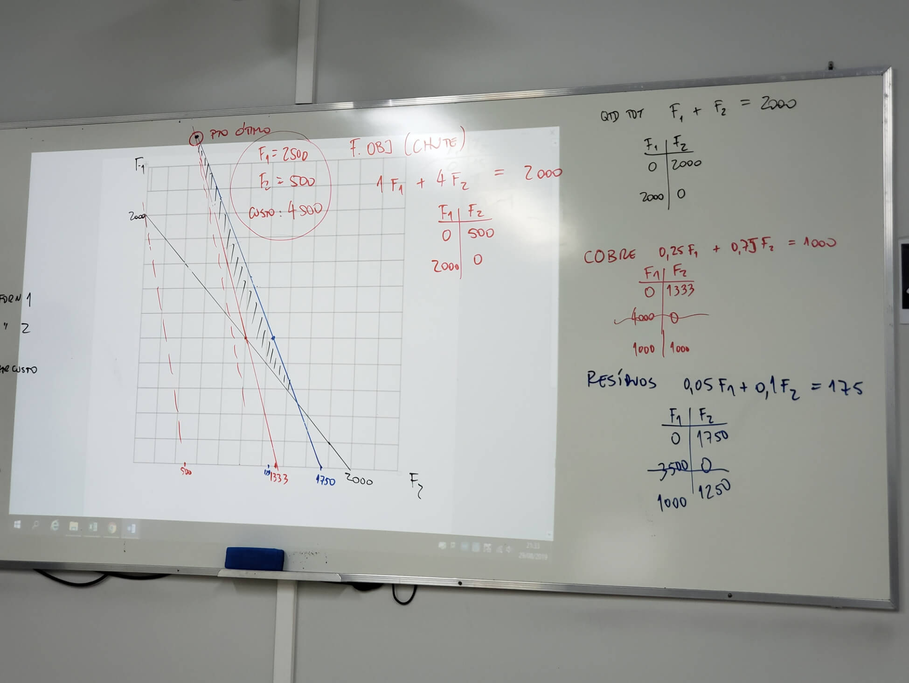
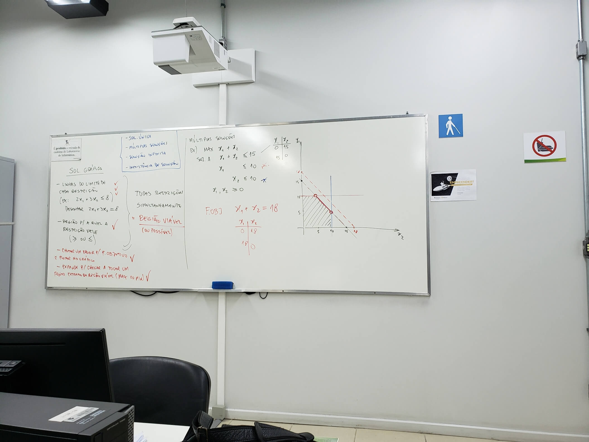
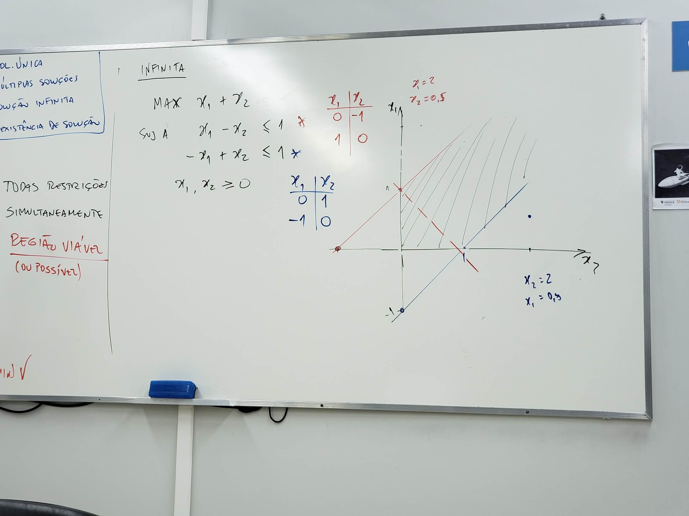

# Aula V

## Correção dos exercícios

### 7 - Um intermediário de ferro velho

Um intermediário de ferro velho recebeu um pedido de um freguês para que entregue um **mínimo de duas toneladas de metal**. O freguês exige, no entanto, que pelo menos **uma tonelada** do total entregue seja **Cobre**. O freguês recusar-se-á a aceitar a entrega caso o total contenha mais de **175 kg de resíduos**. O intermediário pode comprar ferro velho de dois fornecedores, em quantidades ilimitadas, com os seguintes percentuais de cobre e resíduos: 

|              | **FORNECEDOR 01** | **FORNECEDOR 02** |
| ------------ | ----------------- | ----------------- |
| COBRE        | 25%               | 75%               |
| RESÍDUOS     | 5%                | 10%               |
| **CUSTO/Kg** | **R$ 1,00**       | **R$ 4,00**       |

Determinar as quantidades ótimas a comprar de cada fornecedor a fim de satisfazer o pedido. O objetivo é minimizar o custo. 

#### Variáveis de decisão

- F1: Quantidade de kg compradas do fornecedor 1
- F2: Quantidade de kg compradas do fornecedor 2

#### Função objetivo

MIN(1F1 + 4F2)

#### Restrições

Resíduos: 0,05F1 + 0,1F2 <= 175

Cobre: 0,25F1 + 0,75F2 >= 1000

Pedido mínimo: F1 + F2 >= 2000

Não negativo: F1 >= 0, F2 >= 0

---------------------------------

### 10 - Um fabricante de brinquedos deseja programar a produção de um determinado brinquedo para atender à seguinte demanda:

| **QUANTIDADE** | **MÊS**  |
| -------------- | -------- |
| 1200           | OUTUBRO  |
| 3600           | NOVEMBRO |
| 2400           | DEZEMBRO |

A capacidade normal de produção é 1920 unidades por mês. Usando-se horas extras obtém-se uma capacidade adicional de 1320 unidades por mês. O custo unitário de produção normal é de R$ 480,00. Fora do turno normal o custo é de R$ 620,00 por unidade. O custo mensal de armazenagem é de R$ 220,00 por unidade. Supondo que não exista estoque inicial e que o fabricante não deseja estoque sobrando no final do trimestre (dezembro). Formule um modelo de programação linear para determinar quanto produzir durante cada um dos três meses, no turno normal e no extra, de maneira a minimizar o custo total. Caso seja necessário efetuar suposições, mencione quais foram estas suposições.

## Dicas

- Quando tem um **limite** agregado é **restrição**

- Quando tem um **custo** é **variável**
- Sempre colocar a não negatividade

### Soluções Gráficas

- Linhas do limite de cada restrição                     \

(ex: 2x, + 3x_2 <= 8)                                                         \   Todas restrições simultaneamente

Desenhar 2x_1 + 3x_2 = 8                                               /   = Região Viável / (ou possível)
- Região para a qual a restrição vale (>= ou <=)  /
- Chutar um valor para a função objetivo e plotar no gráfico
- Expande para chegar a tocar um ponto extremo da região viável (max ou min)

- 4 Tipos de soluções

  - Solução única

  - Múltiplas soluções

  - Solução infinita

  - Inexistência de solução

#### Múltiplas soluções

  - MAX         x_1 + x_2
  - Sujeito A x_1 + x_2 <= 15
  - ​                 x_1           <= 10
  - ​                           x_2 <= 10
  - ​                  x_1,  x_2  >= 0

#### Solução infinita

MAX          x_1 + x_2

Sujeito A  x_1 - x_2 <= 1

​                  -x_1 + x_2 <= 1

​                  x_1, x_2 >= 0

#### Solução Inexistente

Onde **não existe** ponto comum entre **todas** as restrições

"Não existe região viável"

MAX         x_1 + x_2

Sujeito A  x_1 + x_2 <= 3

​                  x_1 + x_2 >= 5

​                  x_1, x_2 >= 0

