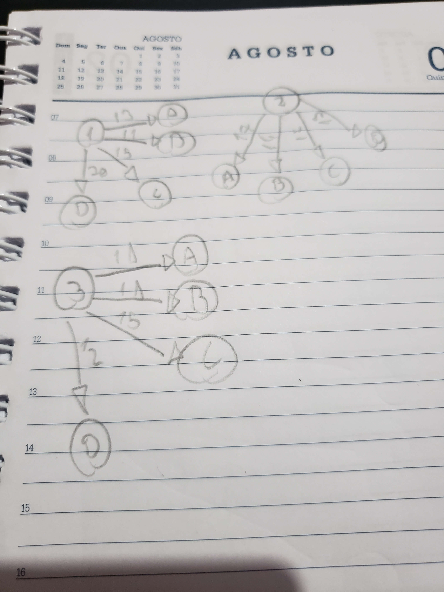

# Aula VI

## Estudo para prova

### 8 - No início de cada dia, certos ônibus devem se deslocar de suas garagens até o ponto inicial de suas rotas. 

Assuma que 3, 3, 4 e 5  ônibus são necessários nos locais A, B, C e D respectivamente, enquanto que 2, 6 e 7 ônibus encontram-se respectivamente nas garagens 1, 2 e 3. Os tempos de viagem das garagens 1, 2 e 3 ao local A são 13, 17 e 18 minutos, respectivamente; ao local B: 11, 14 e 18; ao local C: 15, 12 e 15; ao local D: 20, 13 e 12.

Para minimizar o tempo total de viagem, como devem ser distribuídos os ônibus?

#### Variáveis de decisão

- A1: Onibus que irão realizar trajeto 1 => A
- A2: Onibus que irão realizar trajeto 2 => A
- A3: Onibus que irão realizar trajeto 3 => A
- ...
- D3: Onibus que irão realizar trajeto 3 => D

#### Função objetivo

MIN(13A1 + 17A2 + 18A3 + ... + 12D3)

#### Restrições

Numero de onibus no local A: A1 + A2 + A3 = 3

Numero de onibus no local B: B1 + B2 + B3 = 3

Numero de onibus no local C: C1 + C2 + C3 = 4

Numero de onibus no local D: D1 + D2 + D3 = 5

Numero de onibus no local 1: A1 + B1 + C1 + D1 <= 2

Numero de onibus no local 2: A2 + B2 + C2 + D2 <= 6

Numero de onibus no local 3: A3 + B3 + C3 + D3 <= 7

Não negativo: A1 >= 0, A2  >= 0, A3  >= 0, ... D3  >= 0,

### 9 - Uma firma de pesquisas de mercado foi contratada para investigar a reação do consumidor a um produto recentemente introduzido. 

Trata-se de uma pesquisa a domicílio e as seguintes condições foram impostas pelo cliente:

(1) Um total de 2.000 famílias deve ser contactado;

(2) O número de domicílios contactados durante a noite deve ser pelo menos igual ao número contactado durante o dia;

(3) Pelo menos 700 domicílios com crianças devem ser contactados (de dia ou de noite)

(4) Pelo menos 350 domicílios sem crianças devem ser contactados (de dia ou de noite);

A firma de pesquisa terá os seguintes custos por entrevista: 

| **DOMICÍLIOS** | **DIA**    | **NOITE**  |
| -------------- | ---------- | ---------- |
| COM CRIANÇAS   | R$   25,00 | R$   30,00 |
| SEM CRIANÇAS   | R$   20,00 | R$   24,00 |

Formule um modelo de programação linear para determinar quantos domicílios de cada tipo devem ser contactados durante o dia e à noite de maneira a minimizar o custo da pesquisa.

#### Variáveis de decisão

- CCD: Quantidade de domicilios **com** crianças a serem contactados de **dia**
- CCN: Quantidade de domicilios **com** crianças a serem contactados de **noite**
- SCD: Quantidade de domicilios **sem** crianças a serem contactados de **dia**
- SCN: Quantidade de domicilios **sem** crianças a serem contactados de **noite**

#### Função objetivo

MIN(25CCD + 30CCN + 20SCD + 24SCN)

#### Restrições

**Total** familias: CCD + CCN + SCD + SCN = 2000

Contactados de **noite**: CCN + SCN <= CCD + SCD

Contactados **com** crianças: CCD + CCN >= 700

Contactados **sem** crianças: SCD + SCN >= 350

Não negativo: CCD >= 0, CCN >= 0, SCD  >= 0, SCN  >= 0,

### 11 - Uma empresa produz um componente para um produto industrial e o distribui a cinco atacadistas (A, B, C, D, E) a um preço de R$ 25,00 por unidade. 

Previsões de vendas indicam que as entregas mensais serão 3.000 unidades para A; 3.000 unidades para B; 8.000 unidades para C; 5.000 unidades para D; e 4.000 unidades para E.

A empresa tem três fábricas. As capacidades de produção mensais são 5.000 na Fábrica I; 9.000 na fábrica II; e 11.000 na fábrica III. Os custos diretos de produção em cada unidade são R$ 10,00 na fábrica I, R$ 9,00 na fábrica II e R$ 8,00 na fábrica III. Os custos de transporte por unidade de cada fábrica à cada atacadista é dado abaixo, em R$.

| **FAB/ATACADO** | **A** | **B** | **C** | **D** | **E** |
| --------------- | ----- | ----- | ----- | ----- | ----- |
| FÁBRICA I       | 0,50  | 0,70  | 1,00  | 1,50  | 1,50  |
| FÁBRICA II      | 0,80  | 0,60  | 0,90  | 1,20  | 1,40  |
| FABRICA III     | 1,00  | 0,90  | 0,80  | 1,00  | 1,50  |

Formular um modelo de programação linear que minimize o custo total de produção e distribuição, e outro que maximize o lucro da empresa. 

#### Variáveis de decisão

- IA: Quantidade de produtos produzidos na **fabrica I** e entregues no atacadista **A**
- IIA: Quantidade de produtos produzidos na **fabrica II** e entregues no atacadista **A**
- IIIA: Quantidade de produtos produzidos na **fabrica III** e entregues no atacadista **A**
- IIIE: Quantidade de produtos produzidos na **fabrica III** e entregues no atacadista **E**

#### Função objetivo

MIN(10,50IA + 9,80IIA + 9IIIA + ... + 9,50E)

#### Restrições

...

### 12 - O presidente Antônio Castor, da Companhia Ramos de Carvalho, quer utilizar do melhor modo possível os recursos de madeira em uma de suas regiões florestais. 

Dentro desta região, há uma serraria e uma fábrica de compensados; Assim, as toras podem ser convertidas em madeira beneficiada ou compensado.

Produzir uma mistura comercializável de 1 m3 de produtos beneficiados requer 1 m3 de pinho e 4 m3 de canela. Produzir 100 m2 de madeira compensada requer 2 m3  de pinho e 4 m3 de canela. Esta região tem disponíveis 32 m3 de pinho e 72 m3 de canela.

Compromissos de vendas exigem que sejam produzidos, durante o período de planejamento, pelo menos 5 m3 de madeira beneficiada e 1200 m2 de madeira compensada. 

As contribuições ao lucro são $45 por 1 m3 de produtos beneficiados e $60 por 100 m2 de madeira compensada. Formule um modelo de programação linear para maximizar o lucro da Companhia.

#### Variáveis de decisão

- B: Quantidade de tora em m³ convertida em madeira beneficiada
- C: Quantidade de tora em m² convertida em compensado

#### Função objetivo

MAX(45B + 60C)

#### Restrições

Minimo venda madeira beneficiada: B >= 5

Minimo venda compensado: C >= 1200

Não negativo: B >= 0, C >= 0