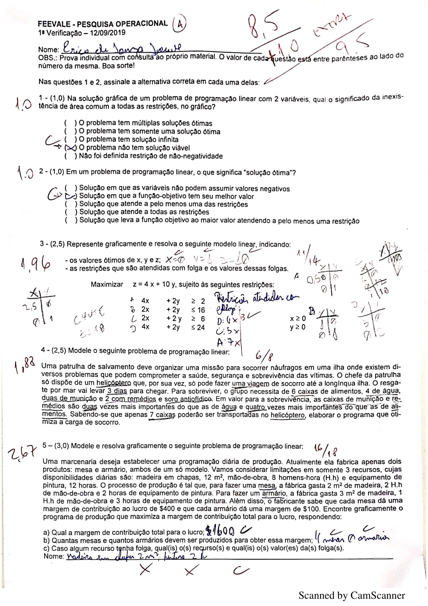
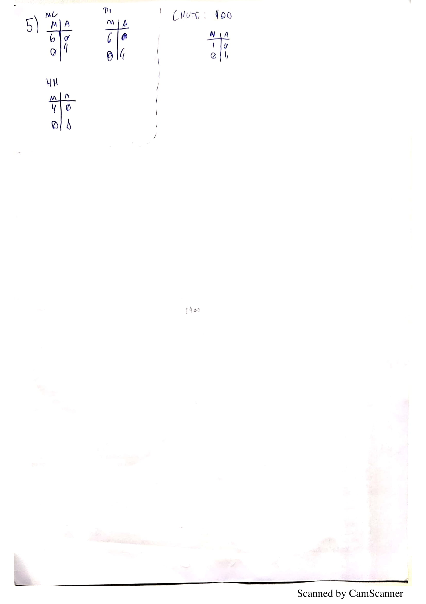
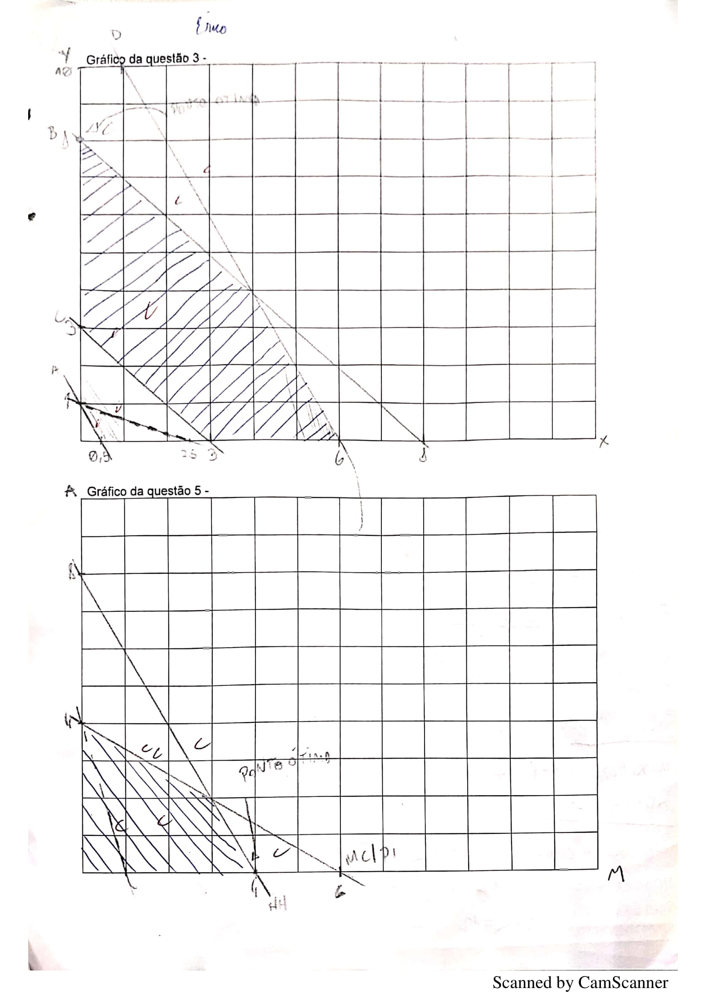
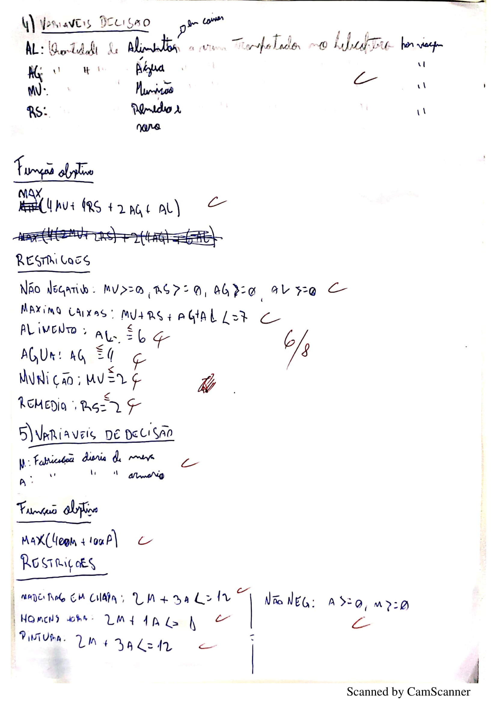

# Aula VII

## Estudo algoritmo simplex

Simplex é um algoritmo criado pelo matemático George Dantzig que viabiliza a solução de muitos problemas da programação linear.

## Correção prova

O valor da **folga** de uma função objetivo pode ser obtida a partir das restrições. Exemplo:

Ponto ótimo: x: 0, y: 5

Restrições:

- 2x + 2y > 4
  - ***Folga: 6***
- 4x + 5y < 50
  - ***Folga: 25***

### Prova

