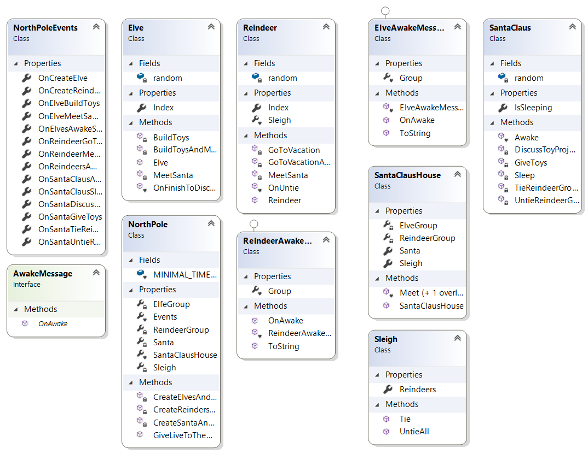
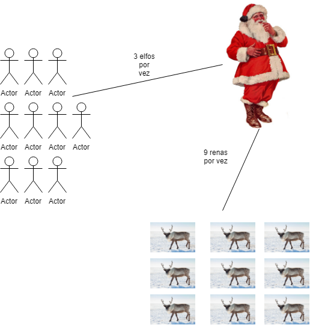
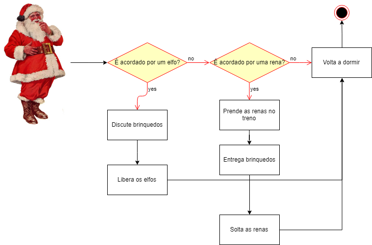
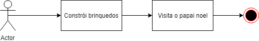

# Trabalho I

## Descrição

O trabalho apresentado tem intuito de elucidar problemas clássicos no campo da programação concorrente, disputa de recursos e paralelismo. Eles servem para comparar vários formalismos provenientes de programas concorrentes. São problemas e características suficientemente simples para ser tratado, ainda que bastante desafiante. 

### O trabalho poderá ser desenvolvido nas seguintes linguagens:

• C

• C ++

• Java

• C#

### O que deve ser entregue junto com o trabalho:

1. Apresentação em aula para o professor;
2. Redação de relatório técnico;
   1. Documentação (tais como, fluxos, diagramas de classes e estados);
   2. Descrição e apresentação dos algoritmos;
3. Código Fonte, o relatório deve conter uma seção com as explicações de como executar o projeto/fonte;
4. O Relatório deve conter um exemplo de aplicação dos problemas estudados.

 

Boa Sorte!

## O problema do papai noel

### Pequeno resumo

O trabalho é um perfeito caso para o estudo de concorrências, onde foi possível aprender como tratar a concorrência por dados em threads simultâneas.

### Execução

Trabalho feito em dotnet core 2.2.

Para executar a aplicação, é necessário:

- Realizar o [Download do .NET (Linux, macOS, and Windows)](https://dotnet.microsoft.com/download)
- Instalar em seu dispositivo
- Acessar a pasta `console` do projeto enviado pelo terminal
- Rodar os comandos 
  - `dotnet restore`
  - `dotnet run`
- Pronto, seu programa esta rodando

### Código

Toda aplicação inicia a partir do projeto console que pede para o polo norte gerar vida

```csharp
// NorthPole.cs
// A aplicação começa por esse metodo
public static void GiveLiveToTheWorld(NorthPoleEvents events = null)
{
    ...

    // é criado o objeto do papai noel e sua casa
    CreateSantaAndYourHouse();
    // é criado os objetos das renas
    CreateReindersAndMeetSanta();
    // é criado os objetos das elfos
    CreateElvesAndMeetSanta();

    // Iteração simples para as threads não serem derrubadas
    ...
}
```

Então é cada participante desse mundo é criado e iniciado seu ciclo de vida

```csharp
// Elve.cs
// construtor elfo
public Elve(int index)
{
    // Da um nome ao elfo
    this.Index = index;
    // Inicia o ciclo de vida
    BuildToysAndMeetSanta();
    ...
}

private void BuildToysAndMeetSanta()
{
    new Task(() =>
    {
        // Constroi brinquedos
        BuildToys();
        // Apos construir brinquedos vai ao encontro do papai noel
        MeetSanta();
    }).Start();
}

// Reindeer.cs
// construtor rena
public Reindeer(int index)
{
    // Da um nome ao elfo
    this.Index = index;
    // Inicia o ciclo de vida
    GoToVacationAndMeetSanta();
    NorthPole.Events.OnCreateReindeer(Index);
}

private void GoToVacationAndMeetSanta()
{
    new Task(() =>
    {
        // Sai de ferias
        GoToVacation();
        // Quando volta de ferias, vai ao encontro do papai noel
        MeetSanta();
    }).Start();
}
```

No momento em que as renas ou elfos desejam ir visitar o papai noel, ambos vão a sua casa para verificar se ele esta disponível, caso esteja, eles resolvem o que precisam resolver, caso não, eles ficam em espera até que ele esteja disponível.

```csharp
// Reindeer.cs
// Elve.cs
private void MeetSanta()
{
    ...
    // Vão ao encontro do papai noel
    NorthPole.SantaClausHouse.Meet(this);
}
```

Quando chegam na casa do papai noel, existem uma regra para atender cada um deles, sendo:

- Um elfo entra na fila por vez e eles só podem acordar o papai noel quando 3 estiverem esperando na fila e todas as renas já não estão na fila de espera.
- Uma rena entra na fila por vez e elas só podem acordar o papai noel quando todas estiverem esperando na fila de espera.

```csharp
// SantaClausHouse.cs
internal void Meet(Reindeer reindeer)
{
    // garantia de que estamos lindando com a fila de espera atualizada
    lock (ReindeerGroup)
    {
        // uma rena entra na fila por vez
        ReindeerGroup.Add(reindeer);

        // quando todas as renas entram na fila
        if (ReindeerGroup.Count == 9)
        {
            ...
            // é enviado uma mensagem para o papai noel com as renas
            Santa.Awake(awakeMessage);
        }
    }
}

internal void Meet(Elve elve)
{
    // garantia de que estamos lindando com a fila de espera atualizada
    lock (ElveGroup)
    {
        // um elfo entra na fila por vez
        ElveGroup.Add(elve);

        // garantia de que estamos lindando com a fila de espera atualizada
        lock (ReindeerGroup)
        {
            // quando 3 ou mais elfos estiverem na fila e não tem todas as renas na fila
            if (ElveGroup.Count >= 3 && ReindeerGroup.Count < 9)
            {
                ...
                // é enviado uma mensagem para o papai noel com 3 elfos
                Santa.Awake(awakeMessage);
            }
        }
    }
}
```

Assim que controlado as filas de esperas, é enviado a mensagem com os visitantes para o papai noel. E somente então o papai noel acorda.

```csharp
// SantaClaus.cs
internal void Awake(AwakeMessage awakeMessage)
{
    lock (this)
    {
        ...
		// Papai noel esta acordado
        IsSleeping = false;
        ...

        // caso os visitantes sejam as renas
        if (awakeMessage is ReindeerAwakeMessage)
        {
            // Amarra-as
            TieReindeerGroup(reindeerAwakeMessage.Group);
            // Entrega brinquedos
            GiveToys();
            // Solta as renas
            UntieReindeerGroup(reindeerAwakeMessage.Group);
        }
        // caso os visitantes sejam os elfos
        else if (awakeMessage is ElveAwakeMessage)
        {
            // Discute brinquedos com os elfos
            DiscussToyProjects(((ElveAwakeMessage)awakeMessage).Group);
        }

        // Volta a dormir
        Sleep();
    }
}

private void Sleep()
{
    // Papai noel volta a dormir
    IsSleeping = true;
    ...
}

```

Após cada visitando fazer seu papai com o papai noel os mesmos voltam a suas rotinas, isso é, as renas voltam as suas férias, e os elfos voltam a construir brinquedos.

```csharp
// SantaClaus.cs
private void DiscussToyProjects(IList<Elve> group)
{
    ...

    foreach (var elve in group)
    {
        // elfo passa para proxima task e volta ao seu ciclo de vida
        elve.OnFinishToDiscussToyProject();
    }
}

private void UntieReindeerGroup(IList<Reindeer> group)
{
    ...
    // é solto todas as renas do treno
    NorthPole.SantaClausHouse.Sleigh.UntieAll();
}

// Sleigh.cs
public void UntieAll()
{
    foreach (var reindeer in Reindeers)
    {
        ...
        // rena passa para proxima task e volta ao seu ciclo de vida
        reindeer.OnUntie();
    }
    
	...
}
```

Então o ciclo começa novamente...

### Fluxogramas

#### Diagrama de classes



#### Fluxograma basico



#### Fluxograma papai noel



#### Fluxograma Rena


#### Fluxograma Elfo



### Exemplo de aplicação dos problemas estudados

Um exemplo de aplicação do problema estudado é um servidor, onde o mesmo recebe diversas requisições (Tasks) e precisa corresponder a cada uma das mesmas sem perder dados.


