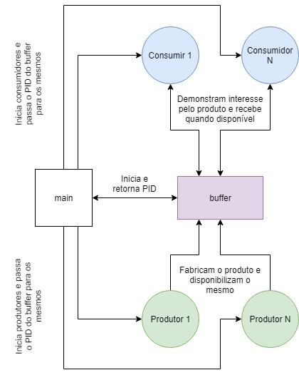

# Trabalho II

## Descrição

### O que deve ser entregue junto com o trabalho:

1. Apresentação em aula para o professor;
2. Redação de relatório técnico;
1. Documentação (tais como, diagramas de classes e estados);
2. Descrição e apresentação dos algoritmos;
3. Código Fonte, o relatório deve conter uma seção com as explicações de como
    executar o projeto/fonte;
4. O Relatório deve conter um exemplo de aplicação dos problemas estudados.

### Enunciado:
O grupo deverá estuda o problema chamado denominado, produtor consumidor. Após estudar deverá propor um sistema, que implemente, e simule a necessidade do produtor consumidor (Erlang). Além disso,  deverá mencionar no relatório um pequeno esboço sobre o problema e sua relação com a programação paralela. 

Linguagem: [Erlang](http://www.erlang.org/)

## O problema do produtor, consumidor

### Pequeno resumo

Da linguagem utilizada, foi selecionada as documentações abaixo.

#### Erlang

##### erl

- Documentação: [Link](http://erlang.org/doc/man/erl.html)
- [Iniciando um binário](https://stackoverflow.com/questions/30091487/init-terminating-in-do-boot-is-thrown-when-executing-erlang-script)


### Execução

Trabalho feito em Erlang (versão 21)

Para executar a aplicação, é necessário:

- Realizar o [Download do instalador do Erlang/OTP](https://www.erlang.org/downloads)
- Instalar em seu dispositivo

Opcional:

- Realizar o [Download do instalador do rebar3](https://www.rebar3.org/)
- Instalar em seu dispositivo (Mais informações em: [Getting Started with rebar3](https://www.rebar3.org/docs/getting-started))

### Código

Foi criado um arquivo principal onde é instanciado o buffer (fila|mercado), consumidores e produtores. Os consumidores e produtores são instanciados cada um em um processo separado e para cada um é passado o PID do buffer (`BufferPid`) para ser feito a troca de "produtos" entre eles.

```erlang
% producer_and_consumer.erl
main(NumberOfConsumers, NumberOfProducers) ->
    io:format("[main] started"),
    BufferPid = spawn(buffer, start, []),
    createConsumers(NumberOfConsumers, BufferPid),
    createProducers(NumberOfProducers, BufferPid).
```

O trabalho do consumidor basicamente se resume em enviar uma solicitação para o buffer - para entrar na fila de consumidores que desejam um "produto" - e escutar sua resposta. Quando recebido a resposta, o consumidor usufrui do "produto" e reinicia o ciclo.

```erlang
listenBufferAndConsume(ConsumerId, BufferPid, TimeToConsume) ->
    BufferPid ! {ConsumerId, self()},
    receive
      Product ->
	  io:format("[consumer] receive: ~p ~n", [Product]),
	  timer:sleep(TimeToConsume),
	  listenBufferAndConsume(ConsumerId, BufferPid,
				 TimeToConsume)
    end.
```

Já o trabalho do produtor se resume em basicamente "produzir" e enviar o produto para se consumido ao buffer. Realizar o envio, o produtor reinicia seu ciclo.

```erlang
produce(ProducerId, BufferPid, TimeToProduce) ->
    io:format("[producer] #~p working ~n", [ProducerId]),
    Product = TimeToProduce,
    timer:sleep(Product),
    BufferPid ! {ProducerId, Product, self()},
    produce(ProducerId, BufferPid, TimeToProduce).
```

O trabalho do buffer consiste em receber os produtos dos produtores e enviar os mesmos para os consumidores que estão na lista de espera.

```erlang
manage(Consumers, Products) ->
    io:format("[buffer] managing: c=~p p=~p ~n",
	      [length(Consumers), length(Products)]),
    receive
      {ConsumerId, PID} ->
	  receiveConsumerAndKeepManaging(ConsumerId, PID,
					 Consumers, Products);
      {ProducerId, Product, PID} ->
	  receiveProductAndKeepManaging(ProducerId, Product, PID,
					Consumers, Products)
    end.
```

Ele faz isso a partir do dois métodos abaixo

```erlang
receiveConsumerAndKeepManaging(ConsumerId, PID,
			       Consumers, Products) ->
    io:format("[buffer] receive consumer: ~p ~p ~n",
	      [ConsumerId, PID]),
    NextConsumers = Consumers ++ [PID],
    if length(Products) == 0 ->
	   manage(NextConsumers, Products);
       true ->
	   notifyConsumerAndKeepManaging(NextConsumers, Products)
    end.

receiveProductAndKeepManaging(ProducerId, Product, PID,
			      Consumers, Products) ->
    io:format("[buffer] receive producer: ~p ~p ~p ~n",
	      [ProducerId, Product, PID]),
    NextProducts = Products ++ [Product],
    if length(Consumers) == 0 ->
	   manage(Consumers, NextProducts);
       true ->
	   notifyConsumerAndKeepManaging(Consumers, NextProducts)
    end.
```

E a notificação do consumidor é feita a partir de

```erlang
notifyConsumerAndKeepManaging(Consumers, Products) ->
    [PID | RestOfConsumers] = Consumers,
    [MoreOldProduct | RestOfProducts] = Products,
    PID ! {MoreOldProduct},
    manage(RestOfConsumers, RestOfProducts).
```

### Fluxogramas

#### Principal



### Exemplo de aplicação dos problemas estudados

Esse conceito pode ser utilizado para sincronização de processos rodando concorrentemente. Uma de suas principais aplicações é na sincronização da troca de mensagens entre processos.