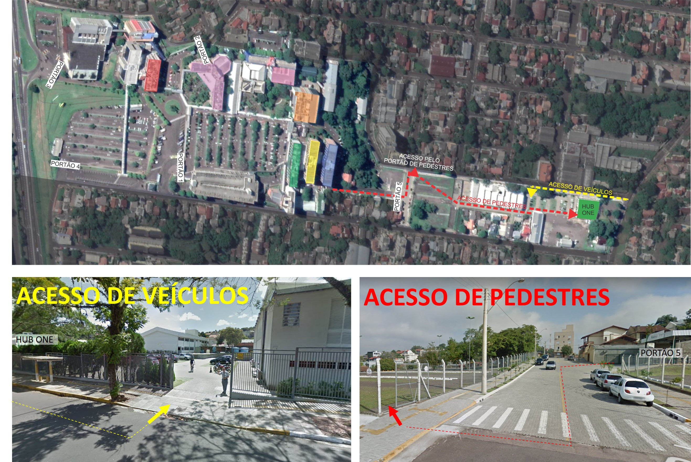

# Avaliação presencial

## Informações

Prezados alunos (as),

para realizarmos o fechamento de todos os conceitos desenvolvidos durante a disciplina de **Psicologia Geral**, faremos a **Avaliação Presencial** (obrigatória), que constitui 60% da nota final do aluno.

A **Avaliação Presencial** ocorrerá no dia **07/06/2019 (sexta-feira)**, às **19h30min**, na: **sala HUB ONE (veja informações abaixo)**, com a **Prof.ª Claudia M. T. Goulart**.

*Orientações:* a prova será individual e sem consulta em nenhum material. É necessário trazer um **documento oficial com foto**, para sua identificação no momento da prova.

Bons estudos e uma *Boa Prova!*

Neste semestre, sua Avaliação Presencial da disciplina **Psicologia Geral** será no **HUB ONE**.

Você sabe onde fica e como chegar?

\- **Local: sala 009, térreo do HUB ONE - Rua Rubem Berta, 38 - Bairro Vila Nova, Novo Hamburgo – RS**

Se você vier de carro, pode estacionar junto ao prédio, sem custo. Mas se utiliza transporte coletivo, pode se deslocar pela saída do prédio Azul (portão 5) e acessar a quadra do HUB ONE pelas dependências do CIES.

## Compilado estudo

### Temática B

- **Cite algumas das possíveis áreas de inserção da psicologia?**

\- Educação

\- Saúde

\- Politica

- **Caracterize o Funcionalismo, o Estruturalismo e o Associacionismo.**

\- Funcionalismo: 

Procura compreender como funciona a consciência através do seu modo de adaptar-se ao mesmo

\- Estruturalismo:

Procura entender a consciência através do sistema nervoso central

\- Associacionismo:

Todo comportamento tende a se repetir, se nos recompensamos assim que nos emitimos

- **O que é a ciência da psicologia?**

A psicologia como ciência tem como objetivo colaborar com a subjetividade humana

- **Cite os quatro cientistas apontados como responsáveis diretos pelas primeiras aplicações do método experimental ao objeto de estudo da Psicologia e descreva suas principais contribuições.**

\- Hermann Von Helmholtz:

Foi um dos maiores cientistas do século XIX. A Psicologia estava em terceiro lugar entre as áreas de suas contribuições científicas; contudo, o seu trabalho, ao lado do de Fechner e Wundt, foi decisivo para a fundação da nova Psicologia 

\- Ernst Weber:

Seu principal interesse de pesquisa foi a fisiologia dos órgãos sensoriais, área em que forneceu duradouras contribuições 

\- Gustav Theodor Fechner

Preocupou-se com a relação existente entre mente e corpo, físico e psíquico, adotando a ideia de paralelismo psicofísico, ou seja: os fenômenos mentais correspondem a fenômenos orgânicos. Fechner considerava que as sensações somente poderiam ser testadas a partir do método das Ciências Exatas, nesse caso, através dos estímulos. Dessas experiências nasceram os métodos psicofísicos, experimentais e quantitativos que constituíram a sua maior e mais importante contribuição para a nova ciência denominada Psicologia. Em virtude disso, Fechner é considerado o pai da Psicometria. 

\- Wilhelm Wundt

Fundador da Psicologia como disciplina acadêmica formal. A primeira pessoa na história da Psicologia a ser designada, adequada e irrestritamente, como psicólogo. Wundt fundou o primeiro laboratório de Psicologia Experimental do mundo em Leipzig, na Alemanha, em 1879, e foi o responsável pela formação de muitos psicólogos. Editou a primeira revista e deu início à Psicologia Experimental como ciência. As áreas que ele investigou— incluindo a sensação e a percepção, a atenção,o sentimento, a reação e a associação — se tornaram capítulos básicos em manuais que ainda não haviam sido escritos. O fato de uma parte tão grande da história da Psicologia depois de Wundt consistir numa oposição à sua concepção de Psicologia não diminui as suas realizações e contribuições como fundador

- **Qual a diferença entre o conhecimento do senso comum e o conhecimento científico?**

Senso comum é um conhecimento pequeno e superficial que pode ser obtido pelo proprio sujeito.

Já a ciência é o conjunto de conhecimento sempre obtidos de maneira programada, sistemática e controlado sobre aspectos da realidade, expressados de uma maneira precisa e rigorosa.

- **Tendo em vista que início do desenvolvimento histórico da Psicologia começa a surgir entre os filósofos gregos com a primeira tentativa de sistematizar uma Psicologia, explique as contribuições de Sócrates, Platão e Aristóteles.**

A partir de Sócrates (469-399 a.C.), a Psicologia, na antiguidade, ganha consistência. Sócrates preocupava-se com o limite que separa o homem dos animais e postulava que a principal característica humana era a razão. A razão permitia ao homem sobrepor-se aos instintos, que seriam a base da irracionalidade. As teorias da consciência são, de certa forma, frutos dessa primeira sistematização.

Platão (427-347 a.C.), discípulo de Sócrates, segundo Rosenfeld (1993), foi o primeiro pensador que definiu com clareza a noção do ser imaterial constituído pelas ideias.

Conforme Aristóteles (384-322 a.C.), aluno de Platão, a alma e o corpo não poderiam ser dissociados. Rosenfeld (1993) destaca que, para Aristóteles, a alma é a enteléquia dos seres vivos, enumerando três níveis de desenvolvimento da psyché: a alma vegetativa (com as funções de alimentação e reprodução), alma já presente no nível das plantas; a alma sensitiva (funções de percepção e movimento), que se associa no animal à alma vegetativa; e a alma racional (pensante), que se associa no homem aos níveis inferiores. 

#### Respostas dos professores

- **Cite algumas das possíveis áreas de inserção da psicologia?**

Jurídica, clínica, escolar, trânsito etc

- **Caracterize o Funcionalismo, o Estruturalismo e o Associacionismo.**

O movimento funcionalista concentrou-se numa questão prática: o que os processos mentais realizam? Os funcionalistas não estudavam a mente do ponto de vista de sua composição (uma estrutura de elementos mentais), mas como um conglomerado de funções e/ou processos que levam a consequências práticas no mundo real.

O Estruturalismo foi estabelecido por Edward Titchner estando ele preocupado com a compreensão do mesmo fenômeno que o Funcionalismo: a consciência. Mas, diferentemente de W. James, Titchner irá estudá-la em seus aspectos estruturais, isto é, os estados elementares da consciência como estruturas do Sistema Nervoso Central.

O termo “Associacionismo” origina-se da concepção de que a aprendizagem se

dá por um processo de associação das ideias — das mais simples às mais complexas. Assim, para aprender um conteúdo complexo, a pessoa precisaria primeiramente aprender as ideias mais simples que estariam associadas àquele conteúdo.

- **O que é a ciência da psicologia?**

Psicologia é o estudo científico do comportamento e dos processos mentais, abrangendo não somente o que as pessoas fazem, mas também suas atividades biológicas, seus sentimentos, suas percepções, sua memória, seu raciocínio e seus pensamentos.

- **Cite os quatro cientistas apontados como responsáveis diretos pelas primeiras aplicações do método experimental ao objeto de estudo da Psicologia e descreva suas principais contribuições.**

Hermann von Heimholtz foi um dos maiores cientistas do século XIX. A psicologia estava em terceiro lugar entre as áreas de suas contribuições científicas; contudo, o seu trabalho, ao lado do de Fechner e Wundt, foi decisivo para a fundação da nova Psicologia.

Gustav Theodor Fechner considerava que as sensações somente poderiam ser testadas a partir do método das Ciências Exatas, nesse caso, através dos estímulos. Dessas experiências nasceram os métodos psicofísicos, experimentais e quantitativos que constituíram a sua maior e mais importante contribuição para a nova ciência denominada Psicologia. Em virtude disso, Fechner é considerado o pai da Psicometria.

Ernst Weber seu principal interesse de pesquisa foi a fisiologia dos órgãos sensoriais.

Wilhelm Wundt foi fundador da Psicologia como disciplina acadêmica formal. A primeira pessoa na história da Psicologia a ser designada, adequada e irrestritamente, como psicólogo. Wundt fundou o primeiro laboratório de Psicologia Experimental do mundo em Leipzig, na Alemanha, em 1879, e foi o responsável pela formação de muitos psicólogos.

- **Qual a diferença entre o conhecimento do senso comum e o conhecimento científico?**

O conhecimento do senso comum pode ser explicado como o conhecimento pequeno e superficial acumulado a partir de experiências próprias ou de outros. É considerado intuitivo, espontâneo, de tentativas e erros. Já o conhecimento científico tem como propósito compreender, elucidar, alterar o cotidiano a partir de seu estudo sistemático.

- **Tendo em vista que início do desenvolvimento histórico da Psicologia começa a surgir entre os filósofos gregos com a primeira tentativa de sistematizar uma Psicologia, explique as contribuições de Sócrates, Platão e Aristóteles.**

Sócrates preocupava- se com o limite que separa o homem dos animais e postulava que a principal característica humana era a razão. A razão permitia ao homem sobrepor-se aos instintos, que seriam a base da irracionalidade.

Platão foi o primeiro a demonstrar o caráter imaterial da alma como garantia de sua imortalidade. Ele acreditava que a vida psíquica era independente da vida do corpo e procurou definir um “lugar” para a razão no nosso próprio corpo, estabelecendo a cabeça como o “lugar” onde se encontra a alma do homem.

Aristóteles acreditava que a alma e o corpo não poderiam ser dissociados. Para ele, existiam três níveis de desenvolvimento da psyché: a alma vegetativa (com as funções de alimentação e reprodução), alma já presente no nível das plantas; a alma sensitiva (funções de percepção e movimento), que se associa no animal à alma vegetativa; e a alma racional (pensante), que se associa no homem aos níveis inferiores.

### Temática C

Para auxiliar na fixação do conteúdo estudado na Temática C, responda às questões.

#### PERGUNTA 1

O processo de envelhecimento envolve um declínio no funcionamento de todos os sistemas do corpo, em especial do cérebro.

- **Verdadeiro**
- Falso

#### Resposta professor:

-

#### PERGUNTA 2

De acordo com dados da Organização Mundial da Saúde, a velhice inicia aos 65 anos e é o ápice do processo de envelhecimento que acompanha o desenvolvimento ao longo do ciclo vital.

- **Verdadeiro**
- Falso

#### Resposta professor:

-

#### PERGUNTA 3

O que caracteriza a fase adulta?

- Fase das realizações e confirmações
- Fase de amadurecimento físico (não mais crescimento)
- Alcança-se o auge da maturidade física e emocional ("auge financeiro")
- Fase de sair da família de origem para formar a própria família (prazer e gratificação)

#### Resposta professor:

-

#### PERGUNTA 4

Paul Baltes indica sete princípios da abordagem ao desenvolvimento do ciclo de vida. Quais são eles?

1. **O desenvolvimento é vitalício.** O desenvolvimento é um processo vitalício de mudança. Cada período do ciclo de vida é afetado pelo que aconteceu antes e afetará o que está por vir. Cada período tem características e valores únicos. Nenhum período é mais ou menos importante que qualquer outro.
2. **O desenvolvimento é multidimensional.** Ocorre ao longo de múltiplas dimensões que interagem – biológica, psicológica e socialmente –, cada uma delas podendo se desenvolver em ritmos diferentes.
3. **O desenvolvimento é multidirecional.** Enquanto as pessoas ganham em uma área, podem perder em outra, às vezes ao mesmo tempo. As crianças crescem principalmente em uma direção – para cima – tanto em tamanho quanto em habilidades. Depois o equilíbrio aos poucos se desloca. Os adolescentes ganham em termos de habilidade física, mas sua facilidade em aprender uma nova língua declina. Algumas habilidades, como o vocabulário, geralmente continuam crescendo ao longo da idade adulta; outras, como a capacidade de resolver problemas com os quais não estão familiarizados, poderão diminuir; mas alguns novos atributos, como a sabedoria, poderão aumentar com a idade. As pessoas procuram maximizar os ganhos concentrando-se em fazer coisas que sabem fazer bem e minimizar perdas aprendendo a administrá-las ou compensá-las.
4. **Influências relativas de mudanças biológicas e culturais sobre o ciclo de vida.** O processo de desenvolvimento é influenciado tanto pela biologia quanto pela cultura, mas o equilíbrio entre essas influências se altera. Habilidades biológicas, como acuidade sensorial, força e coordenação muscular, tornam-se mais fracas com a idade, mas apoios culturais, tais como educação, relacionamentos e ambientes tecnologicamente adequados à idade, podem ajudar a compensar.
5. **O desenvolvimento envolve mudança na alocação de recursos.** Os indivíduos escolhem como “investir” seus recursos de tempo, energia, talento, dinheiro e apoio social de várias maneiras. Os recursos podem ser usados para o crescimento (por exemplo, aprender a tocar um instrumento ou aprimorar uma habilidade), para a conservação ou recuperação (praticar para manter ou recobrar uma proficiência), ou para lidar com a perda quando a conservação e a recuperação não forem possíveis. A alocação de recursos para essas três funções muda ao longo da vida, à medida que diminui o conjunto de recursos disponíveis. Na infância e no início da vida adulta, a maior parte dos recursos é direcionada para o crescimento; na velhice, para a regulação da perda. Na meia-idade, a alocação é mais equilibrada entre as três funções.
6. **O desenvolvimento revela plasticidade.** Muitas capacidades, como a memória, a força física e a resistência, podem ser aperfeiçoadas com o treinamento e a prática, mesmo em idade avançada. Mas, até mesmo nas crianças, a plasticidade tem limites que em parte dependem das várias influências sobre o desenvolvimento. Uma das tarefas da pesquisa em desenvolvimento é descobrir até que ponto determinados tipos de desenvolvimento podem ser modificados nas diversas idades.
7. **O desenvolvimento é influenciado pelo contexto histórico e cultural.** Cada pessoa se desenvolve em múltiplos contextos – circunstâncias ou condições definidas em parte pela maturação e em parte pelo tempo e lugar. Os seres humanos não apenas influenciam, mas também são influenciados pelo contexto histórico-cultural. Conforme discutiremos ao longo deste livro, os cientistas do desenvolvimento descobriram diferenças significativas entre coortes, por exemplo, no funcionamento  intelectual, no desenvolvimento emocional de mulheres na meia-idade e na flexibilidade da personalidade na velhice.

#### Resposta professor:

-

#### PERGUNTA 5

O que caracteriza a fase adulta?

A: Desenvolvimento físico

B: Desenvolvimento cognitivo

C: Desenvolvimento psicossocial

Relacione as colunas

- [ A ] Crescimento do corpo e do cérebro, incluindo os padrões de mudança nas capacidades sensoriais, habilidades motoras e saúde.
- [ B ] Padrão de mudança nas habilidades mentais, tais como aprendizagem, atenção, memória, linguagem, pensamento, raciocínio e criatividade.
- [ C ] Padrão de mudança nas emoções, personalidade e relações sociais.

#### Resposta professor:

-

#### PERGUNTA 6

Tendo em vista que a divisão do ciclo vital em fases é uma construção social, conceitue “construção social”.

É um conceito ou prática que pode parecer natural e óbvio àqueles que o aceitam, mas na realidade é uma invenção de uma determinada cultura ou sociedade

#### Resposta professor:

\-

#### PERGUNTA 7

Como se pode conceituar o fenômeno chamado “adultescência” ou “kidadults”?

É caracterizado por um prolongamento da adolescência, de modo que a transição para a vida adulta ocorre parcialmente.

#### Resposta professor:

\-

#### PERGUNTA 8

Na perspectiva do desenvolvimento humano, qual o papel do brincar na fase da infância?

O brincar tem um papel fundamental na infância, pois auxilia a criança na mediação dessa separação, de modo que é através dele que a criança pode colocar seus conflitos em cena, de forma ativa.

#### Resposta professor:

\-

#### PERGUNTA 9

O que é desenvolvimento humano?

Estudo científico dos processos de transformação e estabilidade ao longo de todo o ciclo de vida humano.

#### Resposta professor:

\-

#### PERGUNTA 10

A utilização do termo velhice é equivocada e, dessa forma, deve-se utilizar somente o termo Terceira Idade, por ter conotações menos depreciativas.

- Verdadeiro
- **Falso**

#### Resposta professor:

\-

#### PERGUNTA 11

A velhice é percebida como fenômeno natural e social cujo processo envolve problemas e limitações de ordem biológica, econômica e sociocultural que singularizam seu processo de envelhecimento.

- **Verdadeiro**
- Falso

#### Resposta professor:

\-

### Avaliação I

1. Acerca das principais perspectivas em psicologia estudadas, a abordagem que preconiza o comportamento como motivado por forças internas inconscientes sobre as quais a pessoa pouco tem controle é a:

   - Perspectiva cognitiva
   - Perspectiva neurocientífica 		
   - Perspectiva comportamental
   - Perspectiva humanista
   - **Perspectiva psicodinâmica**

2. Não há um momento definido **objetivamente** em que um bebê se torna uma criança ou um adolescente torna-se um adulto. No entanto, os cientistas do desenvolvimento definiram períodos do ciclo vital e, dessa forma, essas divisões do ciclo vital devem ser consideradas construções sociais.

   - **Verdadeiro**
   - Falso

3. Os seres humanos são seres sociais. Desde o começo, desenvolvem-se dentro de um contexto social e histórico. Dessa forma, pode-se definir que a unidade econômica e doméstica que compreende laços de parentesco envolvendo duas gerações e que consiste em pai e mãe, ou apenas um dos dois, e seus filhos biológicos, adotados ou enteados é chamada de família extensa:

   - Verdadeiro
   - **Falso**

4. Sobre os conceitos de raça, etnia e grupo étnico estudados, verifique as afirmativas verdadeiras e falsas, em seguida marque a alternativa correta:

   [  :heavy_check_mark:  ] Um grupo étnico consiste em pessoas que pertencem a mesma cultura.

   [  :heavy_check_mark:  ] Não há um consenso científico claro sobre a definição do termo raça, sendo impossível medi-lo de modo confiável.

   [  :x:  ] As pesquisas atuais demonstram que os padrões étnicos não têm relação com o desenvolvimento humano.

   [   :heavy_check_mark:  ] A raça, como categoria social, continua sendo um dos fatores utilizados nas pesquisas porque faz diferença em relação a “como os indivíduos são tratados, onde vivem, suas oportunidades de emprego, a qualidade de sua assistência médica e se podem participar plenamente” em sua sociedade.

   [  :heavy_check_mark:  ] Termos como negro ou hispânico podem ser uma generalização étnica exagerada, que obscurece ou confunde essas variações.

   - F, V, V, F, F
   - **F, V, F, V, V**
   - V, F, V, V, V
   - V, V, F, V, V
   - V, F, V, F, F

5. Acerca do conhecimento científico e do conhecimento do senso comum estudados, analise as afirmativas abaixo.

   I - O conhecimento do senso comum pode ser explicado como aquele formulado a partir de experiências próprias ou dos outros.
   II - O conhecimento científico é obtido a partir de um estudo sistemático, com o propósito de compreender os fenômenos cotidianos.
   III - O conhecimento científico é cristalizado, ou seja, com o passar do tempo não costuma mudar.

   - Apenas a afirmativa I está correta.
   - Apenas a afirmativa II está correta.
   - Apenas a afirmativa III está correta.
   - **Apenas as afirmativas I e II estão corretas.**
   - Apenas as afirmativas II e III estão corretas.

6. Sabe-se que existem fatores que causam impacto sobre o desenvolvimento humano. A partir dos conceitos de hereditariedade e ambiente estudados, analise as afirmativas abaixo.

   I – A hereditariedade pode ser definida por costumes passados de geração para geração. :x:

   II – O ambiente é entendido como o mundo que está do lado de fora do eu, e que começa no útero, e a aprendizagem relacionada à experiência. :heavy_check_mark:

   III – As pesquisas atuais apontam que tanto a genética como as influências ambientais antes e depois do nascimento têm papel importante no desenvolvimento de traços específicos de personalidade. :heavy_check_mark:

- Apenas a afirmativa I está correta.
- **Apenas as afirmativas II e III estão corretas.**
- Apenas as afirmativas I e III estão corretas.
- Apenas a afirmativa III está correta.
- Todas as afirmativas estão corretas.

7. Com base nos materiais estudados sobre a psicologia científica verifique as afirmativas verdadeiras e falsas, em seguida marque a alternativa correta:

   [  :x:  ] A psicologia resume-se basicamente no estudo e no tratamento das doenças/transtornos mentais.

   [  :heavy_check_mark:  ] A psicologia caracteriza-se pelo estudo científico do comportamento e dos processos mentais.

   [  :heavy_check_mark:  ] A psicologia, enquanto ciência, abrange o estudo das atividades biológicas, dos sentimentos, das percepções, da memória e dos pensamentos das pessoas.

   [  :heavy_check_mark:  ] Os conhecimentos produzidos no campo da psicologia podem relacionar-se com diversas áreas do conhecimento.

- **F, V, V, V**
- V, F, V, V
- F, F, V, F
- V, F, F, V
- V, V, V, F

8. De acordo com os conteúdos estudados sobre o Desenvolvimento Humano, pode-se definir a velhice como: 

   - O processo que ocorre em algumas pessoas, independe da idade. Já que você pode ser velho em qualquer idade.
   - O processo no qual a pessoa com mais de 65 anos se aposenta.
   - **Um fenômeno natural e social cujo processo envolve problemas e limitações de ordem biológica, econômica e sociocultural.**
   - Uma mudança de personalidade que ocorre após os 65 anos de idade.
   - A dificuldade de locomoção e tomada de decisão que ocorre após os 65 anos de idade.

9. Considere a situação descrita a seguir e marque a alternativa correta.

   Daniela está na escola onde tem algumas amigas. Elas costumam se encontrar para brincar na hora do intervalo. Às vezes, Daniela quer alguma coisa, só porque as amigas dela têm. Na escola, está aprendendo diferentes conteúdos e, recentemente, descobriu que gosta mais de matemática do que de português. Considerando-se o estudo do desenvolvimento humano, muito provavelmente as características apresentadas por Daniela indicam que ela está no seguinte período do ciclo vital: 	

   - Período pré-natal
   - Primeira infância
   - Segunda infância
   - **Terceira infância**
   - Adolescência

10. Acerca dos conceitos e definições estudadas sobre a cultura, analise as afirmativas abaixo:

    I – Cultura refere-se ao modo de vida global de uma sociedade ou grupo, que inclui costumes, tradições, leis, conhecimento, crenças, valores, linguagem e produtos materiais, de ferramentas a trabalhos artísticos

    II – Cultura inclui todo comportamento e todas as atitudes aprendidas, compartilhadas e transmitidas entre os membros de um grupo social. 

    III - A cultura está em constante mudança, geralmente mediante contato com outras culturas. Quando estamos imersos numa cultura, é difícil perceber o quanto do que fazemos é afetado por ela.

    - Apenas a afirmativa I está correta.
    - Apenas as afirmativas I e II estão corretas.
    - Apenas as afirmativas II e III estão corretas.
    - Apenas a afirmativa III está correta.
    - **Todas as afirmativas estão corretas.**

### Temática D

Após o estudo dos materiais básicos previstos na Temática D, teste seus conhecimentos acerca do conteúdo estudado, respondendo o questionário sobre saúde mental.

#### Pergunta 1

O que preconizam as teorias que surgiram no fim do século XX, chamadas de Antipsiquiatria, a Psiquiatria Existencial e a Psiquiatria Social?

- Todas elas sugerem a extinção dos hospitais psiquiátricos e buscam restaurar a humanidade da pessoa institucionalizada.

#### Resposta professor:

Todas essas teorias sugerem a extinção dos hospitais psiquiátricos e buscam restaurar a humanidade da pessoa institucionalizada.

#### Pergunta 2

De acordo com o texto, qual o conceito básico da reforma da assistência em saúde mental?

- É o de devolver a autonomia, de devolver a “voz”, a identidade, as habilidades, o futuro, o papel social, ao paciente institucionalizado, procurando desta forma reabilitá-lo para o convívio na sociedade 

#### Resposta professor:

O conceito é de devolver a autonomia, de devolver a “voz”, a identidade, as habilidades, o futuro, o papel social ao paciente institucionalizado procurando, assim, reabilitá-lo para o convívio com a sociedade.

#### Pergunta 3

Conforme indicado no texto "Normalidade e Patologia: Reflexões Iniciais", o dicionário de psicologia aponta três definições para normalidade. Cite e explique cada uma delas:

1 - Comportamento é aceito como usual ou de ocorrência frequente

2 - Comportamento normal considera-o assim aquele comportamento que se conforma às normas ou às demandas sociais aceitas

3 - Comportamento estatisticamente comum, independente de consenso 

#### Resposta professor:

(1) Normalidade como um comportamento aceito como usual ou mais frequente. (2) Comportamento normal aquele que está conforme às normas ou às demandas sociais aceitas. (3)  Normalidade como algo estatisticamente comum, independente do consenso.

#### Pergunta 4

Como pode-se evidenciar no texto, os profissionais da área da saúde resistem em usar as terminologias “normalidade” e “anormalidade”. Eles preferem falar em comportamento desajustado ou desajustamento. Por que isso ocorre?

- Pois definir alguém /rotular alguém como "normal" ou "anormal" é algo extremamente complexo, especialmente se nos baseamos em diretrizes absolutas. (Devido a variação da definição entre autores)

#### Resposta professor:

A definição de normalidade ou anormalidade perpassa por padrões culturais, dessa forma, utilizar o termo “comportamento ajustado” ou “desajustamento” permite que não sejam esquecidos os padrões culturais envolvidos, que determinam grande parte dessa questão.

#### Pergunta 5

O que as novas concepções (Antipsiquiatria, a Psiquiatria Existencial e a Psiquiatria Social) preconizam como causas fora do indivíduo que possam gerar a doença mental?

- Condições sociais, trabalho,lazer, sistema educacional competitivo, falta de estrutura familiar, violência urbana, etc.

### Tematica E

Para isso, marque verdadeiro ou falso para as afirmativas.

#### PERGUNTA 1

O psicólogo educacional/escolar atua no âmbito da educação, colaborando para a compreensão e para a mudança do comportamento de educadores e educandos no processo de ensino-aprendizagem.

- **Verdadeiro** :heavy_check_mark:
- Falso

#### PERGUNTA 2

O psicólogo jurídico atua no âmbito da Justiça, nas instituições governamentais e não governamentais, colaborando no planejamento e na execução de políticas de cidadania, direitos humanos e prevenção da violência.

- Verdadeiro :heavy_check_mark:
- **Falso**

#### PERGUNTA 3

Cabe, ao psicólogo clínico a realização de psicoterapia em todas as etapas do ciclo vital e, quando necessário, a realização de testes e o fornecimento de receituário de medicações, desde que não sejam de origem controlada.

- Verdadeiro
- **Falso** :heavy_check_mark:

#### PERGUNTA 4

O psicólogo jurídico, em seu trabalho, elabora laudos, relatórios e pareceres, colaborando com o indivíduo envolvido com a Justiça, através da avaliação da personalidade e, em alguns casos, com a prescrição de medicação, quando necessário.

- Verdadeiro
- **Falso **:heavy_check_mark:

#### PERGUNTA 5

O psicólogo social pode atuar assessorando quanto aos aspectos psicológicos nas técnicas de comunicação e propaganda e pesquisar, analisar e estudar variáveis psicológicas que influenciam o comportamento do consumidor.

- **Verdadeiro** :heavy_check_mark:
- Falso

#### PERGUNTA 6

O psicólogo do trabalho pode ter, entre suas funções, a de participar do processo de desligamento de funcionários e do preparo para aposentadoria podendo, ainda, realizar as demissões dos colaboradores/funcionários na ausência de seus respectivos gestores.

- **Verdadeiro**
- Falso :heavy_check_mark:

#### PERGUNTA 7

O psicólogo do trânsito pode participar de equipes multiprofissionais voltadas à prevenção de acidentes de trânsito.

- **Verdadeiro **:heavy_check_mark:
- Falso

#### PERGUNTA 8

Dentre as atribuições do psicólogo clínico, está a realização de avaliações e diagnóstico psicológicos, podendo ou não utilizar-se de testes psicológicos.

- Verdadeiro :heavy_check_mark:
- **Falso**

### Temática F

Para que você consiga diferenciar os conceitos, descreva:

#### PERGUNTA 1

Sexualidade

Não é o sexo, mas o modo de ser que incorpora um corpo mediante suas práticas (relacionadas ao prazer, ao desejo, aos modos de ser e de buscar se realizar, às expressões de afeto, carinho e sentimento)

#### Resposta professor:

Modo de ser que incorpora um corpo mediante suas práticas (relacionada ao prazer, ao desejo, aos modos de ser e de buscar se realizar, às expressões de afeto, carinho e sentimento)

#### PERGUNTA 2

Racismo

O racismo consiste na idéia de que algumas raças são inferiores a outras, atribuindo desigualdades sociais, culturais, políticas, psicológicas, à “raça” e, portanto, legitimando as diferenças sociais a partir de supostas  diferenças biológicas. 

#### Resposta professor:

Consiste na ideia de que algumas raças são inferiores a outras, atribuindo desigualdades sociais, culturais, políticas, psicológicas, à “raça” e, portanto, legitimando as diferenças sociais a partir de supostas diferenças biológicas.

#### PERGUNTA 3

Orientação Sexual

Adoção de comportamento heterossexuais, bissexuais, homossexuais, transexuais, etc.

#### Resposta professor:

Adoção de comportamento heterossexuais, bissexuais, homossexuais, transexuais, etc.

#### PERGUNTA 4

Raça

Raça é uma construção social essencialista, amplamente aceita criado e reforçado em práticas cotidianas.

#### Resposta professor:

É um operador social usado para agregar indivíduos e grupos que compartilham certos aspectos físicos observáveis e ajuda a determinar uma atitude negativa frente a eles. É uma construção social essencialista, amplamente aceita.

#### PERGUNTA 5

Sexo

Associado àquilo que é físico, geneticamente herdado

#### Resposta professor:

Associado àquilo que é físico, geneticamente herdado.

#### PERGUNTA 6

Gênero

Construção social de masculinidades e feminidades

#### Resposta professor:

Construção social de masculinidades e feminilidades

### Avaliação II

#### PERGUNTA 1

No texto discutido na temática sobre relações humanas acerca da desigualdade racial, do racismo e seus efeitos, a autora destaca que “o racismo constitui nossa história, estrutura as relações em nossa sociedade e precisa ser encarado como o grave problema que realmente é” (VIEIRA, 1995; SANTOS, 2009 apud ZAMORA, 2012, p. 512). Conforme descrito no texto de Zamora (2012), analise as afirmativas abaixo:

I – O racismo legitima as diferenças sociais a partir de supostas diferenças sociais que existem entre as raças.

II - Raça é uma construção social essencialista, amplamente aceita, criada e reforçada em práticas cotidianas.

III - O racismo consiste na ideia de que algumas raças são inferiores a outras, atribuindo desigualdades sociais, culturais, políticas, psicológicas, à “raça”. :heavy_check_mark:

- Apenas a afirmativa I está correta
- Apenas a afirmativa II está correta
- Apenas as afirmativas I e II estão corretas
- **Apenas as afirmativas II e III estão corretas** 
- Todas as afirmativas estão corretas

#### PERGUNTA 2

No texto de Normalidade e Patologia, apresentado na temática de Saúde Mental, afirma-se que os profissionais da saúde resistem em usar as terminologias “normalidade” e “anormalidade”. Isso ocorre porque:

- Há uma definição no código de ética profissional que proíbe a utilização desses termos.
- A definição de normalidade ou anormalidade é utilizada apenas pelo senso comum.
- **Eles preferem utilizar os termos “comportamento ajustado” ou “desajustamento”, os quais permitem que não sejam esquecidos os padrões culturais envolvidos, que determinam grande parte dessa questão.** 
- A definição de normalidade e anormalidade é muito antiga e não contempla as mudanças sociais e econômicas atuais.
- Há um consenso na literatura para não designar as pessoas como “normais” ou “anormais”.

#### PERGUNTA 3

Considerando-se que os psicólogos possuem diversos campos de atuação, analise a afirmativa a seguir, relacionada com esse tema, e preencha as lacunas abaixo, conforme as opções a seguir:

O psicólogo ___________________, entre outras atribuições, elabora laudos, relatórios e pareceres, colaborando com a ordem jurídica através da avaliação da personalidade deste e fornecendo subsídios ao processo judicial quando solicitado pela autoridade competente. Assessora, também, autoridades judiciais no encaminhamento a terapias psicológicas, quando necessário. :heavy_check_mark:

- Clínico
- **Jurídico**
- do Trânsito
- do Trabalho
- Educacional/Escolar

#### PERGUNTA 4

Psicologia possui instrumentos próprios para obter dados sobre a vida psíquica. Entre esses, encontra-se :heavy_check_mark:

- a prescrição de medicamentos
- o reiky
- **as técnicas de entrevista**
- o uso de florais
- a grafologia.

#### PERGUNTA 5

No texto de Normalidade e Patologia, apresentado na temática de Saúde Mental, há a definição de que o comportamento para ser considerado psicologicamente perturbado deve ser angustiante ou incapacitante. Sendo assim, analise a afirmativa abaixo e responda verdadeiro ou falso. :heavy_check_mark:

> Esse entendimento significa que, mesmo um comportamento considerado pela sociedade como típico, quando se torna incapacitante ou gera angústia em demasia, poderá estar indicando um distúrbio psíquico

- **Verdadeiro**
- Falso

#### PERGUNTA 6

4. Sobre o tema da sexualidade humana, verifique as afirmativas verdadeiras e falsas, em seguida marque a alternativa correta: :heavy_check_mark:

[  V  ] Sexo está associado àquilo que é físico, geneticamente herdado.

[  F  ] Sexualidade compreende aquilo que é aprendido após a iniciação sexual.

[  F  ] Opção sexual é a adoção de comportamento heterossexuais, bissexuais, homossexuais, transexuais, etc.

[  V  ] Gênero é uma construção social de masculinidades e feminilidades.

- **V, F, F, V**
- F, F, V, V
- V, V, F, F
- V, V, F, V
- F, V, V, F

#### PERGUNTA 7

Entre as atribuições do Psicólogo do Trabalho pode-se observar: :heavy_check_mark:

I – A comunicação da demissão de um funcionário quando o gestor desse não estiver na empresa. :x:

II – O atendimento psicoterapêutico de funcionários realizado de forma individual ou em grupo. :x:

III – A realização de atividades em grupo e de intervenção psicossocial com os trabalhadores. :heavy_check_mark:

- Apenas a afirmativa I está correta.
- Apenas a afirmativa II está correta.
- **Apenas a afirmativa III está correta.**
- Apenas as afirmativas I e II estão corretas.
- Todas as afirmativas estão corretas.

#### PERGUNTA 8

As teorias que surgiram no fim do século XX, chamadas de Antipsiquiatria, a Psiquiatria Existencial e a Psiquiatria Social preconizam: :heavy_check_mark:

I -   a extinção dos hospitais psiquiátricos. :heavy_check_mark:

II -  a busca por restaurar a humanidade da pessoa institucionalizada. :heavy_check_mark:

III - que os pacientes psiquiátricos possam ter acesso à escola e ao bolsa família. :x:

- Apenas a afirmativa I está correta.
- Apenas a afirmativa II está correta.
- **Apenas as afirmativas I e II estão corretas.**
- Apenas as afirmativas II e III estão corretas.
- Todas as afirmativas estão corretas.

#### PERGUNTA 9

Conforme estudado no tema da Saúde Mental, o Dicionário de Psicologia aponta três definições para normalidade. Diante disso, analise as afirmativas abaixo. :heavy_check_mark:

I - Normalidade como um comportamento aceito como usual ou mais frequente.  :heavy_check_mark:

II – Normalidade como algo que é contrário à anormalidade, ou seja, excetuando-se os comportamentos anormais (errados) todos outros são normais. :x:

III - Comportamento normal aquele que está conforme às normas ou às demandas sociais aceitas. :heavy_check_mark:

- Apenas a afirmativa I está correta.
- Apenas a afirmativa II está correta.
- Apenas a afirmativa III está correta.
- **Apenas as afirmativas I e III estão corretas.**
- Apenas as afirmativas II e III estão corretas.

#### PERGUNTA 10

Sobre a prática profissional do psicólogo, conforme estudado na temática sobre psicologia aplicada à diferentes contextos, pode-se afirmar que: :heavy_check_mark:

I - O psicólogo jurídico, em seu trabalho, elabora laudos, relatórios e pareceres, colaborando com o indivíduo envolvido com a Justiça, através da avaliação da personalidade.

II - O psicólogo de marketing e propaganda pode atuar assessorando quanto aos aspectos psicológicos nas técnicas de comunicação e propaganda e pesquisar, analisar e estudar variáveis psicológicas que influenciam o comportamento do consumidor.

III - O psicólogo federal atua no âmbito da Justiça Federal, nas instituições governamentais e não governamentais, colaborando no planejamento e na execução de políticas de cidadania, direitos humanos e prevenção da violência.

- **Apenas a afirmativa I está correta.**
- Apenas a afirmativa II está correta.
- Apenas as afirmativas I e II estão corretas.
- Apenas as afirmativas II e III estão corretas.
- Todas as afirmativas estão corretas.