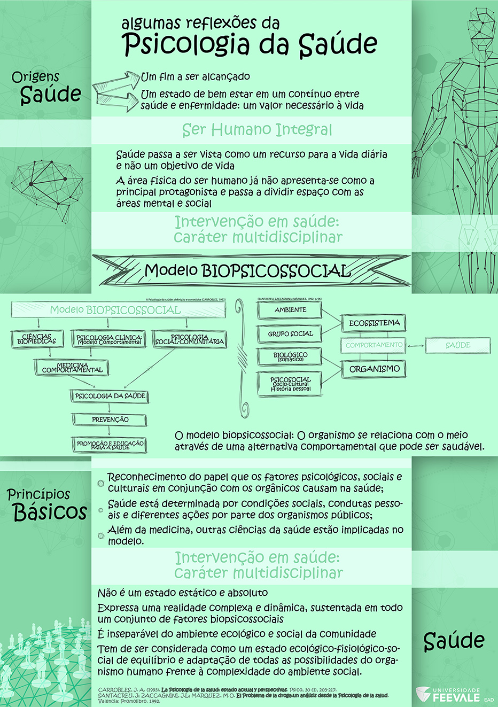

# Temática D - Saúde Mental

## Orientação de estudos
Nesta temática a proposta é estudar o conceito de normalidade e patologia no que tange à saúde mental, a partir da perspectiva biopsicossocial. Sendo assim, reconhecendo que os aspectos biológicos, sociais e psicológicos devem ser conjuntamente (e indissociadamente) levados em conta para que tenhamos um entendimento mais integral do ser humano.
Como se define e diferencia um comportamento normal de um patológico? É possível definir e generalizar um modelo de normalidade aplicável a todas as pessoas?
Para buscar respostas a estas e tantas outras questões que se colocam frente à loucura e à promoção de saúde convido você a estudar os materiais disponíveis e realizar as atividades de estudo.

### Material Básico

[Normalidade e psicopatologia: Reflexões Iniciais](https://feevale.blackboard.com/bbcswebdav/pid-1020599-dt-content-rid-3300340_1/xid-3300340_1)

INFOGRÁFICO: Algumas Reflexões da Psicologia da Saúde

ENTREVISTA SOBRE SAÚDE MENTAL | versão adaptada do material abaixo: Vídeo em Libras [Parte 1](https://youtu.be/orhkAtWLIMk) | Parte 2

<iframe width="560" height="315" style="font-size: 13px;" src="https://www.youtube.com/embed/sfMKjTA8bBA" frameborder="0" allowfullscreen=""></iframe>

<iframe width="560" height="315" src="https://www.youtube.com/embed/y5lO5RHZE2g" frameborder="0" allowfullscreen=""></iframe>

### Material Complementar

#### Saúde Mental

<iframe width="560" height="315" style="font-size: 13px;" src="https://www.youtube.com/embed/hKWN3l07III" frameborder="0" allowfullscreen=""></iframe>

#### Programa A Liga

<iframe width="560" height="315" style="font-size: 13px;" src="https://www.youtube.com/embed/06TvtqPSGjE" frameborder="0" allowfullscreen=""></iframe>

#### Documentário - Saúde Mental e Dignidade Humana

<iframe width="560" height="315" style="font-size: 13px;" src="https://www.youtube.com/embed/Ult9ePwpvEY" frameborder="0" allowfullscreen=""></iframe>

#### A história da Psicopatologia no Brasil

<iframe width="560" height="315" style="font-size: 13px;" src="https://www.youtube.com/embed/r-XJtS0A1WQ?rel=0" frameborder="0" allowfullscreen=""></iframe>

## Atividade de estudo 6: Fórum "Comportamentos Normal e Patológico"
No fórum, partilhe suas impressões e reflexões acerca da identificação dos comportamentos normal e patológico, suas fronteiras e influência sobre a vida cotidiana das pessoas.

Contribua comentando os apontamentos dos seus colegas e discutindo esta temática de tanta relevância social a partir dos vídeos sugeridos.

## Atividade de estudo 7: Questionário sobre saúde mental
Após o estudo dos materiais básicos previstos na Temática D, teste seus conhecimentos acerca do conteúdo estudado, respondendo o questionário sobre saúde mental.

- De acordo com o texto, qual o conceito básico da reforma da assistência em saúde mental?

É o de devolver a autonomia, de devolver a “voz”, a identidade, as habilidades, o futuro, o papel social, ao paciente institucionalizado, procurando desta forma reabilitá-lo para o convívio na sociedade 

- Como pode-se evidenciar no texto, os profissionais da área da saúde resistem em usar as terminologias “normalidade” e “anormalidade”. Eles preferem falar em comportamento desajustado ou desajustamento. Por que isso ocorre?

Pois definir alguém /rotular alguém como "normal" ou "anormal" é algo extremamente complexo, especialmente se nos baseamos em diretrizes absolutas. (Devido a variação da definição entre autores)

- Conforme indicado no texto "Normalidade e Patologia: Reflexões Iniciais", o dicionário de psicologia aponta três definições para normalidade. Cite e explique cada uma delas:

1 - Comportamento é aceito como usual ou de ocorrência frequente

2 - Comportamento normal considera-o assim aquele comportamento que se conforma às normas ou às demandas sociais aceitas

3 - Comportamento estatisticamente comum, independente de consenso 

- O que preconizam as teorias que surgiram no fim do século XX, chamadas de Antipsiquiatria, a Psiquiatria Existencial e a Psiquiatria Social?

Todas elas sugerem a extinção dos hospitais psiquiátricos e buscam restaurar a humanidade da pessoa institucionalizada.

- O que as novas concepções (Antipsiquiatria, a Psiquiatria Existencial e a Psiquiatria Social) preconizam como causas fora do indivíduo que possam gerar a doença mental?

Condições sociais, trabalho,lazer, sistema educacional competitivo, falta de estrutura familiar, violência urbana, etc.

