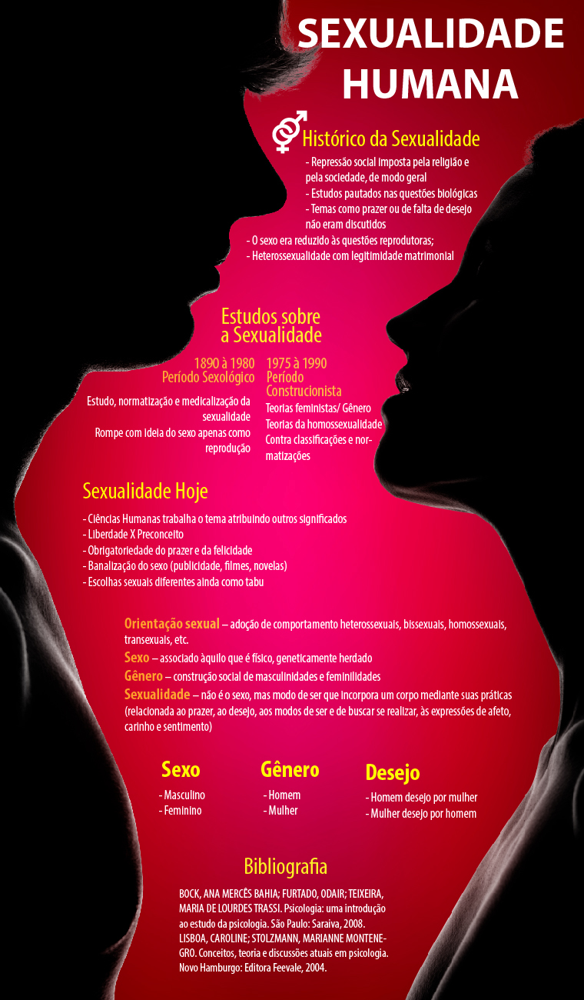

# Temática F – Relações Humanas e perspectivas atuais em Psicologia

## Orientação de estudos

Esta última temática irá abordar o tema das relações humanas e as perspectivas atuais em psicologia. Em especial, vamos estudar o tema dos direitos humanos, gênero e subjetividades, por fim, as relações étnico-raciais sob a perspectiva da psicologia. Os materiais básicos estão organizados no formato de texto. O material complementar caracteriza-se pela apresentação de vídeos que podem auxiliar na compreensão dos materiais básicos.

### 📚 Material Básico

- [Psicologia, Direitos Humanos e Neoliberalismo](https://feevale.blackboard.com/bbcswebdav/pid-1020606-dt-content-rid-3300386_1/xid-3300386_1) 
- Disponível em: http://each.uspnet.usp.br/rpp/index.php/RPPEACH/article/view/5
- [Gênero e Subjetividades: a Produção da Sexualidade Normal/Anormal](https://feevale.blackboard.com/bbcswebdav/pid-1020606-dt-content-rid-3300384_1/xid-3300384_1)
- [Desigualdade racial, racismo e seus efeitos](https://feevale.blackboard.com/bbcswebdav/pid-1020606-dt-content-rid-3300383_1/xid-3300383_1)
- INFOGRÁFICO: Sexualidade Humana

### 🖌 Material Complementar

- Psicologia e Direitos Humanos

<iframe width="560" height="315" src="https://www.youtube.com/embed/ib8JD3Q9omA" frameborder="0" allow="accelerometer; autoplay; encrypted-media; gyroscope; picture-in-picture" allowfullscreen></iframe>

- A despatologização das transexualidades e travestilidades pelo olhar da Psicologia - Parte I

<iframe width="560" height="315" src="https://www.youtube.com/embed/xLugxnORfd0" frameborder="0" allow="accelerometer; autoplay; encrypted-media; gyroscope; picture-in-picture" allowfullscreen></iframe>

- Documentário – Leve-me pra sair

<iframe width="560" height="315" src="https://www.youtube.com/embed/7U3xUZdU3Us" frameborder="0" allow="accelerometer; autoplay; encrypted-media; gyroscope; picture-in-picture" allowfullscreen></iframe>

- Preconceito e Esteriótipo

<iframe width="560" height="315" src="https://www.youtube.com/embed/7m-yuzFljpc" frameborder="0" allow="accelerometer; autoplay; encrypted-media; gyroscope; picture-in-picture" allowfullscreen></iframe>

- [Representações do corpo: psicossomática](https://feevale.blackboard.com/bbcswebdav/pid-1020606-dt-content-rid-3300399_1/xid-3300399_1)

## Atividade de estudo 9: questionário

No material disponível estão vários conceitos sobre os diferentes assuntos abordados na temática Relações Humanas e perspectivas atuais em Psicologia. 

Para que você consiga diferenciar os conceitos, descreva:

### PERGUNTA 1

Sexualidade

Não é o sexo, mas o modo de ser que incorpora um corpo mediante suas práticas (relacionadas ao prazer, ao desejo, aos modos de ser e de buscar se realizar, às expressões de afeto, carinho e sentimento)

#### Resposta professor:

Modo de ser que incorpora um corpo mediante suas práticas (relacionada ao prazer, ao desejo, aos modos de ser e de buscar se realizar, às expressões de afeto, carinho e sentimento)

### PERGUNTA 2

Racismo

O racismo consiste na idéia de que algumas raças são inferiores a outras, atribuindo desigualdades sociais, culturais, políticas, psicológicas, à “raça” e, portanto, legitimando as diferenças sociais a partir de supostas  diferenças biológicas. 

#### Resposta professor:

Consiste na ideia de que algumas raças são inferiores a outras, atribuindo desigualdades sociais, culturais, políticas, psicológicas, à “raça” e, portanto, legitimando as diferenças sociais a partir de supostas diferenças biológicas.

### PERGUNTA 3

Orientação Sexual

Adoção de comportamento heterossexuais, bissexuais, homossexuais, transexuais, etc.

#### Resposta professor:

Adoção de comportamento heterossexuais, bissexuais, homossexuais, transexuais, etc.

### PERGUNTA 4

Raça

Raça é uma construção social essencialista, amplamente aceita criado e reforçado em práticas cotidianas.

#### Resposta professor:

É um operador social usado para agregar indivíduos e grupos que compartilham certos aspectos físicos observáveis e ajuda a determinar uma atitude negativa frente a eles. É uma construção social essencialista, amplamente aceita.

### PERGUNTA 5

Sexo

Associado àquilo que é físico, geneticamente herdado

#### Resposta professor:

Associado àquilo que é físico, geneticamente herdado.

### PERGUNTA 6

Gênero

Construção social de masculinidades e feminidades

#### Resposta professor:

Construção social de masculinidades e feminilidades

## Atividade Avaliativa - 2C - 24/05 a 07/06

**Importante:**

- As **Atividades Avaliativas** possuem uma única tentativa de envio.

- Caso você não consiga realizar todas as questões no momento de acesso ao questionário, você tem a possibilidade de clicar na opção "salvar todas respostas" e, posteriormente, dentro do prazo estabelecido, realizar novo acesso ao questionário e concluir as questões.

- Para continuar a responder seu questionário, **clique no link da atividade** e, em seguida, clique em “continuar”.

- O envio final da sua atividade será realizado somente após clicar na opção : "Salvar e Enviar".

O gabarito e feedback estarão **disponíveis** no link *Minhas Notas* a partir do dia 08/06.
