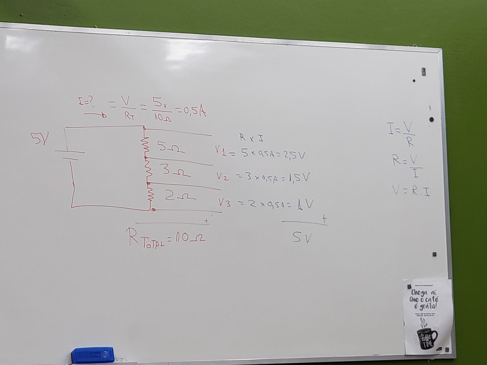
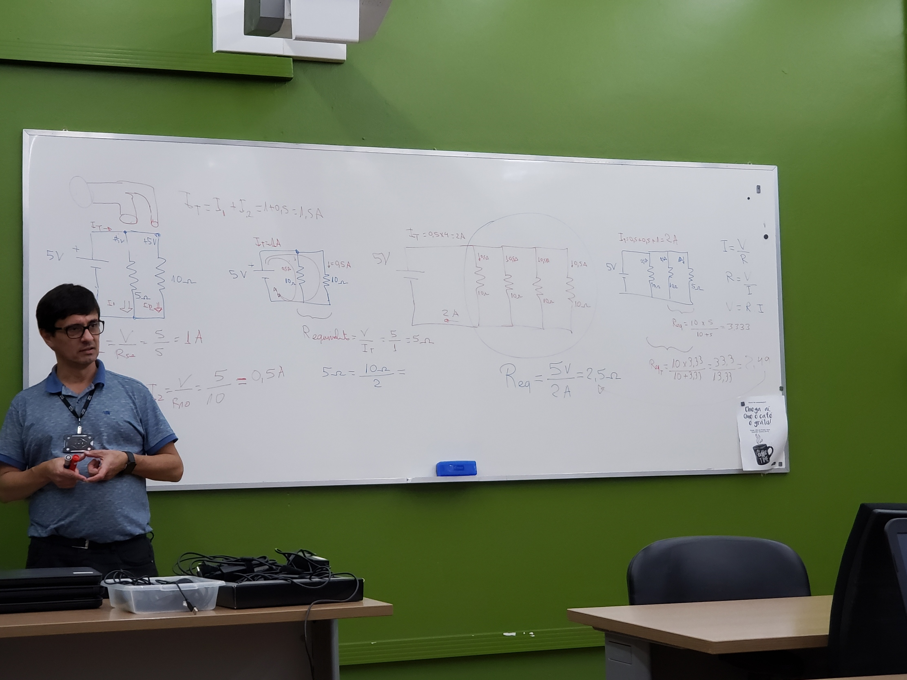
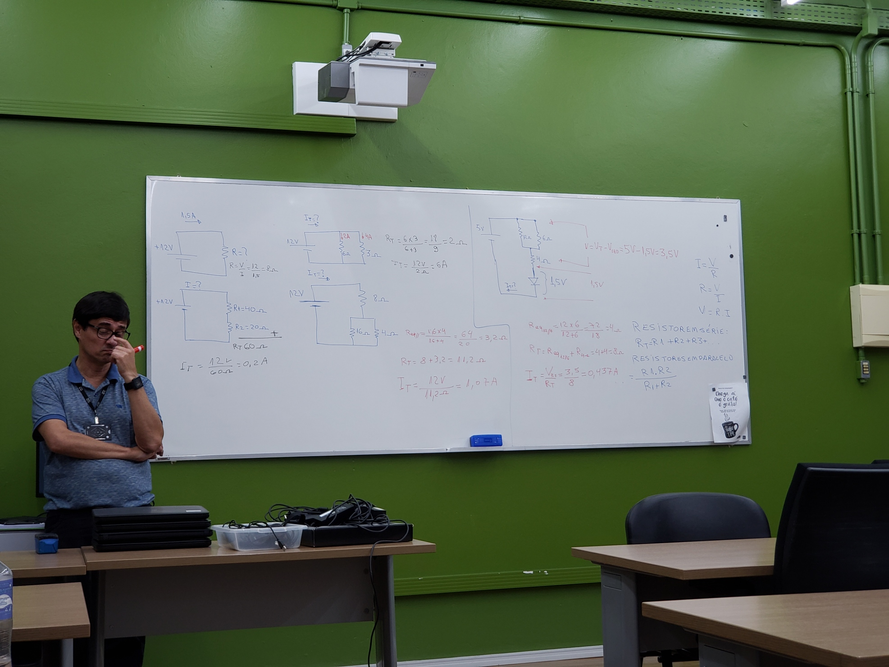
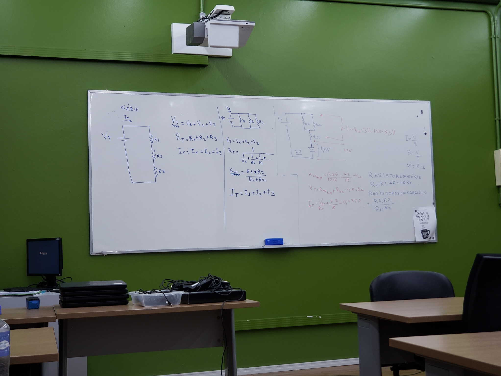
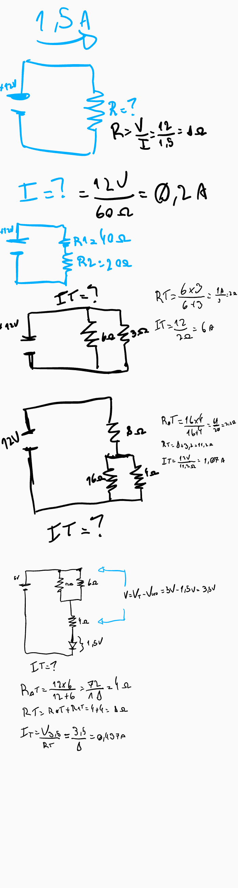

# Aula I

No presente utiliza da IOT

## Resistencia

Quanto maior o resistor menor a corrente

Em cada resistor existe uma queda de tensão

Quadro I

Quadro II

Quadro III

Quadro IV

Quadro V

