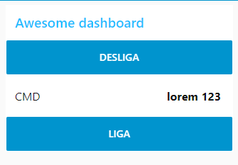

# Aula VIII

## Protocolo MQTT

> https://www.ibm.com/developerworks/br/library/iot-mqtt-why-good-for-iot/index.html 

 O MQTT foi inventado e desenvolvido inicialmente pela IBM no final dos anos 90. Sua aplicação original era vincular sensores em pipelines de petróleo a satélites. Desenvolvido com base na pilha TCP/IP, o MQTT (Message Queue Telemetry Transport) tornou-se o padrão para comunicações de IoT.

### Informações importantes

- É um protocolo de mensagem com suporte para a **comunicação assíncrona** entre as partes 

- Usa um modelo de **publicação e assinatura** 
  - Desacopla o emissor e o receptor da mensagem tanto no espaço quanto no tempo
  -   

### Mensagens do protocolo

Primeiro, o cliente conecta-se ao broker enviando uma mensagem CONNECT. A mensagem CONNECT pede para estabelecer uma conexão do cliente com o broker. A mensagem CONNECT tem os parâmetros de conteúdo a seguir.

#### Tabela 1. Parâmetros da mensagem CONNECT

| **Parâmetro**   | **Descrição**                                                |
| --------------- | ------------------------------------------------------------ |
| cleanSession    | Esta sinalização especifica se a conexão é persistente ou não. Uma sessão persistente armazena todas as assinaturas e as mensagens possivelmente perdidas (dependendo do QoS) no broker. (Consulte Tablela 3 para obter uma descrição do QoS). |
| username        | As credenciais de autenticação e autorização do broker.      |
| password        | As credenciais de autenticação e autorização do broker.      |
| lastWillTopic   | Quando a conexão for encerrada inesperadamente, o broker publicará automaticamente uma mensagem de "último desejo" em um tópico. |
| lastWillQos     | O QoS da mensagem de "último desejo". (Consulte Tablela 3 para obter uma descrição do QoS). |
| lastWillMessage | A própria mensagem de "último desejo".                       |
| keepAlive       | Este é o intervalo de tempo em que o cliente precisa efetuar ping no broker para manter a conexão ativa. |

O cliente receberá uma mensagem CONNACK do broker. A mensagem CONNACK tem os parâmetros de conteúdo a seguir.

#### Tabela 2. Parâmetros da mensagem CONNACK

| **Parâmetro**  | **Descrição**                                                |
| -------------- | ------------------------------------------------------------ |
| sessionPresent | Indica se a conexão já tem uma sessão persistente. Ou seja, a conexão já tem tópicos assinados e receberá a entrega de mensagens ausentes. |
| returnCode     | 0 indica sucesso. Outros valores identificam a causa da falha. |

Depois que uma conexão for estabelecida, o cliente poderá enviar uma ou mais mensagens SUBSCRIBE ao broker para indicar que ele receberá mensagens do broker de determinados tópicos. A mensagem pode ter uma ou várias repetições dos parâmetros a seguir.

#### Tabela 3. Parâmetros da mensagem SUBSCRIBE

| **Parâmetro** | **Descrição**                                                |
| ------------- | ------------------------------------------------------------ |
| qos           | A sinalização qos (qualidade de serviço ou QoS) indica com que consistência as mensagens neste tópico precisam ser entregues aos clientes. Valor 0: não confiável, a mensagem é entregue no máximo uma única vez, se o cliente estiver indisponível no momento, ele perderá a mensagem.Valor 1: a mensagem deve ser entregue pelo menos uma vez.Valor 2: a mensagem deve ser entregue exatamente uma vez. |
| topic         | Um tópico para assinar. Um tópico pode ter vários níveis separados pelo caractere barra. Por exemplo, "dw/demo" e "ibm/bluemix/mqtt" são tópicos válidos. |

Depois que o cliente tiver assinado um tópico com sucesso, o broker retornará uma mensagem SUBACK com um ou mais parâmetros returnCode.

#### Tabela 4. Parâmetros da mensagem SUBACK

| **Parâmetro** | **Descrição**                                                |
| ------------- | ------------------------------------------------------------ |
| returnCode    | Existe um código de retorno para cada um dos tópicos no comando SUBSCRIBE. Os valores de retorno são os seguintes. Valores 0 a 2: sucesso como nível de QoS correspondente. (Consulte Tablela 3 para saber mais sobre QoS.)Valor 128: falha. |

Correspondendo à mensagem SUBSCRIBE, o cliente também poderá UNSUBSCRIBE (cancelar a assinatura) de um tópico ou de vários tópicos.

#### Tabela 5. Parâmetros da mensagem UNSUBSCRIBE

| **Parâmetro** | **Descrição**                                       |
| ------------- | --------------------------------------------------- |
| topic         | Este parâmetro pode se repetir para vários tópicos. |

O cliente pode enviar mensagens PUBLISH ao broker. A mensagem contém um tópico e uma carga útil de dados. Em seguida, o broker encaminha a mensagem a todos os clientes que assinam esse tópico.

#### Tabela 6. Parâmetros da mensagem PUBLISH

| **Parâmetro** | **Descrição**                                                |
| ------------- | ------------------------------------------------------------ |
| topicName     | O tópico no qual a mensagem é publicada.                     |
| qos           | O nível de qualidade de serviço da entrega da mensagem. (Consulte Tablela 3 para obter uma descrição do QoS). |
| retainFlag    | Esta sinalização indica se o broker reterá a mensagem como a última mensagem conhecida deste tópica. |
| payload       | Os dados reais na mensagem. Pode ser uma sequência de texto ou um blob binário de dados. |

## node-red-dashboard

> https://flows.nodered.org/node/node-red-dashboard 

  

### Criado board teste para aula



```json
[ 
   { 
      "id":"d69a69d.f030e98",
      "type":"tab",
      "label":"Liga / Desliga",
      "disabled":false,
      "info":""
   },
   { 
      "id":"883997b7.ae98e8",
      "type":"ui_button",
      "z":"d69a69d.f030e98",
      "name":"",
      "group":"264cf463.fb755c",
      "order":0,
      "width":0,
      "height":0,
      "passthru":false,
      "label":"DESLIGA",
      "tooltip":"",
      "color":"",
      "bgcolor":"",
      "icon":"",
      "payload":"DESLIGA",
      "payloadType":"str",
      "topic":"",
      "x":360,
      "y":80,
      "wires":[ 
         [ 
            "20baacf7.e5b974"
         ]
      ]
   },
   { 
      "id":"20baacf7.e5b974",
      "type":"mqtt out",
      "z":"d69a69d.f030e98",
      "name":"",
      "topic":"liga_desliga",
      "qos":"",
      "retain":"",
      "broker":"858430d6.bc6cb",
      "x":610,
      "y":80,
      "wires":[ 

      ]
   },
   { 
      "id":"21c62ea0.723332",
      "type":"ui_text",
      "z":"d69a69d.f030e98",
      "group":"264cf463.fb755c",
      "order":0,
      "width":0,
      "height":0,
      "name":"",
      "label":"CMD",
      "format":"{{msg.payload}}",
      "layout":"row-spread",
      "x":390,
      "y":400,
      "wires":[ 

      ]
   },
   { 
      "id":"62cb59d.b3453a8",
      "type":"mqtt in",
      "z":"d69a69d.f030e98",
      "name":"",
      "topic":"liga_desliga",
      "qos":"2",
      "datatype":"auto",
      "broker":"858430d6.bc6cb",
      "x":130,
      "y":400,
      "wires":[ 
         [ 
            "21c62ea0.723332",
            "273cb205.d734de"
         ]
      ]
   },
   { 
      "id":"ee56e56c.f6d058",
      "type":"ui_button",
      "z":"d69a69d.f030e98",
      "name":"",
      "group":"264cf463.fb755c",
      "order":0,
      "width":0,
      "height":0,
      "passthru":false,
      "label":"LIGA",
      "tooltip":"",
      "color":"",
      "bgcolor":"",
      "icon":"",
      "payload":"LIGA",
      "payloadType":"str",
      "topic":"",
      "x":350,
      "y":140,
      "wires":[ 
         [ 
            "20baacf7.e5b974"
         ]
      ]
   },
   { 
      "id":"273cb205.d734de",
      "type":"ui_toast",
      "z":"d69a69d.f030e98",
      "position":"top right",
      "displayTime":"3",
      "highlight":"",
      "sendall":true,
      "outputs":0,
      "ok":"OK",
      "cancel":"",
      "raw":false,
      "topic":"Liga / Desliga",
      "name":"Liga / Desliga",
      "x":420,
      "y":360,
      "wires":[ 

      ]
   },
   { 
      "id":"264cf463.fb755c",
      "type":"ui_group",
      "z":"",
      "name":"Awesome dashboard",
      "tab":"83f2f46e.87cb18",
      "disp":true,
      "width":"6",
      "collapse":false
   },
   { 
      "id":"858430d6.bc6cb",
      "type":"mqtt-broker",
      "z":"",
      "name":"localhost",
      "broker":"localhost",
      "port":"1883",
      "clientid":"",
      "usetls":false,
      "compatmode":false,
      "keepalive":"60",
      "cleansession":true,
      "birthTopic":"",
      "birthQos":"0",
      "birthPayload":"",
      "closeTopic":"",
      "closeQos":"0",
      "closePayload":"",
      "willTopic":"",
      "willQos":"0",
      "willPayload":""
   },
   { 
      "id":"83f2f46e.87cb18",
      "type":"ui_tab",
      "z":"",
      "name":"Home",
      "icon":"dashboard",
      "disabled":false,
      "hidden":false
   }
]
```

