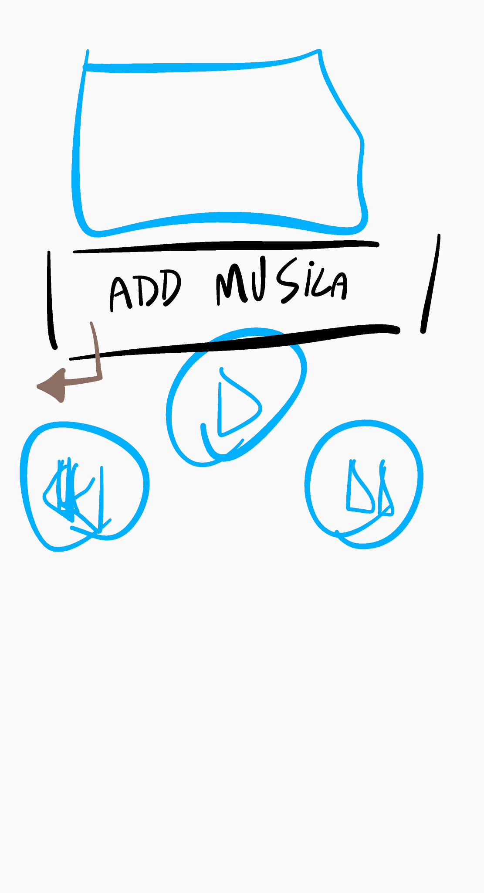
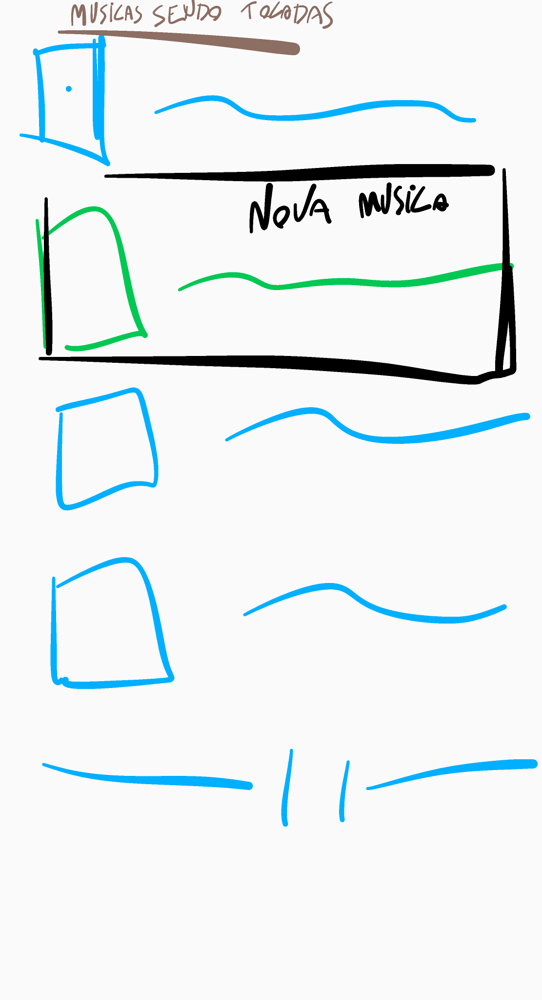

# Contexto

## Tipos de contexto

### Comportamental

- recomendar em cima da sequencia de ações que o usuário tomou
- passar uma musica adiante
  - salvar a musica e tempo da musica
- avaliação do quanto a musica se encaixa no contexto
- **nível de "prazer" que a musica traz no contexto**
  - **ou nivel de "excitação" que a musica traz no contexto**
- analisar comportamento **sequencial**
- a mudança imediata da fila de musicas baseado na detecção do contexto

## Anotações

- a recomendação não deve ser a mesma se o usuario estiver sozinho ou com mais pessoas
- In their state-of-the-art on CARS, Adomavicius and Tuzhilin [1] present several ways to include contextual information 

