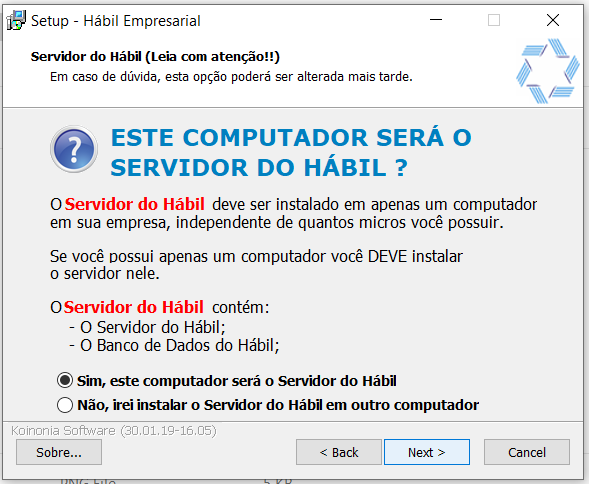

# Software as a Service vs On-premises

Atualmente, cada vez mais os sistemas tem passado para aplicações WEB para se tornarem online e disponíveis por múltiplos meios. A ideia desse trabalho é demonstrar os benefícios que podemos ter utilizando sistemas online.

## Quickbooks ZeroPaper vs Hábil Empresarial

Sistemas de gestão financeiras são muito importantes e são utilizados, pois planilhas não são suficientes para gerenciar um negocio, por isso empresas|consumidores acabam buscando esse tipo de solução para melhorar e aperfeiçoar a gerencia das suas finanças.

### Quickbooks ZeroPaper

É uma ferramenta utilizada para gerenciar MEI's e empresas de pequeno porte. Busca simplicidade na gerencia das finanças de uma empresa. 

O sistema é indicado para profissionais que não possuem muito tempo disponível em um computador, e precisam de seu sistema disponível em diversos lugares.

Devido a se tratar de um sistema online, onde terá dados de diversos consumidores, o ZeroPaper buscou fazer uma solução extremamente segura, onde os dados

Para utilizar a ferramenta é necessário:

- Acessar a aplicação em seu browser [QuickBooks ZeroPaper — Crie sua conta](https://www.zeropaper.com.br/sign_up)
- Realizar o cadastro
  - Confirmar email|telefone
- Pronto, já é possível gerenciar suas finanças de qualquer dispositivo com um browser

#### Pros

- Acesso de qualquer dispositivo com internet
- Possui aplicativo
- Envia SMS (notificações) das transações do dia

#### Contras

- Sem acesso aos dados (arquivos|banco de dados)

### Hábil Empresarial

É uma utilizada para gerenciar empresas MEI's e empresas de pequeno, médio porte. É indicada para profissionais que tem acesso a um computador para gerenciar e analisar suas finanças.

Para utilizar a ferramenta é necessário:

- Acessar a [pagina de download](https://www.habil.com.br/downloads/)

- Baixar o executável do sistema

- Executar o arquivo como administrador da maquina

- Instalar o sistema

  - É necessário instalar o servidor da aplicação
  - Após instalação, pode ser instalado o sistema em outras maquinas sem o servidor

  

- Com o sistema de pé é possível acessar a aplicação em seu desktop (windows) e gerenciar suas finanças nos computadores instalados

#### Pros

- Com acesso aos dados (arquivos ou banco de dados)

#### Contras

- Servidores precisam ser instalados e configurados
- Não possui app
- Não possui acesso online

## Conclusão

Com esse trabalho foi possível verificar o que o

## Referencias

- [QuickBooks - Controle financeiro para seu negócio](https://quickbooks.intuit.com/br/compare/)
- [Hábil Empresarial - Qual a Diferença entre as soluções?](https://www.habil.com.br/conheca-o-h%C3%A1bil/diferen%C3%A7as-entre-as-solu%C3%A7%C3%B5es/)