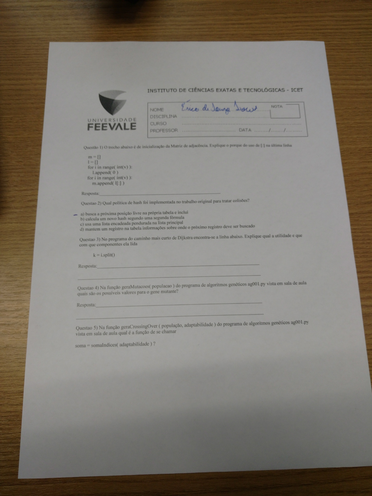

# Prova I (valendo 1 ponto)

## Questões

### 1)

Resposta: [:] foi utilizado para fazer uma espécie de copia da lista l 

### 2)

Resposta: letra a

### 3)

Resposta: O `split` foi utilizado para transformar a *string* com números e espaços em uma lista.

respectivamente `origem destino peso`

### 4)

qualquer um dos caracteres da string _ALFABETO

### 5)

somar os valores da lista adaptabilidade

## Fotos

