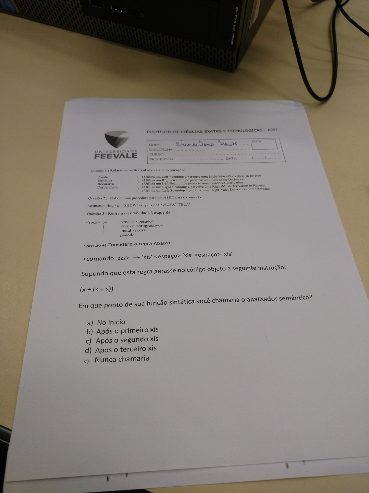

# Prova I (valendo 1 ponto)

1) Relacione os itens abaixo à sua explicação:

- D
- A
- R
- 

- S

2) Elabore uma procedure para um ASRD para o comando:

```
<comando ring> ::= 'SHOW' <expressao> 'VEZES' 'TELA'

Respostas: ⬇

void comandoRing() {
	if (token === T_SHOW) {
		buscaProximoToken();
		espressao();
		
		if (token === T_VEZES) {
			buscaProximoToken();
			
			if (token === T_TELA) {
				buscaProximoToken();
			} else registraErro(...)
		} else registraErro(...)
	} else registraErro(...)
}
```

3) Retire a recursividade à esquerda:

```
<rock> ::=   <rock> <pesado>
        |    <rock> <progressivo>
        |    metal <rock>
        |    pagode
        
Respostas: ⬇

<rock>  ::=  pagode <'rock>
<'rock> ::=  metal <'rock>
        |    <pesado> <'rock>
        |    <progressivo> <'rock>
        |    ε
```

4) Considere a regra abaixo:

```tiki wiki
<comando_zzz> ➡ 'xis' <espaço> 'xis' <espaço> 'xis'
```

Supondo que esta regra gerasse no código objeto a seguinte instrução:

`(x + (x + x))`

Em que ponto de sua função sintática você chamaria o analisador semântico?

Respostas: ⬇

a) No inicio

## Anexos

